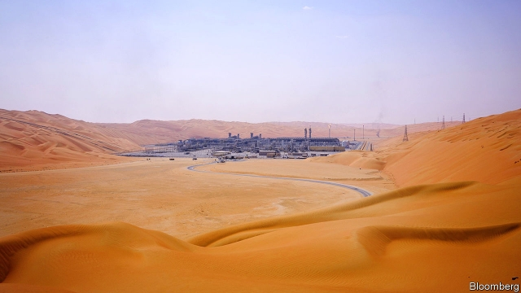
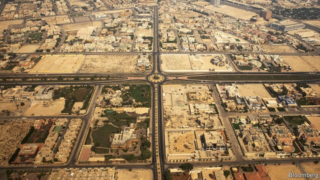
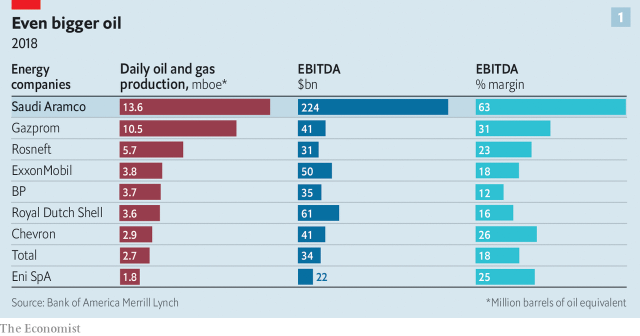
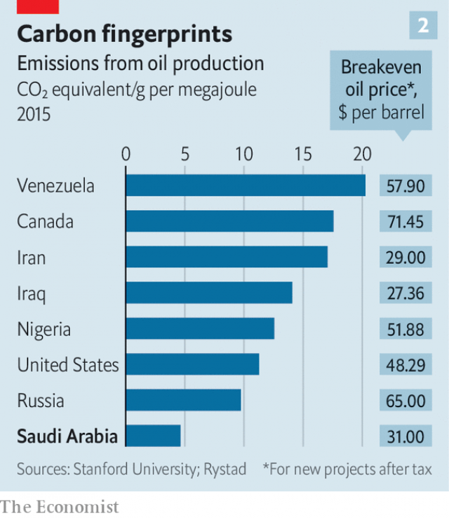

###### Saudi Aramco’s IPO

# Aramco is both the oil sector’s Goliath and a firm vexed by problems 

 

> print-edition iconPrint edition | Briefing | Oct 31st 2019 

IN THE HEADQUARTERS of the world’s most profitable company, past its heavily guarded perimeter, down a road, through another security gate, out of the blazing sun and into a cool office building sit box after box of rocks. They are samples of anhydrite, shale, dolomite and grainstone, retrieved from kilometres below ground. A block of grainstone looks perfectly ordinary, its dark surface dotted with pores. But nestled in this rock were the remains of the tiny marine animals and plants which blanketed the Arabian peninsula before there was such a thing, over 100m years ago, and which still give the rock a faint, familiar scent: oil. “Smells like money,” says one executive—$111bn, to be precise. 

That was the net income earned last year by Saudi Aramco, the kingdom’s state-owned oil company. It is nearly twice that of Apple, the world’s most profitable listed firm, and more than the combined earnings of the five biggest international oil companies—ExxonMobil, Royal Dutch Shell, BP, Chevron and Total. For decades, the riches from Saudi Arabia’s vast reserves have been the exclusive property of Saudi Arabia. Muhammad bin Salman, the kingdom’s crown prince, wants that to change. 

In 2016 Prince Muhammad told this newspaper he was keen to list a portion of Aramco’s shares, in an effort to raise money to diversify the kingdom’s economy. After much delay, those plans seem to be proceeding. In September the government appointed Yasir al-Rumayyan, the head of the kingdom’s sovereign-wealth fund, to be the new chairman of Aramco and charged him with taking the listing forward. Eleven banks and financial advisers have been working feverishly to that end. If all goes according to schedule, in early November the kingdom will announce its intention to list 2-3% of Aramco’s shares on the Tadawul, the Saudi stock exchange. It would probably be the biggest initial public offering (IPO) in history, raising $30bn or more and eclipsing Alibaba’s $25bn listing in 2014. A second listing may follow on a foreign exchange sometime in 2020. 

Yet almost four years after Prince Muhammad announced the desire for an IPO, there remains a chance it is postponed. Disagreement over the company’s value has already delayed the listing—Aramco was expected to announce its intention to float in late October. It is unclear what price will satisfy the crown prince, who said in 2016 he hoped for a valuation of $2trn. Independent analysts think he would be lucky to get $1.5trn. 

The uncertainty points to a contradiction at the heart of Aramco, at once the oil industry’s undisputed titan and a company plagued by problems. In September drones struck two Aramco facilities in eastern Saudi Arabia, knocking out more than half of its production. Further attacks are possible—America says Iran was responsible. In October Fitch downgraded Aramco’s credit rating, owing to risks posed by geopolitics and its economically shaky sovereign. Saudi Arabia’s ability to use its heft to support global oil prices is in doubt. The oil price has sunk to about $60 a barrel, from $75 in April, amid fears of a recession. 

What is more, investors have soured on the oil industry. Energy’s weighting in the S&P 500 index dipped below 5% in June, less than a third of its level in 2008. Oil markets are notoriously volatile; they may become more so as efforts to mitigate climate change hit oil consumption. “If this IPO was 15 years ago, it would be a compelling investment opportunity,” says Oswald Clint of Bernstein, a financial firm. “But the outlook for oil demand and the energy sector is opaque.” 

Aramco maintains that, regardless of the oil market’s broader troubles, it will outcompete its rivals. Recently the company has used deals and new business units to secure customers, diversify its revenue and maximise the value of its oil. Its boosters like to say that the world’s last barrel of oil will come from Saudi Arabia. But it is unclear what value investors will ascribe to such a distant possibility. As international energy giants and petrostates jostle to find their footing in an uncertain era, no company will loom larger than Aramco. 

The company’s history is in some ways similar to that of other national oil giants. Americans drilled their first successful well in Saudi Arabia in 1938; the Arabian American Oil Company once had its headquarters in New York. The nationalisation of Aramco from 1973 to 1981 was part of a wave of requisitions that swept oilfields from Venezuela to Malaysia. 

However Aramco is no ordinary national oil company. It is widely regarded by those within the industry as being well run, with professional managers and a distinct culture. The Aramco compound in Dhahran, in Saudi Arabia’s Eastern Province, is a world unto itself, home to 15,000 people. It has schools, gyms, food shops and streets lined with quaint houses—the campus resembles an Arizona suburb, with more mosques. About 90% of Aramco’s employees are Saudi, but women are as likely to wear trousers as an abaya. 

Nor is Saudi Arabia an ordinary petrostate. Much of its treasure resides in the Eastern Province, including oilfields such as the celebrated 48.3bn-barrel Ghawar, shaped like a dancer’s leg en pointe. Oil is also tucked beneath the rolling dunes of the Empty Quarter and the seabed of the Gulf. In all Aramco has nearly 500 reservoirs, with 260bn barrels of proved reserves. That is more than triple the combined proved reserves of the five supermajors. Last year Aramco pumped one in eight of the world’s barrels of crude. 

Such astonishing scale has ensured that Saudi Arabia remains the de facto leader of the Organisation of the Petroleum Exporting Countries (OPEC). American frackers may collectively produce more oil, but they operate independently. Saudi Arabia alone can ramp production up and down quickly in the attempt to tame volatile oil markets. 

Oil has brought the kingdom prosperity. Saudi Arabia sustains its absolute monarchy by offering citizens a safety-net, including free education and health care, as well as a guaranteed-income programme. The kingdom’s natural resources benefit some Saudis more than others. In posh parts of Riyadh and Dammam, lush greenery peeks above the concrete walls separating residential compounds from the dusty streets beyond. As a whole, however, Saudi Arabia is dangerously dependent on crude. 

Oil accounts for nearly 70% of the government’s revenue and almost 80% of exports. Non-oil activity is often the result of government spending, which is itself dependent on oil. It is hard to find a person or service in the kingdom that does not somehow rely on oil or gas. The arid climate requires the use of energy-intensive desalination plants—in Saudi Arabia, even water depends on fossil fuel. 

The country has long been vulnerable to shifts in the oil price. However the kingdom faces three new, big problems. First, shale has transformed America into the world’s largest oil producer, vexing OPEC’s efforts to maintain high, stable prices. Second, Saudi Arabia has a burgeoning, youthful population. The oil industry, which requires capital but not much labour, cannot employ enough of them. The IMF reckons that up to 1m jobs could be needed in Saudi Arabia in the next five years. 

 

The third risk is the largest and most uncertain: global oil demand may subside. Economic growth and demand, which have risen in sync, could be decoupled as the threat of climate change grows. However no one knows whether this might happen, or when. America’s Energy Information Administration, within President Donald Trump’s energy department, expects the world to remain thirsty for oil, with demand rising up until 2050. ExxonMobil also takes a bullish view. Mohammed al-Qahtani, Aramco’s head of upstream, expects that “demand will be robust for the next two decades plus”—the company models its reservoirs to 2200. Some oil companies tactfully present a variety of scenarios, as does the International Energy Agency (IEA), a forecaster. Any tidy prediction belies a tangle of assumptions and debate, according to an independent expert who has reviewed the IEA’s drafts. 

Little wonder, then, that Prince Muhammad wants to diversify. His Vision 2030 aspires to transform the economy through strategic investment—for instance in manufacturing and “special economic zones”, such as a planned robotic city called NEOM near the Red Sea. Raising cash for that depends on the Aramco IPO. 

There have been many reasons to delay, including concern over legal exposure that might come from listing in New York, the desire to acquire Sabic, the kingdom’s giant petrochemical company, as well as the valuation question. This time last year, plans for an offering seemed postponed indefinitely amid uproar over the murder of Jamal Khashoggi, a dissident journalist, at the Saudi consulate in Istanbul. 

Since then, however, Aramco has announced a $69bn deal to buy Sabic. To raise money for the transaction, in April Aramco issued $12bn in bonds, which investors lapped up. The publication of a 469-page bond prospectus eased anxiety about letting the world pore over Aramco’s books. Meanwhile, the rationale for pursuing a listing—to raise money to diversify the economy—remains as urgent as ever. 

Preparations for an IPO accelerated after the bond offering. Aramco held its first earnings call with investors in August (analysts, perhaps eager to establish good will, have rarely been so polite). To co-ordinate the listing the government has hired six global banks, JPMorgan, Goldman Sachs, Credit Suisse, Citi, HSBC, and Bank of America Merrill Lynch, as well as Saudi Arabia’s Samba and National Commercial Bank. Michael Klein, Moelis and Lazard are serving as advisers, say insiders. Investors, at last, are on the threshold of owning a sliver of Aramco’s shares. 

The trouble with letting the market loose on Aramco, however, is that it tends to make up its own mind about valuations. This seems to make the crown prince uneasy. Bloomberg has reported that the government is exploring ways to limit volatility in trading after the Tadawul listing. The government expects local business leaders to buy shares enthusiastically to support Aramco’s valuation. “It is seen as part of being loyal,” says one seasoned businessman in Riyadh. “It’s not an explicit quid pro quo,” says another. “However you cannot do business in Saudi without being seen favourably by the power corridors.” Saudi banks have asked local investors if they would increase their stakes if offered new lines of credit. 

If an IPO does proceed, however, Aramco’s valuation will eventually reflect the business itself: a company of staggering scale, aggressive strategy and unique complications. In recent years Aramco has moved to strengthen its traditional business and expand to new areas—Mr Qahtani describes this as “opportunistic”, not defensive. Changes include establishing a trading operation and investing more in natural-gas projects. 

Its most important strategic shift is to move downstream, into petrochemicals. Its purchase of a 70% stake in Sabic, announced in March, serves the twin goals of raising cash for Saudi Arabia’s sovereign- wealth fund and diversifying Aramco’s revenue. The IEA expects petrochemicals to account for almost half of the growth in oil demand up to 2050. Sabic is already the world’s fourth-largest chemical company, generating $14bn of gross operating profit last year. Its businesses span fertilisers in India to plastics used in Range Rovers. 

Aramco has also used its deep pockets to bolster its standing in Asia. In August Reliance, an Indian conglomerate, said that Aramco had taken a 20% stake in its refining unit, for roughly $15bn. Aramco has announced other investments in Asia, including projects in South Korea, Malaysia and China. Joint ventures in refineries and petrochemical plants help Aramco hedge against low oil prices. They also include agreements to be the projects’ long-term supplier of crude. Deal by deal, Aramco is securing customers for its oil in Asia, where demand is most likely to rise. Asia buys 71% of the company’s crude exports. 

Some national oil companies are trying to pursue a similar strategy. ADNOC, of the United Arab Emirates, is joining up with Aramco on a big refining complex in India. What makes Aramco most distinct, however, is how cheaply it can pump oil. Its centralised resources, slick infrastructure and decades spent honing its drilling mean that extracting oil costs just $2.80 a barrel, one-third the average level of international oil companies. That helps Aramco achieve margins more than twice that of Rosneft, a Russian giant, and nearly four times that of Shell (see chart 1). 

 

The Economist worked with Rystad Energy, a research firm, to examine how the value of Saudi Arabia’s reserves might stack up if demand wanes—because of, say, the strengthening of American climate regulations after an election. The oil price at which a company could make a 10% return, the breakeven price, is one way of showing which countries’ reserves are most vulnerable. Another way is to look at how much energy is used to extract oil, thereby increasing emissions, which would add a further layer of costs if carbon were to be taxed. On both measures, Saudi Arabia stands out. 

 

Aramco’s breakeven costs for new projects, even after tax, are $31, according to Rystad Energy’s data, slightly higher than Iran, Iraq or Kuwait but less than half the level of Russia and two-thirds the level in America. Its carbon-dioxide emissions from extraction and flaring are less than half the global average. A separate analysis, published last year by researchers at Stanford University and Aramco, found similar results (see chart 2). Indeed, Aramco exposes its peers’ weakness. Canada and Venezuela are particularly vulnerable, owing to production that is both dear and dirty. Compared with those of many rivals, Aramco’s reserves therefore seem well situated, no matter what happens to demand. 

Yet even with its relative bounty it faces several big risks. The trove of oil assets under Saudi soil remain vulnerable to attack. Aramco executives, who usually refer to the September strikes as “the incident”, point out that repairs were done quickly. However it was no one-off. The attacks in September followed strikes on a large pipeline, airports and an oilfield. Further incidents could complicate Aramco’s efforts to secure more long-term customers. 

The kingdom’s claim on Aramco also makes investors nervous. Saudi Arabia has tried to ease their concern. Reforms announced in 2017 included reducing Aramco’s tax rate from 85% to 50%. In September Aramco unveiled a new dividend policy, which envisions a total payout of $75bn in 2020 and beyond. Non-state shareholders will receive a proportionate share of this, and their absolute payout will be protected, even if the total value of Aramco’s dividend drops. Further, it said that dividend would probably rise. 

However Aramco’s dividend yield, at a valuation of $1.5trn, remains lower than those of the European supermajors. Some investors remain squeamish about what might happen if oil prices were depressed for a long period. Aramco could still be profitable, but its profits might not be high enough to sustain the kingdom’s budget. Prince Muhammad’s Vision 2030 might not go as planned—one of the Saudi sovereign-wealth fund’s big early investments was in SoftBank’s Vision Fund, which made a disastrous bet on WeWork. “If oil prices are lower, you could expect that the state would potentially increase taxes,” says Dmitry Marinchenko of Fitch. The promise to maintain high dividends to non-state shareholders, he points out, would not be legally sacrosanct. 

There remains the question of what a listed Aramco would mean for OPEC, and therefore for oil markets. Historically Saudi Arabia has curbed its own output, often beyond the levels required by OPEC, in the effort to support oil prices. Khalid al-Falih long served as both oil minister and Aramco’s chairman. In September the government sacked him from both posts, ensuring that one person now oversees Aramco and another the oil ministry. Yet the rational goals of a listed Aramco—boosting production to lower prices and squeeze rivals, for instance—may diverge wildly from the historic goals of OPEC. 

Such uncertainties will weigh on Aramco, before and after any listing. Rivals are watching with interest. Saudi Arabia’s transition to oil’s new era is tortured. For the many countries with higher costs and less cash, it may be even more so. ■ 

