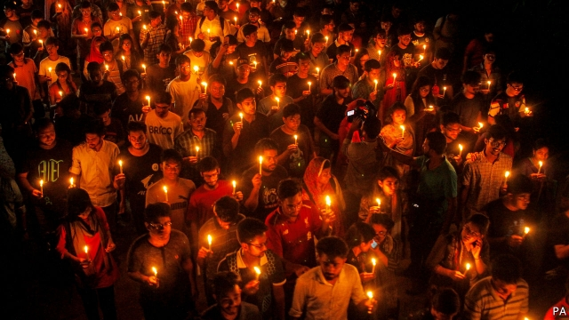

###### Learning the hard way

# Bangladesh’s ruling party runs university campuses with an iron fist 

 

> print-edition iconPrint edition | Asia | Nov 2nd 2019 

EARLY IN OCTOBER Abrar Fahad, a student at Bangladesh University of Engineering and Technology (BUET) was beaten to death in his dormitory. Police have detained 21 people in connection with the murder, many of them members of the Chhatra League, the student wing of the ruling Awami League party. He appears to have offended them by making critical comments on Facebook about a water-sharing deal the government recently struck with India. 

The death of Mr Fahad, who was 21, has prompted protests at the university and a public outcry across the country. Yet such killings are quite common in Bangladesh, where violent party politics is mirrored—and often amplified—on university campuses. “This is part of the university culture,” says Mubashar Hasan of the University of Oslo. “Dormitory rooms are turned into torture rooms to quell opposition.” 

The Chhatra League “basically controls universities on behalf of the government”, explains a 21-year-old student from Dhaka, the capital. That is important to the authorities, since universities have long been hotbeds of political dissent. No male student can get a room in the halls of residence without co-operating with the League or having a political connection, says a fellow student. “They show their tyranny very publicly in these universities.” 

Instead of allocating the individual rooms, the Chhatra League puts all the first-year students—sometimes up to 100—in one enormous dormitory, the “public room”. Here, first-years are subjected to “ragging”, meaning bullying by older students, who report back to the League’s leadership. The whole process is designed to scare students into toeing the line. 

“Abrar didn’t do that,” notes the student from Dhaka. League members accused Mr Fahad of being involved with Chhatra Shibir, the student wing of Jamaat-e-Islami, an Islamist opposition party. “Anyone who opposes the government can be called Shibir nowadays,” the Dhaka-ite continues. “It’s an easy excuse for [the League] to beat someone up and no one will say anything.” 

The Chhatra League’s clout extends far beyond dormitories. Earlier this year, when the government gave funds to Jahangirnagar University for a development project, the local branch of the League demanded a share. The vice-chancellor paid up, and later gave yet more money to the League’s central committee. Companies are often forced to pay off the local branch of the League in order to start a project or operate in their area. A crackdown on opposition parties before last year’s election, which saw the Awami League re-elected in a landslide, has made it even harder to stand up to the Chhatra League. 

Bureaucrats, MPs and the police connive in this system, says Mr Hasan. But none of this is new, he points out. Before Chhatra League, he says, there was Chhatra Dal—the student wing of the Bangladesh Nationalist Party, in government from 2001 to 2006. Chhatra Dal, like the Chhatra League, operated with impunity. So did the student front that backed Hussain Muhammad Ershad, the military dictator from 1983 to 1990. The Daily Star, a newspaper, looked at all campus killings since independence in 1971 and found 151 murders for which no charges had been brought. 

Mr Fahad’s murder was perhaps a step too far, however. His Facebook post echoed widespread anti-Indian sentiment. Obaidul Quader, the general secretary of the Awami League, said the government would take action against the perpetrators “regardless of [their] affiliation”, although he did remind people of the Chhatra League’s “good accomplishments”. Sheikh Hasina Wajed, the prime minister, had already seemed inclined to rein in the Chhattra League. Before Mr Fahad’s death she had dismissed its president and general secretary and reshuffled its central committee. 

BUET’s vice-chancellor, meanwhile, has promised not only to ban ragging, but also to bar political organisations from campus. Students doubt they have seen the last of their tormentors. “Maybe Chhatra League will stop what they’re doing,” says the student from Dhaka, “or at least take a break. That would be nice.” ■ 

