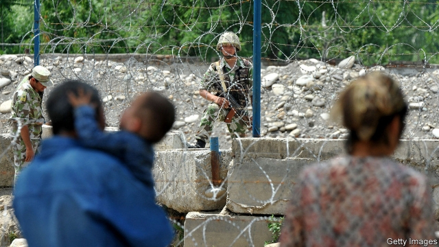
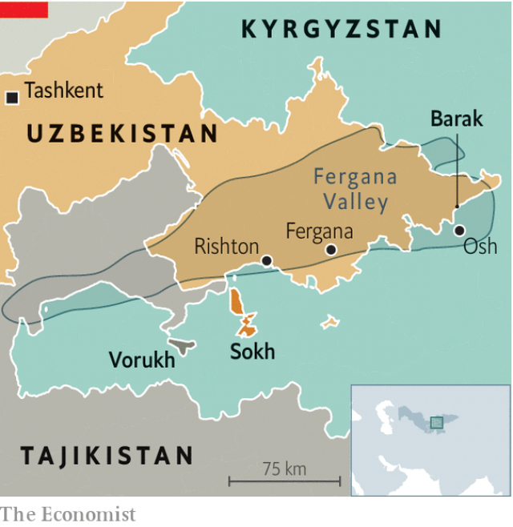

###### Stalin’s splatter

# Convoluted borders are hampering Central Asian integration 

 

> print-edition iconPrint edition | Asia | Nov 2nd 2019 

THERE WAS jubilation in August in Rishton, a town in the bit of the Fergana Valley that lies in Uzbekistan, when the gates of a nearby border checkpoint with Kyrgyzstan were unlocked for the first time in almost seven years. The opening reduced the length of the journey to Sokh, an island of Uzbek-governed territory surrounded by Kyrgyzstan, from 150km to 50km. As the crossing was reopened, officials from both countries waxed lyrical about a renewed spirit of fraternity. Kyrgyz and Uzbeks—both Turkic-speaking, Muslim peoples—are “like a bird with two wings”, mused Akram Madumarov, the governor of the province on the Kyrgyz side of the border. “If one wing is missing, the bird cannot fly.” 

The next day, the bird’s wings were clipped as the border gates were slammed shut again. In early September the road leading out of Rishton towards Sokh ended in a tangle of barbed wire, the Uzbek flag fluttering forlornly rather than festively. “The Kyrgyz are our friends and brothers,” said a cheery Uzbek border guard patrolling the closed frontier, who could not explain why it was sealed. Officials have unconvincingly blamed divergent food-safety standards. 

 

Indeed, for all the talk of brotherly love, perhaps a more revealing moment came two weeks later, when a shoot-out at another border post in the Fergana Valley, between Kyrgyzstan and Tajikistan, left four border guards dead. That was the third fatal incident on the Kyrgyz-Tajik border this year. Three villagers have been killed in two clashes near another Fergana Valley exclave, Vorukh, a Tajik-governed territory encircled by Kyrgyzstan. This is one of nine pockets of land in the valley that are ruled by one country but surrounded by another (see map). 

For most of the 20th century the borders that divide the Fergana Valley today were merely internal administrative boundaries within the Soviet Union. Ordinary people could travel more or less freely between Soviet republics, to visit relatives, say, so it mattered little that the lines sliced up the region haphazardly. Although Soviet mythology holds that Stalin designed the cartographical crazy quilt to undermine Central Asian solidarity, in practice the divisions were the result of horse-trading by local power-brokers keen to keep particular locations in their fiefs. In addition, every Soviet republic was supposed to have a population of at least 1m. The result was meandering frontiers that do not even follow the region’s already muddled ethnic divisions. Sokh, for instance, although part of Uzbekistan and encircled by Kyrgyzstan, is peopled mostly by Tajiks. 

After the Soviet Union collapsed in 1991, the notional boundaries became firm borders. Herdsmen were suddenly cut off from their pastures and farmers from their wells. Border conflicts became, and remain, fairly common. They erupt over seemingly petty matters—the placing of electricity poles, say—the cause of the dust-up that led to the closure of the border crossing near Rishton in 2013. It does not help that the Fergana Valley is Central Asia’s most densely populated region, and that ethnic violence can quickly intensify. In the city of Osh in southern Kyrgyzstan, clashes between the Kyrgyz and Uzbek communities in 2010 left 470 people dead. 

Kyrgyzstan and Tajikistan dispute half of their 1,000-kilometre frontier, using different historical maps to support conflicting claims. Until recently Uzbekistan, too, was quick to bicker about borders, threatening to go to war over water-sharing and even mining its frontier with Tajikistan. As Central Asia’s most populous country and the only one that borders all the others, Uzbekistan was ideally placed to impede regional integration. 

But after Uzbekistan’s dictator of almost 30 years died in 2016, his successor, Shavkat Mirziyoyev, abandoned prickly isolationism in favour of engagement. He has ordered the opening of more frontier posts and pledged co-operation over hydropower. He has also signed border agreements with both Tajikistan and Kyrgyzstan. A separate treaty with Kyrgyzstan will soon wipe one of the region’s exclaves, Barak, off the map, as part of a land swap. The results of Uzbekistan’s overtures are tangible: trade with its neighbours shot up by 54% last year. 

But the re-sealed border between Rishton and Sokh shows that travel around the Fergana Valley remains far from frictionless. “What can we do?” shrugged one Sokh resident. He was boarding a bus in Fergana, the provincial capital in Uzbekistan proper that oversees exclaves like Sokh. His journey home entails a long detour because of the closed crossing-point at Rishton. “We haven’t been able to travel freely since Soviet times,” he says philosophically. ■ 

