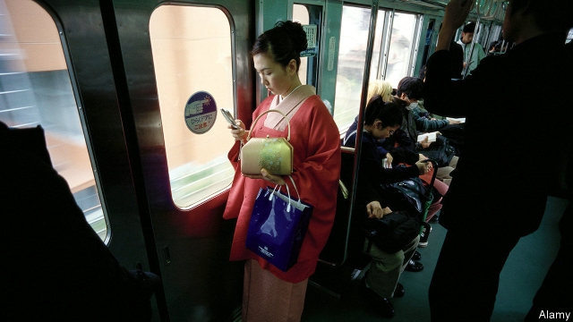

###### Pervert alert

# Japanese commuters try new ways to deter gropers 

 

> print-edition iconPrint edition | Asia | Nov 2nd 2019 

THROUGHOUT HER 20s, Yayoi Matsunaga was groped, almost daily, on packed rush-hour trains going to and from work. Three decades later, she discovered that her friend’s daughter was being molested on her commute to high school. The teenager, after fruitless talks with the police and railway companies, decided to hang a sign from her bag that read: “Groping is a crime. I will not cry myself to sleep.” The groping stopped immediately. Inspired, Ms Matsunaga launched a crowdfunding campaign in 2015 to create badges with the same message. They proved as effective as the sign: nearly 95% of users stopped experiencing groping on public transport, according to a survey. 

Recent years have seen a flurry of innovations in the fight against groping—chikan in Japanese—in addition to the many train services that offer carriages which only women can use, or have installed ceiling cameras in the hope of catching molesters on film. Nari Woo and Remon Katayama of QCCCA, a startup, have launched “Chikan Radar”, an app that enables users to report groping and thus see where it is common. Since its launch in August, 981 cases have been reported across Japan. The Tokyo Metropolitan Police have also created an app, “Digi Police”, that, when activated, screams “Stop it!” and produces a full-screen message that says: “There is a molester. Please help.” Shachihata, a company that sells personal seals, has developed a stamp that allows victims to mark their attackers with invisible ink, which can be detected under ultraviolet light. A trial run of 500 anti-groping stamps, priced at ¥2,500 ($23), sold out within 30 minutes. 

There were 2,943 reported cases of groping in Japan in 2017, mostly in Tokyo. The true number of victims is undoubtedly far higher. Surveys suggest that half or more of female commuters have experienced it, although only 10% of victims report the crime to police. Some hold back out of fear and embarrassment; others because they do not want to be late for school or work. “We are socialised to think that groping is not a big deal,” says Ms Woo. 

Groping has long been trivialised as a nuisance rather than a form of sexual assault, says Masako Makino of Ryukoku University. Offenders face up to six months in prison or fines of up to ¥500,000. (The potential sentence rises to ten years if violence is involved.) 

It does not help that the media tend to focus on stories about men who have been falsely accused of groping. A book and film about a man unjustly accused of molesting a schoolgirl became a hit in 2007. Insurance firms provide policies that defray the cost to commuters of fighting accusations of groping. But Ms Matsunaga, who now runs an organisation called the Groping Prevention Activities Centre, remains hopeful: “I believe that we will be able to eliminate groping.” ■ 

