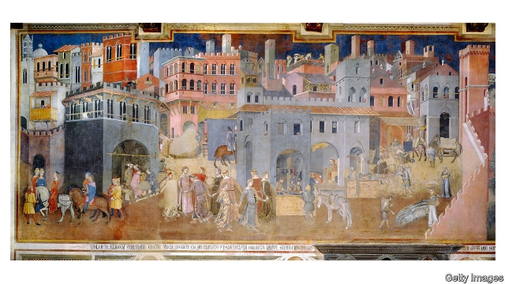

###### Art therapy

# A writer’s meditation on painting, life and history 

 

> print-edition iconPrint edition | Books and arts | Nov 2nd 2019 

A Month in Siena. By Hisham Matar. Random House; 126 pages; $27. Viking; £12.99. 

JABALLA MATAR was a businessman and dissident in Muammar Qadaffi’s Libya. In 1979 he fled to Cairo with his family. One afternoon in 1990, when his son Hisham was 19 and studying in London, Jaballa was “kidnapped, bundled into an unmarked airplane and flown back to Libya. He was imprisoned and gradually, like salt dissolving in water, was made to vanish.” 

Jaballa has been missing ever since, an absence that has been the central preoccupation of Hisham Matar’s work. He wrote about it in “The Return” (2017), which chronicles a journey to the country of his birth and his attempt to trace his father (who may yet be alive), or to find out what happened to him (more likely, he was one of the estimated 1,270 victims of the massacre at Abu Salim prison in 1996). 

“The Return” won a Pulitzer prize, but in terms of Mr Matar’s questions, it comes up empty-handed, the answers remaining elusive. “A Month in Siena”, a slim bewitching meditation on art, history and the relationship between them, offers some of the resolution that its author is still seeking, if not in the form he originally hoped for. 

Mr Matar’s pilgrimage to Siena and his quest to unravel the disappearance are not as unrelated as they may at first seem. Around the same time that he “lost” his father, and “for reasons that still remain unclear to me now”, he writes, “I began to visit the National Gallery in London every day during my lunch break.” He became fascinated by the work of Duccio di Buoninsegna, a Sienese painter, whose “Annunciation” and “Jesus Opens the Eyes of a Man Born Blind” are in the gallery’s collection. For Mr Matar, Duccio was a gateway to the rest of the Sienese School, which emerged in the 13th century and lasted into the 15th, and which stands apart from other contemporary movements, “neither Byzantine nor of the Renaissance, an anomaly between chapters, like the orchestra tuning its strings in the interval”. 

The Tuscan city of Siena itself appeals to Mr Matar for having favoured civic rule at a time when many other Italian city-states were controlled by the Catholic church or the aristocracy. The paintings that he travels to Siena to see, during the sojourn of his title, reflect this context. They are the three frescoes by Ambrogio Lorenzetti that were commissioned for the Palazzo Pubblico (town hall) in 1338: “Allegory of Good Government”, “The Effects of Good Government” (pictured) and “The Effects of Bad Government”. Mr Matar goes repeatedly to the Palazzo Pubblico to look at the frescoes, admiring their celebration of civil society. Besides their political import, visiting them is an opportunity “to grieve alone, to consider the new terrain and to work out how I might continue from here”. 

He takes Italian lessons, cooks himself baby artichokes, befriends a Jordanian who has lived in the city for 30 years; he observes the “sex on the surface of everything” that is particular to Italy but reminiscent of Libya. He considers his wife, who will probably never meet his father, overlaying the history of art onto the present in the manner of John Berger or Teju Cole, two similarly associative writers. 

There are ambulatory musings on the fabric of cities and the rips in it, as when Mr Matar uses the anti-Semitism and Islamophobia unleashed by the Black Death to hint at today’s politics. The result is an intensely moving book, at once an affirmation of life’s quiet dignities in the face of loss, and a portrait of a city that comes to stand for all cities—which exist, Mr Matar postulates, to “render us more intelligent and more intelligible to each other”. ■ 

