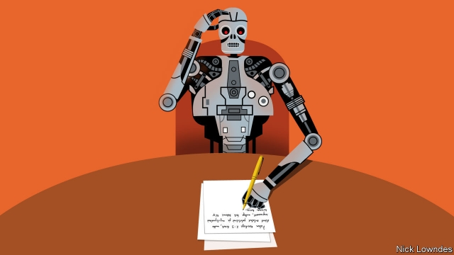

###### Johnson

# Don’t fear the Writernator 

 

> print-edition iconPrint edition | Books and arts | Nov 2nd 2019 

MANY PEOPLE will be familiar with automated writing through two features of Gmail. Smart Reply proffers brief answers to routine emails. If someone asks “Do you want to meet at 3pm?”, Gmail offers one-click responses such as “Sure!” More strikingly, Smart Compose kicks in as you write, suggesting endings to your sentences. Both are not only rendered in flawless English; they often eerily seem to have guessed what you want to say. If someone sends bad news, Smart Reply might offer “Ugh.” 

The New Yorker’s John Seabrook recently described a more powerful version of this technology, called GPT-2, which can ably mimic his magazine’s style. Such systems use a digital network of billions of artificial “neurons” with virtual “synapses”—the connections between neurons—that strengthen as the network “learns”, in this case from 40 gigabytes-worth of online writing. The version Mr Seabrook tested was refined with back-issues of the New Yorker. 

The metaphor of the brain is tempting, but “neurons” and “synapses” deserve those scare-quotes. The system is merely making some—admittedly very sophisticated—statistical guesses about which words follow which in a New Yorker-style sentence. At a simple level, imagine beginning an email with “Happy…” Having looked at millions of other emails, Gmail can plausibly guess that the next word will be “birthday”. GPT-2 makes predictions of the same sort. 

What eludes computers is creativity. By virtue of having been trained on past compositions, they can only be derivative. Furthermore, they cannot conceive a topic or goal on their own, much less plan how to get there with logic and style. At various points in the online version of his article, readers can see how GPT-2 would have carried on writing Mr Seabrook’s piece for him. The prose gives the impression of being human. But on closer inspection it is empty, even incoherent. 

Meaningless prose is not only the preserve of artificial intelligence. There is already a large quantity of writing that seems to make sense, but ultimately doesn’t, at least to a majority of readers. In 1996 Alan Sokal famously submitted a bogus article to a humanities journal, with ideas that were complete nonsense but with language that expertly simulated fashionable post-modernist academic prose. It was accepted. Three scholars repeated the ruse in 2017, getting four of 20 fake papers published. Humans already produce language that is devoid of meaning, intentionally and otherwise. 

But to truly write, you must first have something to say. Computers do not. They await instructions. Given input, they provide output. Such systems can be seeded with a topic, or the first few paragraphs, and be told to “write”. While the result may be grammatical English, this should not be confused with the purposeful kind. 

To compose meaningful essays, the likes of GPT-2 will first have to be integrated with databases of real-world knowledge. This is possible at the moment only on a very limited scale. Ask Apple’s Siri or Amazon’s Alexa for a single fact—say, what year “Top Gun” came out—and you will get the answer. But ask them to assemble the facts to prove a case, even at a straightforward level—“Do gun laws reduce gun crime?”—and they will flounder. 

An advance in integrating knowledge would then have to be married to another breakthrough: teaching text-generation systems to go beyond sentences to structures. Mr Seabrook found that the longer the text he solicited from GPT-2, the more obvious it was that the work it produced was gibberish. Each sentence was fine on its own; remarkably, three or four back to back could stay on topic, apparently cohering. But machines are aeons away from being able to recreate rhetorical and argumentative flow across paragraphs and pages. Not only can today’s journalists expect to finish their careers without competition from the Writernator—today’s parents can tell their children that they still need to learn to write, too. 

Aside from making scribblers redundant, a common worry is that such systems will be able to flood social media and online comment sections with semi-coherent but angry ramblings that are designed to divide and enrage. In reality, that may not be much of a departure from the tenor of such websites now, nor much of a disaster. Perhaps a flood of furious auto-babble will force future readers to distinguish between the illusion of coherence and the genuine article. If so, the Writernator, much like the Terminator, would even come to do the world some good. 

