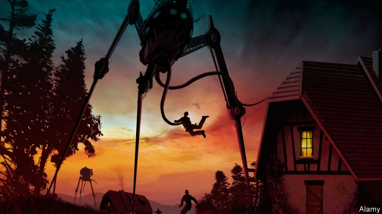

###### War of the words

# H.G. Wells and the underbelly of modernity 

 

> print-edition iconPrint edition | Books and arts | Nov 2nd 2019 

Inventing Tomorrow: H.G. Wells and the Twentieth Century. By Sarah Cole. Columbia University Press; 392 pages; $35 and £27. 

IN AN EPISODE of “Downton Abbey”, Maggie Smith’s character, Violet Crawley, expresses horror at the brisk march of innovation. “First electricity,” she complains, “now telephones; sometimes I feel as if I were living in an H.G. Wells novel.” It is an apt line, for Wells (1866-1946) believed that modernity presented a “bristling multitude” of problems—and that fiction was the best medium through which to examine them. Combining a gift for shrewd social commentary with far-reaching prophecy, he foresaw inventions such as television and air-conditioning, as well as coining the terms “war of the worlds”, “atomic bomb” and “time machine”. 

Yet despite his blazing intuitions and his sense of the darker repercussions of technological progress, Wells is now an unfashionable figure. Virginia Woolf lumped him together with Arnold Bennett and John Galsworthy as drab “materialists”— writers prosaically interested in the fabric of the world, rather than the inner life. That judgment caught on. Today only a few of Wells’s books are much read, and they are studied more often than enjoyed. His style, shaped by a mission to educate, can seem pedantic. Readers balk at his passion for eugenics, attitude to what he called “the inferior races” and tendency to trivialise women. A glut of biographical material has suggested that he was a petulant egomaniac who treated personal relationships like experiments. 

In “Inventing Tomorrow”, Sarah Cole of Columbia University sets out to reclaim Wells as a visionary and a radical. Without denying his flaws, she characterises him as a “global thinker”, and her dense, ultimately rewarding book shows the grand sweep of his interests and erudition. Ms Cole does not dwell on the details of his biography—the suburban childhood in a bug-infested house in Kent, or his being judged, at 13, too unrefined to be an apprentice to a draper. Instead she concentrates on his ideas: on the importance of scientific education, the hazards of genetic engineering, the violent wastefulness of Western culture, nuclear proliferation, and the need to eradicate national identity and launch a socialist world-state, in which everyone would speak a single language. 

Wells was sure that imaginative literature had a crucial role to play in public conversations about these subjects. Yet for a book that seeks to present him as a writer deserving a mass audience, “Inventing Tomorrow” is sometimes hard going. Ms Cole’s own phrasing can be opaque. She applauds Wells’s novel “Ann Veronica” for the “jouissance it purveys” and “The Island of Doctor Moreau” for the “hybridity it literalises”, and refers to his work being “washed by waves of violence and decimation”. 

Still, she succeeds in calling attention to the expansiveness of Wells’s thinking. And she investigates neglected areas of his writing, among them the pacifist pamphlets he produced during the first world war; she is especially enthusiastic about lesser-known novels such as “Mr Britling Sees It Through” (1916), which pictures the impact of conflict on non-combatants, and the heftily philosophical “The World of William Clissold” (1926). Some of Wells’s ideas and personal traits were certainly rebarbative, but he emerges from this wide-ranging account as a passionate and persistent advocate of social change, and of literature’s capacity to shape it��driven as he was by the belief that modern life is a “race between education and catastrophe”. ■ 

