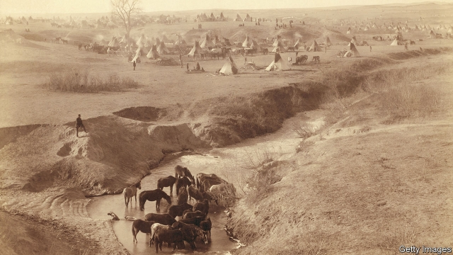

###### Dual destiny

# The forgotten empire of the Lakota 

 

> print-edition iconPrint edition | Books and arts | Nov 2nd 2019 

Lakota America. By Pekka Hamalainen. Yale University Press; 544 pages; $35 and £25. 

THE LAKOTA, a division of the Sioux nation, were long dismissed as “a foil of the American condition”. Like other Native Americans, writes Pekka Hamalainen of the University of Oxford (also the author of “The Comanche Empire”), they were seen as the helpless “victims” of Manifest Destiny—foes of the Lewis and Clark expedition, General Custer’s nemesis, the martyrs of the Wounded Knee massacre. 

In “Lakota America”, a comprehensive history of the tribe, Mr Hamalainen portrays them as trailblazers of empire, and forceful actors in the power games of North America. Far from fleeing the onslaught of civilisation, the Lakota’s hot pursuit of beaver and buffalo drew colonial traders into the West in their wake. Over 200 years they morphed from trappers wielding stone axes along the Mississippi to “the pirates of the Missouri”, exacting tolls on commercial river traffic, and then to nomad warlords of the Great Plains. 

The Lakota and American empires were similar. The Lakota had their own version of Manifest Destiny through their hold on the Black Hills (in what became South Dakota and Wyoming), which they believed to be the birthplace of humanity. “The Mysterious One has given us this place,” says a chieftain in an origin myth, “and now it is up to us to try to expand ourselves.” In fact, the Black Hills had been seized from other tribes through conquest. “In this we did what the white men do when they want the lands of the Indians,” said a Lakota representative in 1851. They frequently drove occupiers from their homes and forced others into quasi-serfdom. 

Unlike European settlers, however, the Lakota did not segregate other peoples, absorbing native and European allies into their kinship system through adoption or marriage. And unlike the United States, when they conquered they did not claim the land itself but its resources, imposing control over buffalo, water, food and people. By 1876 their territory stretched from Kansas to the Canadian border, and from the Mississippi to the Rocky Mountains. 

Time and again, outside powers were forced to accommodate them. The Lakota were adept at playing the wasicus [white men] against each other. In the 18th century’s swirl of colonial rivalries, they and their allies parlayed loyalties into guns and used them to fight opposing tribes. Coveting their hold on the Missouri trade in beaver pelts, and “because of their immense power”, President Thomas Jefferson wanted Lewis and Clark to win their allegiance. Even with the advent of the reservation system, the Lakota were not boxed in. They flouted reservation borders, believing they had sovereignty wherever the buffalo roamed. They used a treaty conference to claim lands that did not belong to them. 

But Lakota power was brittle. Their empire was built on unsustainable resources such as the declining buffalo population. After the United States decimated that species in the late 19th century, the Lakota fell rapidly. They had to rely on food handouts; the army confiscated their horses and guns. Still, while there was no escaping the flood of American “progress”, Mr Hamalainen shows that, for a time, some indigenous tribes surfed the crest of the wave. ■ 

