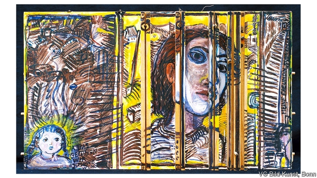

###### Wire in the blood

# Thirty years after the Wall fell, East German art is causing a stir 

 

> print-edition iconPrint edition | Books and arts | Nov 2nd 2019 

A NEW TREND swept through East Germany’s underground art scene in the 1980s: window blinds. Called “Rollos” in German, these foldable, commercial blinds were an instant hit as an alternative to traditional canvases. They were cheap and widely available, an important consideration in a pinched socialist economy. They were visually interesting, and fun to paint on. And, crucially, they were perfect for evading censors. 

Artists painted on Rollos, then unfolded them in spontaneous group shows in churches or homes. Then they stashed them away again before the authorities could intervene. After the Berlin Wall fell in November 1989, the flimsy material remained popular, capturing, as it seemed to, the mood of upheaval and transience. Some artists hoarded blank Rollos, utilising them long after the German Democratic Republic (GDR) expired. 

Rollo art is one of many bold creative experiments that undercut the GDR’s reputation as a desert of dour Socialist Realism. Long derided as the obsolete propaganda of a collapsed state, GDR-era art is now experiencing a revival. Several major shows have introduced it to a wider audience; prices for some artists are rising. Alongside names that were already celebrated in the socialist era, less well-known aspects of East Germany’s creative legacy are belatedly winning attention. It helps that the GDR’s rebels, especially its female artists, tackled issues that continue to be relevant: surveillance, gender inequality, self-discovery and sexual liberation. Their subversive and often humorous paintings, performances, prints, collages and texts have lost none of their provocative power. 

“Making art ourselves, that was a lifeline,” says Gabriele Stötzer, one of the GDR’s most radical writers and artists, from her home in the East German city of Erfurt. “Art needs a public, and we were at least our own public.” As a young woman, Ms Stötzer was imprisoned for signing a petition in support of Wolf Biermann, a dissident singer. After her release, she says, she was no longer afraid of anything. She ran an underground gallery, which was shut down by the Stasi. All around her, she saw her fellow artists being silenced, exiled, driven to depression or suicide. Through art, she reminded herself that she existed. She made her own clothes, and her own plates and cups. She covered herself with ketchup and pressed herself against a wall, “just to leave a trace, just to see that I am here.” 

Together with other women, she experimented with film, photography, performance, concertina books and Rollos. In 1989 she helped storm the Stasi’s local headquarters in Erfurt, preventing its goons from destroying their surveillance files. She knew the building, having been held in solitary confinement and interrogated there. “These days I’ve been rehabilitated a bit,” Ms Stötzer says wryly. “As an artist, I now have one show after another.” 

For many, such recognition was a long time coming. After Germany reunified in 1990, it was not just state-supported artists from the GDR who found themselves adrift. Many alternative spirits also struggled to adjust to the West’s competitive, individualistic art market. “They thought, ‘Now our time has come.’ But no one was interested in these artists,” says Hilke Wagner, director of the Albertinum museum in Dresden. The Albertinum hosted the GDR’s official art exhibitions and collected established artists. One museum consistently bought East German avant-garde art before and after the Wall fell: the Brandenburg State Museum of Modern Art (BLMK), which has sites in Cottbus and Frankfurt an der Oder. Here, in provincial cities close to the Polish border, on the political and cultural margins, curators were freer. 

Now Brandenburg is reaping the rewards of saving treasures that others neglected. “I don’t even want to put this GDR label on everything. We look at it as art,” says Ulrike Kremeier, the BLMK’s director. On a recent tour of one of its buildings, the Dieselkraftwerk in Cottbus, she proudly gestured at rooms filled with big, vibrant Rollos. Four by Angela Hampel show a sequence of falling women. Another, by Sabine Herrmann, depicts a woman kneeling and bowing her head as if to shake out her hair. The museum owns a unique collection of GDR-era photography, as well as its trove of Rollos. It bought early paintings by A.R. Penck and Neo Rauch, now known around the world, and works by women such as Ms Stötzer, Cornelia Schleime, Doris Ziegler and Sigrid Noack. 

These days, glitzier institutions borrow from this hoard. Works by Ms Stötzer are on loan at the Galerie für Zeitgenössische Kunst in Leipzig. Other pieces are due to be shown in an exhibition at the Albertinum next year. Word has spread farther afield, too. In 2018 a team from the Museum of Modern Art in New York visited Cottbus to study the collection. Female artists from countries behind the Iron Curtain, including the GDR, are at the heart of a show at the Wende Museum in Culver City, California, which opens on November 10th (the day after the Wall fell). Susanne Altmann, the curator, says these women took aesthetic as well as political risks: “To paint on film, to paint on photos, to paint on Rollos, these are all aesthetic transgressions that required a lot of courage.” 

The resulting work reflects the repressive circumstances of its creation. When Ms Schleime was banned from exhibiting her paintings and drawings, she turned to performance art, using her own body as material. She stripped naked and painted eyes on herself. She wrapped herself in wire. “You can’t tear the body off a wall”, she commented, “the way officials once tore down a drawing of mine.” A certain pragmatism is also characteristic of the era. Christine Schlegel, whose colourful Rollos feature at the Wende Museum, initially started painting on window blinds to enliven her child’s bedroom, says Ms Altmann. When she left for the West, she took her Rollos with her. 

Yet despite this bygone historical context, many of these works feel surprisingly timely. A photo of Ms Schleime covered with painted-on eyes could be a comment on privacy and exposure in the internet age. Annemirl Bauer’s “Untitled (Woman and Child behind Bars and Barbed Wire)”, painted on a discarded wardrobe door in 1985 (pictured), is reminiscent of latter-day images of migrant families detained at the American border. In Cottbus experimental photography from the 1980s was recently juxtaposed with a new series of photos of former neo-Nazis having their tattoos removed. 

The GDR’s rebel artists show no signs of quietening down. A Rollo that Ms Hampel painted in 2010 presents a defiant, red-haired woman reaching out as if to warn the viewer. Decades after reunification, she continued painting on the blinds. She no longer needed to outfox censors; she had simply grown fond of the Rollos, everyday objects that could be turned into art. ■ 

