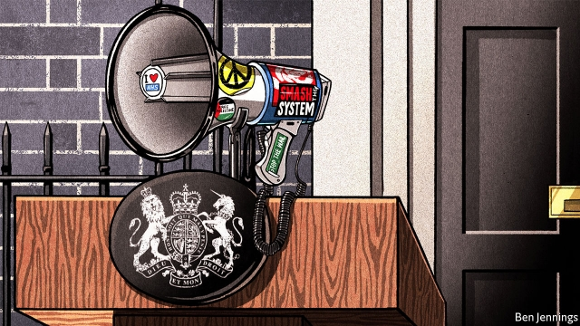
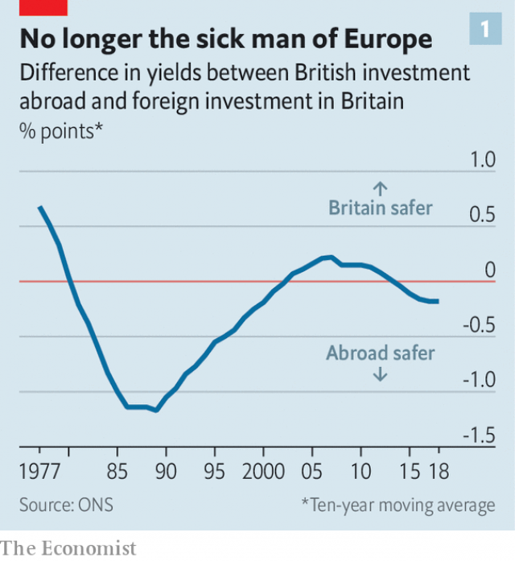
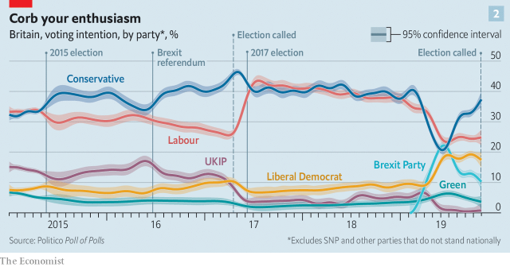
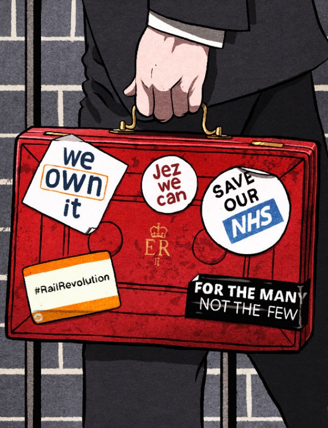

###### Downing Street calling

# A Labour government would radically transform Britain 

 

> print-edition iconPrint edition | Briefing | Oct 31st 2019 

SHORTLY BEFORE the financial crisis of 2008, a little-known Labour MP published a 64-page pamphlet. In “Another World is Possible: A Manifesto for 21st Century Socialism”, John McDonnell laid out an economic vision which clashed with the slick, pro-business mantra of Tony Blair’s New Labour. It praised participatory democracy in Venezuela and hailed co-ops in the Basque country, while calling for the sweeping nationalisation of industry. 

The booklet was an attempt by Mr McDonnell, then on the backbenches, to scupper the coronation of Gordon Brown as leader of the Labour Party and prime minister in 2007. Mr McDonnell attracted the support of just 29 MPs. A little over a decade later, Mr Brown is long gone from politics. New Labour is history. Mr McDonnell is shadow chancellor and Jeremy Corbyn, his friend and socialist ally, is leader. Labour will campaign in Britain’s general election, to be held on December 12th, on the most left-wing platform in a generation. 

The goal, according to Mr McDonnell, is an “irreversible shift in wealth and power in favour of working people”. If the party were to be elected, even as a minority government, it could fundamentally reshape the British economy, to a degree not seen since Margaret Thatcher in the 1980s. 

For a start, the party pledges to end the Conservatives’ programme of fiscal austerity. Reversing cuts to day-to-day department spending since 2010 would cost some £50bn ($64bn, or 2.4% of GDP). At least £25bn a year would be put towards infrastructure investment, in part through the creation of a “national investment bank”. Water and energy firms would be brought into public ownership. The Bank of England would be given a new mandate. The state would forcibly transfer 10% of the equity of large companies to their workers and compel pharmaceutical firms to supply drugs cheaply. Private schools would be abolished. Britain’s working week could fall from five days to four. 

The prospect of a majority Labour government worries most economists. It is not clear that Britain’s public finances are strong enough to allow for a borrowing binge, especially in the face of an ageing population. A credible commitment from the central bank to keep inflation under control, and from the government to respect private-property rights, are the building blocks of a sustainable economy. 

 

Britain is almost uniquely vulnerable to a radical shift in policy. The country runs a current-account deficit of 5% of GDP, large by rich-country standards, meaning that it is highly reliant on inflows of foreign capital. Foreigners own a quarter of the outstanding stock of British government bonds. Investors’ trust in the British government and the country’s institutions, which rose during the 1990s (see chart 1), has already been tested by the financial crisis, the Scottish independence referendum of 2014 and Brexit. A loss of faith would send the pound plunging, increase the cost of government borrowing and imperil financial stability. 

In 2017 a partner at Goldman Sachs remarked, echoing the French President Emmanuel Macron’s quip over his predecessor’s 2012 campaign pledge to set a top income-tax rate of 75%, that Britain under Mr Corbyn would be like “Cuba without the sun.” Mr Corbyn then had a public battle with Morgan Stanley, after the investment bank warned of the dangers of a Labour government. Yet some in the financial establishment have started to look more favourably on the prospect, for two reasons. 

The first is Brexit. The Conservatives have negotiated the hardest of hard-Brexit deals, which the best estimates suggest will cut incomes by 6% in the long run. That is not much less of an impact than leaving the EU with no deal at all. Labour, by contrast, promises to hold a second referendum on Brexit, with a freshly negotiated deal put against staying in the EU altogether. 

Second, the polls suggest that Labour has little chance of forming a majority government (see chart 2). Most probably it would have to rely on the Scottish National Party (SNP) or the Liberal Democrats, which are likely to become the third- and fourth- biggest parties, respectively. In the company of more moderate parties, the argument goes that Labour would have little chance of getting its most radical plans through Parliament. That parliamentary arithmetic, plus the checks and balances on any British government, would thus curb the instincts of a Corbyn government. 

 

At a recent briefing from a big investment firm in London, managers insisted that British assets were now cheap, on the grounds that too many investors did not realise just how constrained Mr Corbyn would be in practice. In September Citi, a bank, suggested that a Corbyn government would be “the more market-friendly election outcome” relative to no-deal under the Conservatives, provided that Labour was in an alliance with the SNP and Liberal Democrats. Deutsche Bank has argued that while “any market-unfriendly policies instigated during a Labour government are temporary”, a no-deal Brexit would be a “permanent shock”. 

Those analysts are making a mistake. Without a majority, Labour would be constrained, but it would still be radical. Compared with most other countries, governments in Britain have unusual powers of discretion to get things done without passing laws. No matter the makeup of Parliament after a general election, an incoming Labour government could overhaul much of the system—and do so fairly quickly. 

Some of this could be for political gain; an attempt to convince the British public that it meant business. Labour could quickly launch pilot schemes on the pros and cons of adopting a “universal basic income”. One Labour policy wonk impishly suggests the incoming government could follow the example of the Bolsheviks in 1917 and immediately publish highly sensitive documents relating to previous governments—perhaps those related to the Iraq war or the Troubles in Northern Ireland. 

It could also pursue more substantive policies. Take government spending. A recent report from the Hansard Society, a think-tank, noted that Britain has “among the weakest systems for parliamentary control and influence over government expenditure in the developed world”. Mr McDonnell could boost spending on public services at a stroke. He could go some way towards creating a national investment bank by boosting funding to the British Business Bank, an existing programme which directs investment to small firms. He would need to seek parliamentary approval for such largesse at a later date. But MPs would have limited opportunities to amend these plans, short of defunding the entire government.  

Without much difficulty, a Labour government could unilaterally raise the minimum wage (currently £8.21 for people aged 25 and over) to whatever level it deemed appropriate. It could also reduce the age at which people are eligible to receive the top rate, to 18. The roll-out of “universal credit”, a hugely unpopular Conservative welfare reform, could easily be halted. That would come close to Mr McDonnell’s pledge to “get rid of the bloody universal credit”. 

Labour’s plans for the Bank of England could also be implemented with little scrutiny. The wording of the Bank of England Act 1998, which enshrines the operational independence of the central bank, leaves plenty of room for change. For a period of three months the Treasury can take over the management of monetary policy “...if they are satisfied that the directions are required in the public interest and by extreme economic circumstances.” 

The act also leaves the door open for more permanent changes. The bank must target “price stability”. Adding a target of 3% productivity growth does not appear to flatly contradict that requirement, especially as the next bit of the act states that the bank must “support the economic policy of Her Majesty’s Government, including its objectives for growth and employment”. An incoming Labour government could probably move the Bank of England from London to Birmingham, as it has said it would like to. Its time in government would probably coincide with the opportunity to pick the next governor. Mark Carney, the incumbent, is leaving the post early next year. The Labour leadership is thought to like Andy Haldane, the bank’s chief economist, who has more left-leaning views on economic policy. 

When it comes to the rest of the programme—including the sweeping nationalisations and the necessary tax increases—legislation would be required. Moderate Labour MPs and trade unions might try and block some of these plans. Mr Corbyn is a life-long critic of both NATO and nuclear weapons. However, unions would hate to see the disappearance of well-paid manufacturing jobs in the arms industry; the party at large retains a militaristic streak. He has therefore pledged to stay in the alliance and continue the renewal of Trident, Britain’s nuclear deterrent. While the country’s soft power could shift, focusing on the pet causes of Mr Corbyn, its hard power would remain unchanged. Britain could be left looking like an NGO with nukes. 

But in the case of domestic economic policy, MPs outside Labour’s inner circle would present less of a problem. Many worry that wealth and income inequality in Britain are too high, and are pleased that someone at last seems to have the courage to do something about it. 

Relying on the MPs of other parties is more likely to gum up the process. The Liberal Democrats would be the trickier partner. Its leader, Jo Swinson, has refused any official partnership with the Labour Party. “We’re going to constrain Corbyn,” says Sir Ed Davey, the party’s finance spokesman. Any support for a Labour government would be both grudging and on a case-by-case basis, particularly as the Liberal Democrat ranks have been bolstered by former Labour MPs such as Chuka Umunna, who partly left the party because they feared Mr Corbyn in Downing Street. 

With a big financial sector in Edinburgh, and a large oil-and-gas industry in the North Sea, the SNP might blanch at any plans to curb banker bonuses or to make life more difficult for carbon-intensive firms. Yet the party has drifted left in recent years, shedding their reputation as “Tartan Tories”. The SNP is hoping to start its own version of a national investment bank north of the border; it has also raised income-tax rates and its water supply is already in public hands. Its real prize is holding another referendum on Scottish independence, something for which Mr Corbyn has recently voiced support. Backing the manifesto of a Labour government is a small price to pay. 

The legal system and the markets would present further obstacles. In a series of lectures earlier this year Jonathan Sumption, a former Supreme Court justice, complained that the law has come to play an overbearing role in political life. Governments may decide they want to do something, but all sorts of legal institutions, from the Supreme Court to the European Court of Human Rights, constrain what is possible. “There’s always someone judicially reviewing you,” huffs one former Conservative chancellor, who, needless to say, did not attempt to nationalise Britain’s utilities during his time in office. 

Legal questions dog Labour’s plans, particularly over policies such as nationalisation. The party insists that Parliament will decide the appropriate price to pay shareholders in Royal Mail, the water companies, and electricity and gas networks. Labour also plays down the significance of forcibly transferring 10% of the value of large companies to their workers. “That’s not a levy,” Mr McDonnell told The Economist, with a grin. “That’s a sharing of the rewards of that particular company.” 

Investors are unlikely to be so relaxed. “The employee-ownership programme proposed by Labour is nationalisation by the front door, back door and side door,” argues one chief executive of a FTSE 250 firm. His company would move to Ireland, and would return only if the Conservatives got into office, he claims. 

If Labour tried to nationalise a company without paying what would reasonably be considered as fair market price, a court challenge would follow. Britain has around 100 bilateral investment treaties (BITs) with other countries, designed with the express purpose of preventing expropriation. Already, firms are shifting the holding companies of their British assets to countries where a BIT exists. 

But the legal system would place only so much of a constraint on Labour’s plans. Though it would be expensive, and therefore win less public support, the party could ward off legal challenges by offering a market price for the companies it wanted to nationalise. Experts disagree over how much that would cost—though the state would be taking on extra debt, it would also be acquiring an asset with a yield. A Labour government could reduce its bill by talking down the companies’ share prices (though this might also face legal challenges). Already, the share prices of firms that Labour has said it will acquire are underperforming the British stockmarket as a whole, according to analysis by The Economist. 

Financial markets might present further problems. Most forecasters believe that a Corbyn government would lead to a depreciation of sterling of around 10%, as well as higher borrowing costs for the government. Though the party promises a second referendum on Brexit, there is little guarantee that it would campaign for Remain with much vigour (Mr Corbyn is a lifelong Eurosceptic). It is even less certain that, in a second referendum, the country would vote the way that the markets want. 

 

Many in the party would welcome a depreciation of sterling, on the grounds that it would help Britain’s exporters. The effect of rising gilt yields would be felt over a number of years, since the higher borrowing costs apply only to newly issued government debt. In any case, points out one adviser to the Labour leadership, after three years of the Brexit process Britons have got used to the pound gyrating all over the place. If market turmoil has not proved to be the undoing of the government’s Brexit strategy, then why should it prove to be Labour’s downfall? 

At some point, ructions in financial markets would force a change—a weak pound makes imports more expensive, trimming living standards. But that point may be further away than many assume. Older Corbynites shudder at the story of the government of François Mitterrand, France’s president from 1981 to 1995. It embarked on a solidly socialist programme but embraced monetarism and budget cuts as it sought to quell the markets and keep the franc pegged to the Deutschmark. Younger ones look with alarm at Syriza, the far-left Greek party which capitulated to the EU after coming to office in 2015. 

Would something similar happen with Labour? Some insiders think that policies such as the employee-ownership fund will be watered down. One Labour politician has been heard to complain that Mr McDonnell has “become like a bloody bank manager these days”. 

But those in the inner circle claim to be steely. Seumas Milne, an adviser to Mr Corbyn, co-wrote an academic article in 1994 which excoriated Mitterrand for selling out. In “People Get Ready: Preparing for a Corbyn Government”, a book published earlier this year, Christine Berry and Joe Guinan, two researchers who are close to Labour, implore the leadership to resist the power of international financiers, even if they accept that what they call a “siege economy” is “not particularly desirable as a long-term solution”. 

Another possibility exists. Even as a Labour government appears to compromise, it could remain radical. It is promising so many things to its potential voters that it does not much matter if it has to bargain some of them away. At the end of five years, Britain’s fiscal and monetary policy could be turned upside down. Investors may have reassessed their view of the country. 

Nor is Labour’s leftward turn likely to be a passing phase. At 70 years old, Mr Corbyn is likely to step down after the election should he fail to win. Those around him are already jostling to take over. Few are lurching to the right in anticipation—the party members, who elect the leader, are Corbynites through and through. Another world has already arrived for Labour. Mr Corbyn and Mr McDonnell will hope another world is still possible for Britain. ■ 

