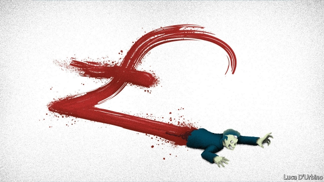
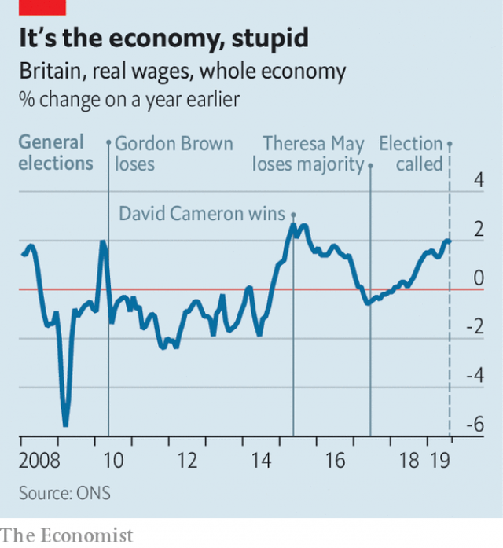

###### The zombie economy

# Britain’s economy is holding up well—for now 

 

> print-edition iconPrint edition | Britain | Nov 2nd 2019 

IN “RESIDENT EVIL 2”, a horror video-game released earlier this year, shooting a zombie does not necessarily kill it. Even after a headshot, the beast may continue to lumber forward in pursuit of the player’s brains. The British economy has behaved in a similar fashion since the Brexit referendum of 2016. Many pundits had predicted that the uncertainty caused by the vote to leave would send Britain into recession, with unemployment shooting up and wages collapsing. But the economy has plodded on. That will work to the advantage of the incumbent Conservative Party at the election on December 12th. 

Smoothing through quarterly data, since the referendum the economy has grown at a quarterly rate of about 0.4% (1.5% on an annualised basis). That is far from impressive by historical standards. Surprisingly enough, however, it is about as fast as the average growth rate across the G7 over the period; President Donald Trump’s trade war has dented global economic growth. And Britain’s labour market has strengthened. The unemployment rate has continued to decline, and now sits around a four-decade low of under 4%. The share of GDP accruing to workers in the form of wages, salaries and employment-related benefits is edging up. 

Two main factors are responsible for this slow but steady performance. For much of the post-referendum period consumers have been doggedly upbeat. Analysis last year from economists at the Bank of England suggested that, since the referendum, spending by Leave voters had grown more quickly than that of Remainers. The tight labour market has supported consumption spending. So has borrowing. Since the referendum, credit-card debt has grown by about 8% a year, a high rate by post-crisis standards. In early 2017 households’ savings ratio (ie, the share of their disposable income which they were setting aside) fell to its lowest level since 1963. 

In recent months growth in consumption spending has slowed—perhaps households became nervous as Brexit day appeared to be just around the corner. Yet another source of demand has taken its place. Breaking from its deserved reputation for fiscal austerity, the Conservative government has turned on the spending taps. A spending review in September promised £13bn ($16.7bn, or 0.6% of GDP) of extra funding for public services and investment. In July doctors and dentists got an above-inflation pay rise. A four-year cash-terms freeze on most working-age benefits will end in April. The budget deficit (ie, the difference between tax receipts and government spending) is once again increasing, having been on a downward path since 2010. 

 

The rise in living standards comes at a useful time for Boris Johnson, the prime minister. In Britain’s three most recent general elections, incumbents did well when real wages were rising smartly, and badly when they were not (see chart). With hindsight, it is clear that Theresa May picked pretty much the worst possible time to go to the polls: in June 2017, the month her snap election was held, real wages fell by 0.5%, largely the result of higher consumer-price inflation caused by the depreciation of the pound. This time, by contrast, Labour’s contention that the British economy needs a complete overhaul may seem less compelling. 

Like a wounded zombie, however, the British economy has not escaped unscathed. One paper from academics at Cambridge University suggests that uncertainty over trade policy has dented export prospects. Fearful of future tariffs on exports, many firms have pulled back from supplying foreign markets. That in part explains why, despite the fall in the value of the pound, which should make Britain’s wares more competitive in foreign markets, there is little sign of an export boom. Meanwhile, recent research from Nick Bloom of Stanford University, and colleagues, suggests that Brexit-related uncertainty has held back business investment—which, in real terms, is no higher than it was at the time of the referendum. 

Low levels of capital spending by firms will weigh on Britain’s productivity, which already has barely grown in the past decade. That will hold back increases in real wages. And the drag from Brexit will become much more noticeable when it actually happens. Over the long run Mr Johnson’s Brexit deal would reduce incomes by about 6% compared with what they would otherwise have been—only a marginally better outcome than the estimated cost of leaving the EU with no deal at all. The paradox of the forthcoming election is that the prime minister is likely to reap the rewards of an unexpectedly strong economy, even as he promises to hobble it. ■ 

