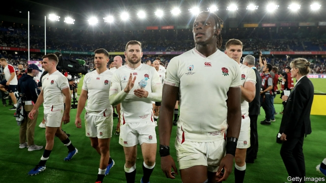

###### Nice try

# English rugby is getting less white, but not much less posh 

 

> print-edition iconPrint edition | Britain | Nov 2nd 2019 

BLEARY-EYED English rugby fans will crowd into pubs early on November 2nd, hoping for a repeat of the fabled World Cup victory in 2003. Against expectations, the men’s national team has already beaten mighty New Zealand at this year’s tournament in Japan. Only South Africa remains. Eddie Jones, the coach, has rewarded youth over experience and selected England’s most ethnically diverse team of any World Cup. Does this mean that “rugger”, a firm favourite of the Old Etonian Boris Johnson, is becoming a true sport of the people? 

The legend goes that rugby was invented in 1823 when William Webb Ellis, a pupil at the fancy Rugby School, picked up the ball during a football match. This is a myth concocted to shore up the upper classes’ claim over the sport, according to Tony Collins, a rugby historian. As the game grew in popularity in northern industrial towns, wealthy teams linked to posh schools outlawed payments to players, to disadvantage teams from poor areas, whose players needed to earn money. This led to a split in 1895. Rugby league, a quicker version of the sport, developed in the north-east. Rugby union flourished in its well-heeled southern heartlands, and went on to conquer much of the rugby-playing world. 

This year over a third of England’s World Cup squad come from ethnic minorities, versus less than a sixth of the total population. Maro Itoje, a star forward, has noted with pride that the Red Roses have never been more diverse. When it comes to class representation, things are less rosy. A majority of the squad attended private schools at some point growing up, against around a tenth of the population. Yet many of the squad gained their school places through scholarships after their talent had been noticed, rather than relying on flush parents. Kyle Sinckler, a hulking forward, started at a London state school that didn’t even have a rugby team. After a teacher spotted his potential he was offered a place at the swanky Epsom College. 

The path to professionalism is still dominated by private schools. The annual St Joseph’s College rugby festival, held at the Suffolk school which charges £36,000 ($46,500) a year, is described by the RFU, English rugby’s governing body, as “one of the most prestigious titles in schoolboy rugby”. This year three-quarters of the teams competing were from private schools. The best young players may find their way into the academy of a top-flight club, and eventually go professional. This largely happens through nominations, helping those with the best contacts. 

The RFU launched a scheme in 2012 to introduce rugby to 750 state schools, focusing on poor areas. It says more than 10,000 youngsters have joined local clubs as a result. But state schools still lack the resources to teach more than a few sports. Many focus on football, which remains far more popular. This helps explain why just 5% of England’s men’s football team came from private schools. 

England’s rugby World Cup team is less white than ever, and may be less upper-class, too. Elite schools’ grip on the sport, however, makes its reputation as a posh pursuit harder to tackle. ■ 

