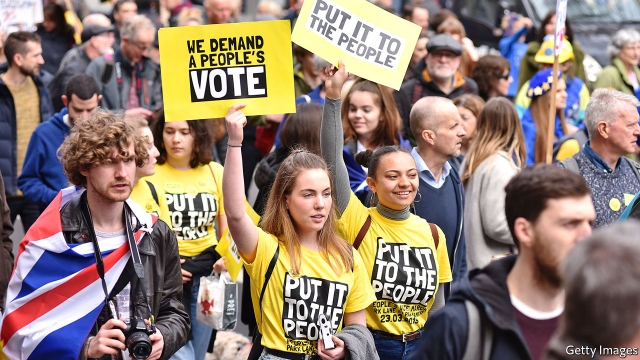

###### Of deadlines and cliff edges

# The risk of no-deal has been postponed, not removed 

 

> print-edition iconPrint edition | Britain | Nov 2nd 2019 

IT WAS A target date to meet, “do or die”. Yet though Boris Johnson said he would rather be dead in a ditch than extend the October 31st Brexit deadline, this week he endorsed an EU decision to push the date back to January 31st 2020. The focus on the election called for December 12th may have disguised this humiliating climbdown, but it is sure to be highlighted by opponents in the campaign. 

For all the government’s (now paused) £100m ($120m) publicity campaign to prepare for Brexit on October 31st, it has been clear for weeks that postponement was likely. Mr Johnson surprised many by securing a new deal on October 17th. But the chances of its being ratified in time for an orderly Brexit at the end of the month were always small. Indeed, Labour’s leader, Jeremy Corbyn, refused to back an election because of the risk of no-deal if there were no extension. Only with no-deal off the table did he deem an election acceptable. 

The EU’s decision was motivated in part by the likelihood of such an election. Yet the new deadline is uncomfortably close. Despite winning parliamentary approval on October 22nd for the second reading of a new withdrawal agreement bill by fully 30 votes, Mr Johnson chose to pull the legislation in favour of his early election. Yet when the new parliament meets shortly before Christmas there will be barely 20 sitting days left to get the bill through before January 31st. 

What happens will depend, of course, on the result. If Mr Johnson wins a majority, he will push ahead quickly with the bill. But if his majority is small, he may still run into difficulties, especially with possible substantive amendments. It is worth recalling that in October 1971, MPs voted by a majority of 112 to approve the principle of joining what became the EU. Yet less than four months later the margin for the subsequent European Communities Act had shrunk to eight votes. 

If Mr Johnson does not win a majority, the withdrawal agreement presumably falls. Labour wants to renegotiate his deal and put it to the people in a new referendum, with Remain as an option on the ballot. The Liberal Democrats propose simply to revoke the Article 50 Brexit request, though they would be likely to support a referendum if they cannot achieve this. So would most other small parties. 

Yet although an election that does not produce a Tory majority is now the clearest route to a second referendum, it is hardcore Remainers who seem most glum. Their expectation that Mr Johnson would find it impossible to get a new Brexit deal has been dashed. So have their hopes of getting a “People’s Vote” before an election. It was fitting that the campaign for such a vote chose this week to indulge in a bout of bloodletting and sackings redolent of the splits in Monty Python’s “Life of Brian” between the different factions fighting for the liberation of the people of Judea. 

The bigger point about Brexit is that, contrary to Mr Corbyn’s claim, no-deal is not off the table. It is not just that the January 31st deadline, which the EU will be reluctant to extend again, is close. It is also that, even if the withdrawal agreement bill becomes law, new deadlines will loom. Talks on a future trade relationship with the EU cannot realistically begin until March. Such a complex trade negotiation usually takes many years. And since it will no longer be conducted as part of the Article 50 divorce, but rather under Article 218, any deal will have to be ratified by all EU national and several regional parliaments, including Wallonia’s. 

It looks highly unrealistic to expect this to be done by the end of the transition period, which broadly freezes the status quo, in December 2020. That period can be extended to December 2022, but a request to do this must be made before July 1st. So within a few months, the prime minister will again face a familiar, agonising choice: does he ask for an extension of the deadline, or does he let Britain leave the EU with no deal at the end of 2020? Mr Johnson makes much of his promise to “get Brexit done” after the election. Yet for most of 2020 Brexit will remain top of the political agenda, no matter who wins. ■ 

