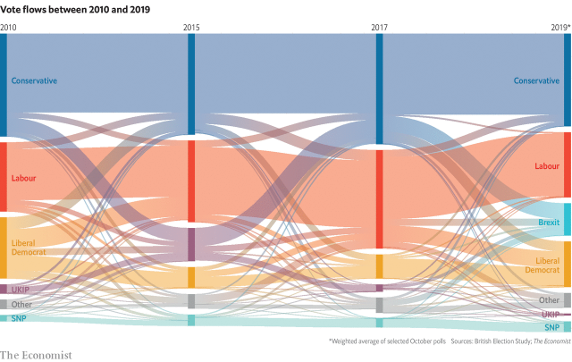

###### The centre folds

# What happened to Britain’s median voter? 

 

> print-edition iconPrint edition | Britain | Oct 31st 2019 

“IMET A man polishing his Ford Sierra—self-employed electrician, dad always voted Labour,” began Tony Blair when describing the type of voter Labour would be after, ahead of his 1997 general election victory. It was, Labour’s thinking went, these middle-of-the-road voters—suburban car-washers in the West Midlands—who held the keys to Downing Street. Two decades later, political parties heading into the election on December 12th will find it much harder to identify the voters who will propel them to power. 

For years, politicos held to the “median-voter theory” beloved by Mr Blair. The idea was that the party that focused on the concerns of the typical voter would triumph, while parties that catered to the fringe would be punished. In this world the centre did more than just hold: it ruled. 

These laws of political science have since come crashing down. Since Brexit sliced through traditional political alliances, politics has become less of a simple matter of left versus right. Parties hammering out manifestos and preparing leaflets for swing seats are thus grappling with “Schrödinger’s median voter”, argues Marcus Roberts, a pollster at YouGov: they are unsure whether this mythical figure is alive or dead. 

If Brexit dominates the coming election, the median voter will be no more. When it comes to leaving the European Union, voters have polarised. There is little sign of compromise between the Remain and Leave camps. Fishing in the gap between these two pools of votes will land few votes, points out Chris Prosser of the University of Manchester. When elections are fought on economic issues, between left and right, political parties can pick a point in the middle and not go far wrong. By contrast, “identity politics do not have give and take,” says Geoffrey Evans of Oxford University. It is relatively easy to compromise on, say, the level of tax. It is harder to do so on notions such as sovereignty. 

As voters are polarising, so are MPs. More than 50 are preparing to stand down in December, including many Tory former Remainers. Most of their successors will be fully paid-up Leavers. 

This division of politics into two opposing camps has been dubbed Ulsterisation. In Northern Ireland, most people vote along sectarian lines. Irish nationalists will not carefully weigh up the economic policy of the Democratic Unionist Party before casting their vote. Nor will ardent unionists consider the merits of Sinn Fein’s social policy. If Brexit divisions persist, British politics could start looking more Northern Irish, with Remain and Leave the new sectarian divide (Remainers have already discovered a love of marches). 

Smaller parties have seized on this strategy. The Liberal Democrats are standing on a policy of revoking Article 50 and cancelling Brexit altogether. At the other end of the political see-saw sits the Brexit Party, which has pledged to quit the EU without a deal. 

In a Brexit-dominated election, few swing voters will switch between these two opposing groups. But plenty of switching could go on within them, says Chris Hanretty of Royal Holloway, University of London. Recent years have seen unprecedented political promiscuity, as Remainers have joined the Lib Dems and Leavers the Brexit Party (see chart). In this sense, the median voters have not disappeared, but fragmented: parties can still chase the centre ground, but only within the confines of their own sectarian group of Remainers or Leavers. 

Not all are convinced that Brexit identities are here to stay. British politics has been marked by extreme volatility of late. Only half of voters backed the same party in the three elections between 2010 and 2017, according to the British Election Study. It is not inevitable, then, that Brexit will be the issue that cements hitherto floating voters into one part of the political spectrum, argues Mr Roberts of YouGov. Talk of an election has already led to a sharp drop in voters highlighting Brexit as the main issue facing Britain, with other topics, such as the health service, rising in salience. 

Others think the median voter has not gone missing but is simply being misidentified. Labour has stopped triangulating on the economy, instead leaping leftward with promises of a much bigger state (see Briefing). The party’s bet is that the median voter is in fact perfectly happy with its left-wing economic policy. 

The Tories have taken a similar approach to social issues. A reluctance to compromise runs through their policies on law and order, which are unapologetically illiberal. The party is betting that the median voter is alive and well, and simply more socially conservative than previously thought. What looks like a failure of median-voter theory is often a failure of commentators to spot where the true median lies, argues James Morris, another pollster. 

Despite their sketchy record on the topic, wonks are still on the hunt for the new Mr Median. Past elections have seen parties target archetypes such as “Mondeo Man”, “Worcester Woman” and “Pebbledash People”. The 2019 contest has already coughed up “Workington Man”, a rugby-league-loving, Leave-voting northerner who, by coincidence, holds many of the same views as Onward, the Tory think-tank that discovered him. Perhaps Workington Man will yet hold the balance of power. But in the polarised campaign ahead, parties seem more intent on rallying their own side than on venturing into the increasingly treacherous middle ground. ■ 

Follow our live poll tracker online at economist.com/britain2019 

