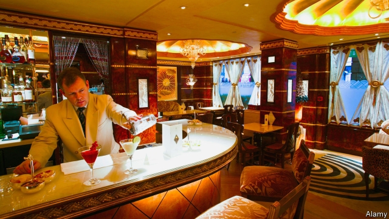

###### Paper chase

# Who will buy Britain’s Telegraph? 

 

> print-edition iconPrint edition | Britain | Nov 2nd 2019 

THE IRON LADY, “strong and bold in character”, is made of gin and champagne. At £24 ($31), the cocktail is overpriced. But so is everything else at the Rivoli Bar in the Ritz, which with its gold leaf and reliefs of naked ladies is where the 1980s went to die. It is the sort of place where you might expect to see a luxuriously whiskered gent settling down with the Daily Telegraph and a cognac. But the 1980s were a long time ago and not many people read the Telegraph any more. Between January 2014 and September 2019 the venerable newspaper’s circulation dropped by 43%, to 310,000. 

That is bad news for Sir Frederick and Sir David Barclay, the 85-year-old twins who own both the Ritz and the Telegraph Media Group. The brothers are looking for buyers for various bits of their empire. The Ritz, a smart London hotel where Margaret Thatcher spent her last days, is in fine fettle, turning a neat annual profit and valued in the region of £800m—not bad for a property bought for a piffling £75m in 1995. 

The newspaper, on the other hand, has fared less well. The brothers bought the Telegraph Media Group, which publishes the daily and a Sunday edition, for £665m in 2004, when the business made £32m in profit and it was still possible for print media bosses to dismiss the internet as a fad. Last year the group’s pre-tax profits fell to £900,000 on revenues of £271m. 

The idea that a print newspaper could still be worth anything like the price the Barclays paid for it—which is reportedly what they are seeking—is optimistic. Suggestions that the Daily Mail and General Trust, which owns the Daily Mail, the Mail on Sunday and Metro, is interested are inaccurate, according to an industry insider, who suggests such rumours are spread to drum up interest. 

What might the paper be worth? Alex Webb, a Bloomberg columnist, reckons less than £100m on the most generous assumptions. The paper has put up an online paywall and is concentrating on subscriptions, but its focus on elderly Brexiteers does not bode well for growing its readership. Yet that does not take into account the Telegraph’s value as a trophy—and as a Boris-whisperer. Despite its financial woes, it remains a mighty force. It is the paper of choice for the wealthier residents of the English shires and is close to Mr Johnson, who, until he became prime minister, was an extravagantly paid columnist. That may be enough for a deep-pocketed investor looking to buy influence in British politics. 

Rumours swirl that the ruling families of Saudi Arabia and Qatar may be interested. The Saudis have some exposure to British media through a 30% stake in the business that owns the Evening Standard. Qatar’s Al Thani family already owns lots of London property and would have a strong negotiating position in a hotel-plus-paper package deal. Axel Springer, a German media giant, is also said to be interested. 

But with an unpredictable election due, the Telegraph’s role as Downing Street’s paper of choice is also up in the air. What is clear, says Claire Enders of Enders Analysis, a research firm, is that “it is not going to be evaluated as a purely financial investment”. As with the cocktails at the Ritz, its worth will be less about its intrinsic value than what it represents. ■ 

