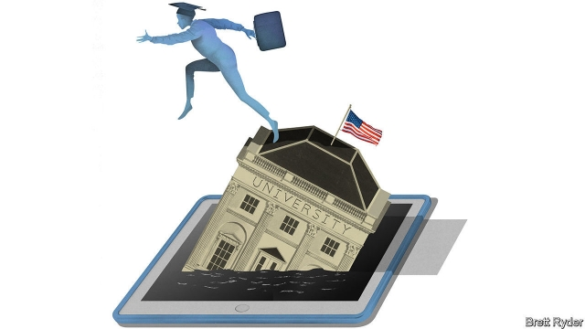
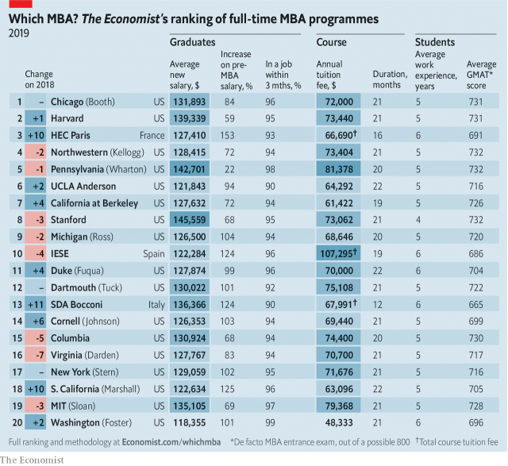

###### The next business revolution

# American business schools are reinventing the MBA 

 

> print-edition iconPrint edition | Business | Nov 2nd 2019 

ON A VISIT to New York in October Marc Benioff, boss of Salesforce, compared Facebook to cigarettes and backed a corporate tax hike to deal with homelessness in San Francisco. If badmouthing a fellow technology giant and cheering the taxman were not heterodox enough for a billionaire entrepreneur, Mr Benioff laid into American management education. It “programmes” students to favour profit over the public good. This, he noted, is out of step with “the new capitalism”. 

Many deans concur. “We need our students to be thoughtful about the role of business in society, particularly at a moment in time when capitalism is coming under attack,” says William Boulding of Duke’s Fuqua School of Business. Nitin Nohria of Harvard Business School (HBS) reports how younger alumni and incoming classes want “the place of work to reflect purpose and values”. Jonathan Levin of Stanford’s Graduate School of Business (GSB) talks of business schools’ responsibility to recognise the societal consequences of corporate actions. “Corporations, their leaders and owners need to act to restore trust,” he intones. 

America’s business schools still dominate our annual ranking of the world’s top MBAs (see table). But the industry is being shaken up. According to the Graduate Management Admission Council (GMAC), an industry association, American MBA programmes received 7% fewer applicants this year than last. Nearly three-quarters of full-time, two-year MBA programmes reported declines from coast to coast. Not even the most illustrious ones were spared: HBS (located in Boston) and Stanford’s GSB (in Palo Alto) both saw applications dip by 6% or so. Schools face growing competition from overseas and online programmes—and, as Mr Benioff’s critique implies, questions over hidebound curriculums. “We’re being disrupted left, right and centre,” confesses Susan Fournier, dean of Boston University’s Questrom School of Business. 

 

When management education boomed in the 1960s, American schools taught mostly American students. As the world economy globalised in the 1980s and 1990s, so too did American curriculums and student bodies. Sangeet Chowfla, who heads GMAC, now discerns a “third wave”: improved schools outside America are letting foreign students study closer to home (and future employers). Many offer cheaper one-year MBAs, popular in Europe but uncommon across the pond. Whereas three in four two-year MBA programmes in America saw declines in overseas applicants in the latest application cycle, numbers applying to Asian business schools rose by 9% from 2017 to 2018. A recent uptick in America’s anti-immigrant sentiment is accelerating the trend. 

Americans, too, are cooling on MBAs. More than half of American schools report fewer domestic applicants. Soaring tuition costs, which have far outpaced inflation, put them off as much as they do foreigners. A top-notch MBA will set you back more than $200,000 (including living costs). Even with financial aid, many students are saddled with $100,000 debts at graduation. The opportunity cost of forgoing two years’ worth of paycheques is higher when the economy is booming and labour markets are tight. Weak demand has caused the number of full-time MBA programmes in America to fall by nearly a tenth between 2014 and 2018, according to the Association to Advance Collegiate Schools of Business, another industry body. 

Geoffrey Garrett, dean of the Wharton School, at the University of Pennsylvania, believes that a flight to quality is benefiting top institutions like his—and their graduates. Add non-wage compensation and alumni often recoup their investments in a few years. Not counting signing bonuses, the average base salary for graduates of the five American schools with the highest earning potential was $139,000. 

Consultancies and investment banks, historically the keenest MBA recruiters, claim their appetite for holders of elite degrees has not diminished. A prestigious MBA “puts a floor on your career”, explains Kostya Simonenko, a 28-year-old consultant on leave from Oliver Wyman (which is paying for his course at Columbia Business School). Silicon Valley, which used to dismiss MBAs as overpaid know-nothings, has become less hostile. As startups grow into large corporations, they need managers to help run things, not just software engineers to run code. A survey of recruiters by GMAC this year found that 80% of technology companies planned to hire MBAs, on a par with consultancies (82%) and financial firms (77%). 

Even the finest schools, though, are not sheltered from the forces buffeting business education. Global competition and new technology platforms enable a lower cost structure for the delivery of high-quality courses. This forces “a reckoning of the MBA value proposition”, says Ms Fournier. 

As part of that reckoning, Questrom has teamed up with edX, a big online-education firm, to offer a full MBA degree online for just $24,000, less than a third of the cost of its on-campus equivalent. Better to cannibalise yourself than let others do it, as Ms Fournier puts it. MIT’s Sloan School of Management provides similarly affordable bundles of online courses, dubbed MicroMasters, in areas like supply-chain management and finance. These grant certificates but the credits will be honoured if a student one day decides to pursue a full degree. 2U, an online-education platform, is introducing deferred-tuition schemes for some hybrid MBA degrees. It will share the upfront costs with its business-school partners; students will pay only when they get a job. 

It is not just how MBA courses are taught that is changing. So, too, is what they teach. Many budding woke capitalists agree with Mr Benioff—and demand to be taught business beyond the primacy of shareholder value. At Stanford Luisa Gerstner, a millennial MBA student from Germany, notes that sustainable capitalism plays a more central role in European schools. Julia Osterman, her American classmate, laments how, despite some social, environmental and ethical topics in its curriculum, core classes are still “too Finance 101”. 

Some of their professors are not so sure. One greybeard at HBS estimates that a third of its faculty (and many older alumni) view the embrace of cuddly “stakeholder capitalism” as an unrigorous sop to political correctness. It certainly introduces lots of grey areas, Mr Boulding concedes. But, he says, schools can at least provide students with “frameworks for making choices”. A new course at Duke is entitled “Capitalism and Common Purpose in a World of Differences”. HBS has made “Leadership and Corporate Accountability” (which delves into “the responsibilities of business to the broader system in which it is embedded”) a required first-year course, with case studies weighing up things like the morality of looking beyond financial metrics at Japan’s Government Pension Investment Fund. 

Curriculums are being transformed in less lofty ways, too. Employers, who partly or wholly bankroll half of all executive education, which earns elite schools between $100m and $150m a year, want it to impart technical skills. In response, deans such as Costis Maglaras, the newish head of Columbia Business School (and an engineer by training), are bolting courses on data, analytics and programming onto the timetable. As their popularity rises, they may displace stodgier subjects. Columbia used to offer several courses on debt markets but now offers perhaps one each academic year. Meanwhile, students have flocked to coding classes. The idea is not to turn business types into boffins but to prepare them to work with and manage technical staff, says Mr Maglaras. A recruiter for a big consultancy affirms that tech-savvy MBAs are “very attractive”. 

Richard Lyons, former dean of the Haas Business School at the University of California, Berkeley, sees the future in providing lifelong professional education as a service: “Give alumni know-how on demand, searchable online.” Scott DeRue, dean of the University of Michigan’s Ross School of Business, is giving alumni tuition-free access to executive education. “The new stuff will come from insurgents, not the big MBA schools,” thinks John Kao, a management guru who formerly taught at HBS. He wants training benchmarks and standardised transcripts to make skills portable and universally recognised. 

At HBS, home to perhaps the most hallowed MBA, Mr Nohria accepts that the market for its traditional offering is shrinking. In a sign of the times, his school has frozen tuition fees. He sees a dramatic expansion for “unbundlers” of online education, who “separate knowing, doing and being”. In time, he says, they will converge with “bundlers” like HBS. Far from collapsing, he reckons, management education will the richer for it. ■ 

