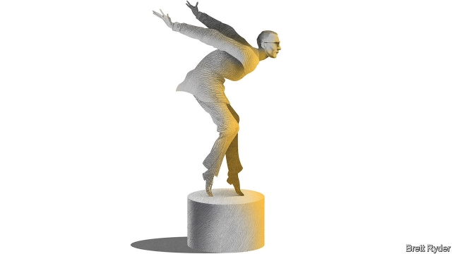

###### Schumpeter

# Peugeot’s boss, Carlos Tavares, plans a merger with Fiat Chrysler 

 

> print-edition iconPrint edition | Business | Oct 31st 2019 

IN 2013 TWO Carloses sat atop the Renault-Nissan alliance. One was Carlos Ghosn, the Brazilian-born architect of the Franco-Japanese carmaking colossus. His protégé was Carlos Tavares, the Portuguese chief operating officer of Renault, who made sure that good cars rolled off the production line. But Mr Tavares, an engineer and racing driver, was not content trailing the fast-living Mr Ghosn. As he revealed in an interview that year, his ambition was to lead a big car company, such as General Motors. Mr Ghosn was horrified. Shortly afterwards, Mr Tavares quit Renault. A few months later he was boss of PSA Group, maker of Peugeot and Citroën, Renault’s domestic rival. It was the start of a series of manoeuvres that have now made him the talk of the car industry, much like Mr Ghosn before and after his arrest in Japan last year on charges of financial misconduct (which Mr Ghosn denies). 

On October 30th the boards of PSA and Fiat Chrysler Automobiles (FCA), an Italian-American company, said the two firms planned to merge. Mr Tavares would become chief executive of the combined group and John Elkann, FCA’s chairman (who sits on the board of The Economist’s parent company), would chair its board. It would create the world’s fourth-biggest carmaker by vehicle sales, with a market value of around $50bn. On-off discussions between the two firms were ruptured in early summer when FCA attempted to merge with Renault, a deal that was thwarted by Renault’s biggest shareholder, the French government. The merged group would probably find most of the €3.7bn ($4.1bn) of annual cost-savings they hope to achieve in Europe, a stagnant market where stringent environmental regulations are about to make carmakers’ lives tougher still. Competition issues in parts of Europe, feisty unions and messy politics could yet scupper any deal. Furthermore, it is not clear whether Peugeot is Fiat’s preferred partner. 

But the planned mega-merger puts the spotlight squarely on Mr Tavares. As Max Warburton of Bernstein, a broker, puts it: “Those of us who subscribe to the Great Man Theory will be fascinated to see what Tavares could achieve at FCA, were he given the chance.” 

The “Great Man Theory” Mr Warburton is referring to states that big car-industry mergers are a murderous task that only a true leader can hope to pull off. Fiat’s revered late boss, Sergio Marchionne, managed this feat with Chrysler. Mr Ghosn succeeded inholding the Renault-Nissan alliance together for many years. 

A corollary to the Great Man Theory is what could be called the “Big Firm Hypothesis”. Typically attributed to Marchionne, it posits that huge challenges facing the industry, such as electric vehicles and self-driving cars, necessitate global consolidation. To an extent Mr Tavares embodies both doctrines, having swiftly turned around first Peugeot, after it was battered by the financial crisis of 2008-09, then Opel and Vauxhall, which he bought from GM in 2017. But what truly sets him apart is his ability to turn carmakers into, as he has put it, “psychopaths of performance”. That tireless devotion to profits, even if it comes at the expense of personal greatness or corporate bigness, is a lesson most of the industry could learn. 

The fraught Renault-Nissan tie-up is a case in point. In the wake of Mr Ghosn’s fall from grace last November it has been an example of how not to run a car empire. Well before his arrest, the arrangement had serious flaws. Rather than being a global network built around strong brands and factory-wide economies of scale, it was more of a global car park. It filled different parts of the world with as many of each firm’s cars as possible (and those of Mitsubishi, the alliance’s other Japanese partner), whatever their price and quality. It was riven with jealousies. Nissan had long chafed at a shareholding structure that gave it less sway than Renault. Worse, the Japanese firm resented the control that the French government, which owns barely 15% of Renault, exercised over the partnership. It also feared French ambitions to take it over. 

Since Mr Ghosn’s arrest things have gone from bad to worse. Renault’s abortive merger with FCA showed what an irksome meddler the French state has become. It has obstinately refused to make any concessions to the wary Japanese, for instance by selling down Renault’s stake in Nissan to rebalance the shareholding or by reducing its own stake in Renault. In the meantime the feud has distracted all three alliance members from the business of selling cars. Nissan’s sales have shrunk. Profits are plunging. Renault’s volumes are dropping, too. Its balance-sheet is coming under strain, especially since it will get less cash from its 43% stake in Nissan, which recently slashed its dividend. 

In the eyes of the French government, the best answer is to double down on the alliance. Renault’s chairman, Jean-Dominique Senard, has vowed to do just that, hoping that a recent change of leadership at the top of both Renault and Nissan will help. Investors would prefer a clearer break with the past. Some want Renault to sell some of its Nissan shares and use the money to strengthen its balance-sheet, as a prelude to a more equitable alliance. Others want a full merger of the two. The boldest had hoped for a grand bargain, in which a stronger Renault once again courts FCA, with Nissan in tow. 

The talks between Peugeot and FCA have, for the time being at least, sent the grand-bargain idea careening off the road. It has left Renault and Nissan looking stranded. That makes it imperative for them to do what Mr Tavares has done with Peugeot, Opel and Vauxhall: put profitability front and centre. As Mr Tavares has said, “there’s going to be chaos between now and 2030. Not all manufacturers will survive the Darwinism, not all will master the electric-vehicle track.” Some regard consolidation as the best way to navigate the disruption. Others see the need for a great leader, who can build and maintain alliances. One thing is certain—none will succeed without a Tavaresque focus on the bottom line. ■ 

