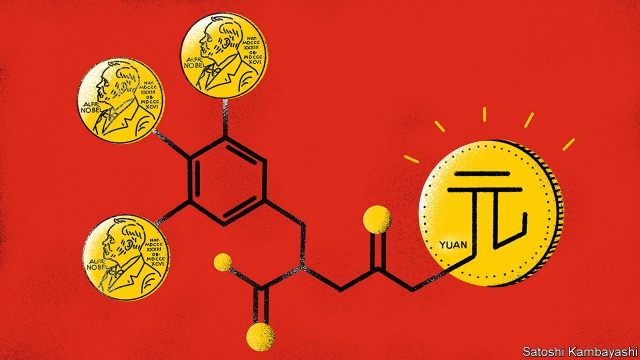

###### Building bridges and selling them, too

# China convenes a giant gathering of Nobel laureates 

 

> print-edition iconPrint edition | China | Nov 2nd 2019 

CHINA REVERES Nobel prizes and it loves things that are big. A four-day forum in Shanghai, under way as The Economist went to press, has been a perfect union of these. It is one of the world’s largest-ever gatherings of Nobel laureates outside the award ceremonies themselves, with 44 attending—mostly scientists, plus a few economists. Winners of prizes such as the Turing award are also taking part. China staged the inaugural World Laureates Forum last year, billing it as a platform for global scientific collaboration. But there is no question that its main goal is the advancement of science in China. At this year’s convention an opening video, set to stirring music, dispensed with subtlety. One segment started with Americans planting their flag on the Moon and culminated in Chinese astronauts holding theirs in space. 

In a letter to the guests, President Xi Jinping said China was willing to work with all countries to cope with the challenges of our age. Yet the concern hanging over Chinese science is whether the West is willing to work with it (see Chaguan). America has been most active in stepping up scrutiny of Chinese researchers, worried that they may be pilfering technology. Others, including Canada and Australia, have also started taking a closer look. 

That is one reason why China is keen to gather foreign laureates. It generates the kind of approbation that it feels it does not get enough of abroad (the Communist-ruled country has produced only one Nobel prize-winner of its own in science). The forum’s participants speak enthusiastically about China’s scientific work. “What the Chinese government understands and is doing well is broad support for basic science,” Roger Kornberg, an American who won the Nobel for chemistry, told state television. It may be that some elderly laureates doddering around the hall are well past their most productive years. But plenty of others are still at the cutting edge. At least 40 have received their various awards in the past decade. One held high office: Steven Chu, America’s secretary of energy under Barack Obama. 

The topics discussed are widely varied, covering fields ranging from dark matter and the atomic analysis of water to pre-term births. “It’s a little too remote from my field to be efficient,” says one European attendee during a break, asking for anonymity to avoid offending his hosts. But China may benefit. The head of a laboratory at a leading American university says he has tentatively offered two postdoctoral fellowships to Chinese he has just met. A biologist from another American university says the forum could draw talent to China. “Back home it’s endless grant applications. Here, they’re promising us stable funding and a pipeline of researchers,” he says. 

The organisers also appear to have a narrower goal in mind. The forum is held on a man-made island on a perfectly circular artificial lake about 70km from downtown Shanghai. The area, known as Lingang New City, feels desolate now, with broad, empty streets and few businesses. Local officials want to make it a technology hub, home to research by the world’s best scientists. They claim already to have signed collaboration agreements with 40 of them. Whether or not these promises come to fruition, the buzz may help Lingang’s marketing as it tries to entice investors. Planners seem to believe that an important commercial application of science is developing valuable property. ■ 

