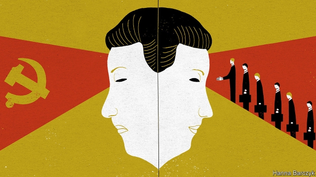

###### Chaguan

# Communists are fascinated by contradictions. China faces a big one 

 

> print-edition iconPrint edition | China | Nov 2nd 2019 

ON PAST FORM, boasts of China’s openness to the world will come thick and fast when President Xi Jinping addresses the Second China International Import Expo in Shanghai on November 5th. Speaking at the inaugural edition of that trade fair last year, Mr Xi cast China as a champion of free trade and mutually beneficial co-operation. Openness brings progress while seclusion leads to backwardness, he declared. Slipping into fluent Globalese, the blandly uplifting argot used at gatherings of world leaders, billionaires and CEOs, Mr Xi beamed that it was natural to share the fruits of innovation “in our interconnected global village”. 

China’s leader has every reason to offer warm words at the upcoming event. Even as his country grows richer and more powerful, it is dependent on the world in ways that it cannot control. China has ambitions to become a standard-setting technology superpower. For all its talk of self-reliance, it needs foreign know-how to get there. In the short term, China is anxious for a truce in its trade war with America. It wants to show other countries that it is a team player, unlike that rule-breaking bully in Washington. Further ahead its economy will need growing room. China is running out of useful places to build shiny airports and high-speed railway lines at home, and wants its own global brands to vie with Boeing or Apple. That will require new markets overseas. 

Yet before he steps to his lectern in Shanghai, Mr Xi must preside over a different meeting, a four-day session of the Central Committee of the Communist Party ending on October 31st. Such conclaves of nearly 400 top officials are typically held every year or so at a high-security hotel run by the People’s Liberation Army in western Beijing. The working language is not Globalese. Communiqués that emerge from these secret meetings are written in unlovely party jargon. State media announced that the plenum would consider “important issues concerning how to uphold and improve the socialist system with Chinese characteristics and make progress in modernising the country’s governance system and capacity”. That sounds dull, but the meaning is serious. Even tighter controls are coming. Clues were dropped this month by an influential party journal, Qiushi, in extracts it published of a previously secret speech in which Mr Xi pondered lessons from history. “Whenever great powers have collapsed or decayed, a common cause has been the loss of central authority,” he concluded. 

Propaganda organs pretend there is no contradiction between these two personas—a smiling President Xi talking to foreigners about global villages, and Xi the general secretary grimly demanding party discipline and vigilance in the face of hostile external forces and internal threats. On the plenum’s opening day, Xinhua, a state news agency, asserted that the world had never seen a governing system with such advantages, combining an “economic development miracle” with a “miracle of political stability”. 

At home, it is fair to concede, many Chinese accept the social contract implicit in that Xinhua commentary, that personal freedoms should be traded for prosperity and order. To outsiders, however, China’s two self-declared miracles are increasingly in tension. For a long time, many foreign admirers of China treated party rule as a bit of a joke. This place has only one ideology, they chuckled: making money. Unfortunately for such people, even as China loosens some rules on market access or foreign investment, the party not only refuses to fade away but is becoming ever more visible and intrusive. Very possibly the guiding ideology is a desire for absolute power, rather than Marxist idealism. In a secretive autocracy, it is impossible to know Mr Xi’s real beliefs. Similarly, outsiders can only guess at the meaning of fawning adulation heaped on him before the plenum, such as by a regional party committee which said officials should, deep in their hearts, “strengthen their trust and love in General Secretary Xi Jinping as the core of the party, the people’s leader and commander-in-chief of the army”. This may reflect Mr Xi’s mightiness, or his weakness and insecurity. But to judge by his actions, Mr Xi has asserted the party’s total authority over China’s system of state capitalism, from law courts to private firms and lumbering state enterprises. And one power-grab often prompts another. When modestly paid bureaucrats have sway over billion-dollar assets at the same time that feistier newspapers are silenced and independent lawyers locked up, it is no surprise that the party has to launch anti-corruption campaigns so fierce that some officials fear taking decisions at all. 

The very complexity of modern Chinese society, with its growing mobility and personal freedoms for those who stay within party-defined boundaries, seems to convince China’s leaders that they must tighten and retighten their grip. Increasingly that involves high-technology systems of control, from algorithms that censor social media, to facial-recognition systems that stop errant citizens from catching high-speed trains. To officials at home, techno-authoritarianism is a saviour. With big data to crunch and nowhere for miscreants to hide, perhaps top-down rule can at last be made to work. Abroad, the trade-offs look different. Not long ago, Silicon Valley investors might have swooned over a mobile-payment system built around Chinese facial-recognition technology, for instance. Now, shrewd fund managers—and young potential consumers in the West—might ask whether the same cameras are used to repress Muslims in the western region of Xinjiang. 

The authoritarian turn that China is taking, in the name of saving one-party rule from itself, is hard to square with a quest for globally driven growth. Already foreign bosses privately admit to wondering, as never before, what it means when a Chinese business partner is a party member. Mr Xi seems to want a China that is open to foreign investors and inventions but closed to dangerously foreign (meaning liberal, Western) ideas. Communists are fascinated by contradictions. This one may prove hard to resolve. ■ 

