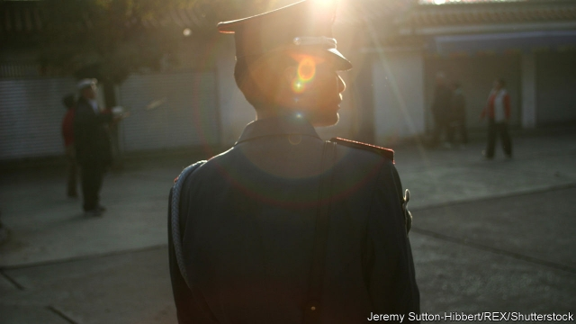

###### A bigger cage

# Justice in China is notoriously harsh, but reforms are afoot 

 

> print-edition iconPrint edition | China | Nov 2nd 2019 

A FEW WEEKS ago, people across China were summoned to government offices. There they were given a piece of paper to sign. It contained several pledges, including not to take part in political protests, not to leave their districts and to keep their mobile phones switched on day and night with GPS enabled. For good measure they were asked to affix their thumbprints. Those breaking their promises could be sure of the risk: imprisonment. 

The “commitments to self-discipline”, as the documents were titled, were part of a nationwide ratcheting-up of security in preparation for official celebrations of 70 years of Communist rule on October 1st. Yet those who agreed to the stipulations had reason to feel relieved. At least they were not in prison already. They were convicts, but serving their sentences at home. 

Justice in China is often harsh. Last year 99% of criminal defendants were found guilty. Only about 800 people were acquitted. China has been reducing the number of capital offences, but it is still believed to execute thousands of people every year, more than the rest of the world combined. In the past two or three years the far western province of Xinjiang has built a vast new gulag where it has interned without trial 1m or more people, mostly ethnic Uighurs, often simply for being devout Muslims. The region is home to less than 2% of China’s people, but last year hosted one-fifth of its criminal prosecutions. 

For some, however, the chance of avoiding jail time has been growing. It used to be that almost all convicted criminals were sent to prison. Minor offenders, such as prostitutes and their clients, were sent to “re-education through labour” camps without even seeing a judge. But in recent years the camps have been abolished and courts have begun experimenting with “correction in the community” sentences instead of locking up people. 

Since these pilots began in 2003, more than 4.3m offenders have served their time outside a cell. Today, about 700,000 are doing so. In some big cities, around 60% of criminal sentences do not involve jail. Instead, convicts usually live at home and, for at least eight hours a month, perform unpaid labour such as cleaning streets or clearing streams. Often they also have to attend at least eight hours monthly of instruction on how to be good citizens. 

For many of those who receive such sentences, the relief must be immense. Torture and other forms of abuse are common in prisons. There is little sign that conditions are improving. Early this century, however, officials began to wonder whether, for less serious crimes, incarceration was effective. Some noted that, despite the large numbers being locked up, crime rates were still increasing. So community service was tried out in a few regions. In 2005 the government adopted a new policy called “balancing leniency and severity”. This meant continuing to impose long jail sentences on people such as violent criminals, corrupt officials and those the Communist Party views as politically dangerous, while punishing petty offenders more lightly. In 2009 the community-corrections system was rolled out nationwide. 

Participants are mainly serving suspended prison sentences of three years or less. They need permission to leave their home districts and are banned from travel abroad. Some are electronically tagged. In addition to their labour duty and study sessions, they have to make contact at least weekly by telephone with a local community-corrections bureau, of which nearly 3,000 have been set up. They are supposed to be offered practical assistance such as help finding work and housing. 

So far the system has been managed with a hodgepodge of regulations that some officials find confusing and lacking in legal weight. To remedy this, the government is preparing a national law on community corrections. On October 21st a second draft of this was presented to senior legislators. As state media pointed out, it included a notable addition. It said that community-corrections work must “respect and guarantee human rights”. The new draft requires that participants’ privacy be protected and their “personal freedom” not be restricted (though they would need permission to leave their hometowns). It says their whereabouts will not be tracked digitally unless they break rules. 

The government has a monetary incentive to encourage community sentences. The cost per convict is about one-tenth of that for prisoners, reckons Wu Zongxian of Beijing Normal University. Benjamin Liebman of Columbia Law School thinks that judges dangle suspended sentences as a reward for defendants who compensate victims. He speculates that judges also sometimes use the community-service approach when they think defendants are innocent. Courts do not want to offend state prosecutors by acquitting people. 

Officials think the system is working. At least while they are enrolled in the scheme, only 0.2% of people re-offend, they say. About 10% of ex-prisoners do. But there is a shortage of well-trained staff. Many of them are former guards at labour camps. They are often more concerned with tracking participants’ movements than with rehabilitating them. The shortage is most acute in rural areas, says Enshen Li of Queensland University. This results in huge unfairness for defendants who have migrated to cities from the countryside. Judges prefer to jail them rather than give them suspended sentences because urban probation officers often refuse to handle them and there is no one in their place of birth to oversee community service. 

Nationwide, the percentage of criminal trials that resulted in community sentences reached around 35% five years ago, according to data collated by Yang Xue of Nanjing Normal University. But since then it has fallen to about 30%. One possibility is that judges are growing more conscious of the system’s flaws. The new law may help allay their concerns. But courts will remain subject to the Communist Party’s whims. In recent months police forces have been vying to outdo each other in their efforts to implement the party’s campaign against “black and evil forces”, a term covering everyone from thugs to labour activists. Those caught can expect no mercy. ■ 

