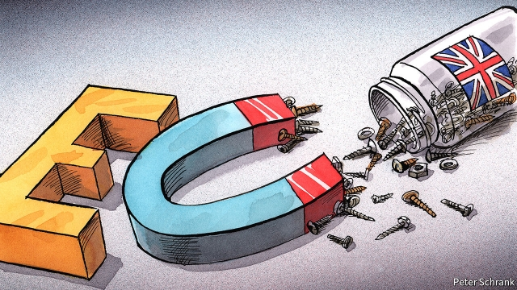

###### Charlemagne

# Britain and the EU will remain close even after Brexit 

 

> print-edition iconPrint edition | Europe | Nov 2nd 2019 

LARGE, BLUE and furry, the bulging-eyed Brexit monster has been spooking Rotterdam for months. Launched ahead of Britain’s scheduled exit from the EU in March, the monster is the mascot of government efforts to brace the Netherlands for the rupture. These have been especially intense at Europe’s busiest port, which handles 40m tonnes of trade with Britain annually. Leaflets showing the monster blocking goods have been distributed to truckers as part of preparations that include creating giant lorry parks, hiring hundreds of staff and obliging firms to register their cargos. Thrice the Brexit monster has haunted the port. Thrice leaders in Brussels have agreed to delays as deadlock has dragged on in London. “Effective from today, the buffer parking locations for trucks will again be dismantled,” announced managers, teeth almost audibly gritted, after the latest postponement on October 28th. 

They are not the only ones to feel mucked around. The Dutch are traditionally among London’s closest EU allies. Though distraught at the Brexit vote—many hoped that Britain would change its mind—they remained initially well-disposed. Your columnist accompanied Theresa May, then prime minister, on her inaugural trip to The Hague in 2016. “My new British colleague!” gushed Mark Rutte, the Dutch prime minister. “So happy to see you!” The goodwill and hopes for a friendly Brexit have since vanished. Earlier this year Mr Rutte compared Mrs May to the dismembered knight in a British comedy sketch who deludedly insists his injuries are “but a scratch”. He seems to have little more respect for Boris Johnson. “He can hardly hide the fact he thinks the English are stupid,” observes Theodor Holman, a Dutch commentator. 

The EU is exasperated with Britain. The Brexit process has dragged on longer than expected and consumed time the EU needs for other things. Mr Rutte joined Emmanuel Macron last week in pushing for the next delay to be short and, ideally, final. Other leaders prevailed and Britain was given until the end of January. But patience is wearing thin across the union. On October 29th Donald Tusk, the outgoing president of the European Council, tweeted ominously: “The EU27 has formally adopted the extension. It may be the last one.” A common refrain in The Hague and other capitals is that whatever the form of Brexit—soft, hard or no-deal—it would now be better to have done with it. Europeans hope that Britain’s election in December will deliver this certainty and fret about another hung parliament or, later, a second Brexit referendum failing to deliver a clear majority for any one course. 

“Good riddance” seems to be the prevailing continental mood. The EU is utterly fed up of the Brexit talks and has stuck to its tough and united line on Brexit; determined not to let Britain leave with a deal better than membership that could boost Eurosceptic populists elsewhere. Both of these things can give the impression that the union is resigned to a weakening of its links with Britain. But it is not. For the fundamentals go beyond the current political mire. 

The Netherlands sums them up. The same Dutch officials who moan about Britain also miss its support as part of the EU’s bloc of frugal, northern EU member states. The Dutch economy remains closely integrated with the British one, with big firms like Unilever and Shell spanning the North Sea and huge flows of goods and services between the coasts. Although the Netherlands benefits from the exodus of firms quitting London for cities like Amsterdam and Rotterdam, its leaders fret about the competitive threat of an offshore Britain that undercuts European regulatory standards. They also worry about a post-Brexit Britain’s geopolitical divergence and the spectre of one of Europe’s few serious security powers pivoting towards Donald Trump’s America or China. “The Germans don’t bring strategic focus, and the French are running their own show. There is no-one to fill the space left by the Brits,” says Rem Korteweg of the Clingendael Institute. Similar concerns also bother European leaders elsewhere. Britain needs a friendly EU and the EU needs a friendly Britain. 

All of which points to four eventualities that are more likely than they look in the current tetchy cross-Channel political environment. First, as much fresh despair as a new British request to delay again in January would create, it is unlikely that the EU or any individual leader in it would want to be held responsible for a no-deal exit; the EU would probably approve a nerve-grinding fourth extension if the alternative were a disorderly departure. Second, the EU will do all it can in negotiations about its future relationship with Britain to keep ties close, adopting a highly conciliatory tone on security and defence co-operation in particular, and trying hard to prevent Britain from diverging far on regulation. 

Third, for all the continentals’ frustration and the Brexiteers’ hopes of a British rapprochement with America, the two sides may be pushed back together if Mr Trump is re-elected. Finally, the EU’s door will never be firmly closed to a Britain that changes its mind about Brexit—before or after its departure. 

Taken together, these principles point to a conclusion as seemingly improbable as it is inexorable: the momentum does not necessarily favour divergence; perhaps quite the opposite. Britain and continental Europe may end up closer, in some form, in the future than looks likely now. 

Which is not, by any means, to say that Brexit is a good idea. The forces of political, security and economic reality pushing Britain and continental Europe together are all arguments for Britain to stay in the club and pursue its interests from within. The painful and inconclusive Brexit process to date has only made those forces clearer; Brexit has been hard for a reason. Figures on both sides of the Channel—hard Brexiteers and continental Anglo-sceptics—may dream of a simple solution, of a “clean break” allowing both sides to get on and pursue their own separate paths. The reality was never that simple. It never will be. ■ 

