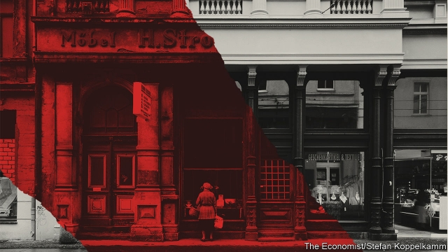
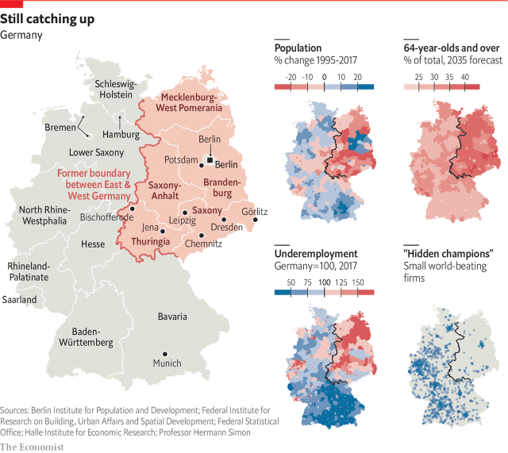
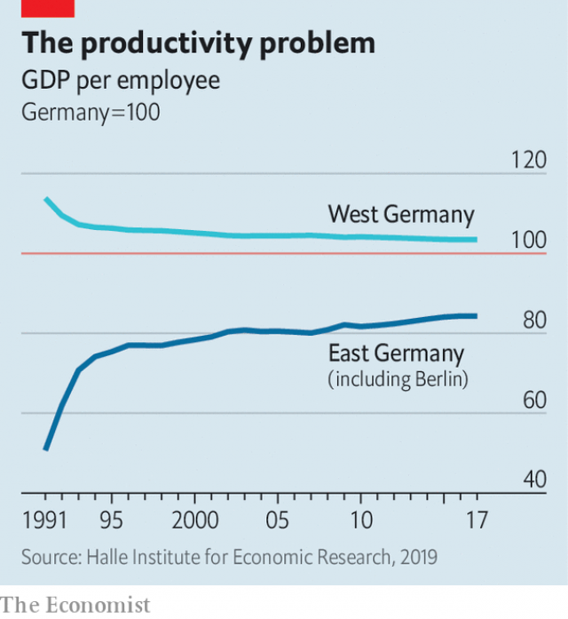

###### Thirty years after the Berlin Wall fell

# Germans still don’t agree on what reunification meant 

 

> print-edition iconPrint edition | Europe | Nov 2nd 2019 

ON NOVEMBER 9TH 1989, as the Berlin Wall tumbled, Hans-Joachim Binder was on night shift at the potash mine in Bischofferode, a village in the communist-ruled German Democratic Republic. Mr Binder, a maintenance worker who had toiled in the mine for 17 years, had no idea of the momentous events unfolding 240km (150 miles) to the east. The first sign something was up was when most of his colleagues disappeared to investigate what was happening at the border with West Germany, just ten minutes’ drive away. Only three returned to complete their shift. 

Less than a year later Germany was reunited, capping one of the most extraordinary stories in modern history. Not only had a communist dictatorship collapsed, releasing 16m people from the fear of the Stasi (secret police) and the stultification of censorship. Unlike any other country ever freed from tyranny, the entire population of East Germany was given citizenship of a big, rich democracy. As a grand, if ill-fated, gesture of welcome the West German chancellor, Helmut Kohl, converted some of their worthless savings into hard currency at the preposterously generous exchange rate of one Deutschmark to one Ostmark. 

More than 1m Ossies took advantage of their new freedom by moving to the West, where most thrived. Official statistics no longer counted this group—who were disproportionally young, clever, female and ambitious—as East Germans. For those who stayed behind, however, the 30 years since the fall of the Wall have been a mix of impressive progress, often taken for granted, and sour disappointment. 

The harm wrought by four decades of oppression and indoctrination could not be undone overnight. But a people brought up in a society where initiative was ruthlessly crushed had to adapt suddenly to the rigours of capitalism. Unsurprisingly, many could not. Mr Binder was laid off. So were hundreds of thousands of others who previously toiled in safe, dreary and unproductive state-backed jobs. Despite attempts to save it, including large protests and a hunger strike, the potash mine was shut down—one of 8,500 companies in the east privatised or liquidated by the Treuhand, a new government agency. Mr Binder bounced around in odd jobs for a while, eventually winding up on Hartz IV, the stingiest of Germany’s unemployment benefits, where he languishes today. Like many East German women, his wife retrained and left for a job in the west. Asked how he feels about the reunification of his country, he shrugs. “My safe job was gone. For me, the GDR could have carried on.” 

There was no manual to guide the absorption of east into west. The policies that failed people like Mr Binder were always going to be subject to fierce dispute. The surprise, as Germany approaches the 30th anniversary of the fall of the Wall, is the speed with which these debates have roared back into the public sphere. Newspapers and magazines are full of reassessments of the Wiedervereinigung (reunification); westerners are lapping up memoirs and polemics by eastern authors. Never before has Germany debated its reunification with such vigour. Why? 

Many observers say the debate grew louder three or four years ago. The most obvious explanation is therefore the migrant crisis of 2015-16. Petra Köpping, the integration minister in Saxony, one of the five eastern states established at reunification, says that when she tried to explain to her constituents why the state was helping refugees, some replied: “Integrate us first!” Many easterners resented the resources being devoted to help newcomers when they felt left behind. They also disliked the labelling of their complaints as racist. 

But the refugee crisis merely triggered a deeper shift, says Christian Hirte, the government’s special commissioner for east Germany. One idea, floated by Angela Merkel, who as chancellor is east Germany’s best-known export, is that the east is undergoing something comparable to the experience of West Germany in 1968, when children forced their parents to account for their activities in the Nazi period. Now, the argument runs, young east Germans seek explanations for what happened to their parents in the early years of reunification. “The long-term wounds were concealed because people were absorbed finding a place in the new society,” says Steffen Mau of Humboldt University in Berlin. “Perhaps you need 25 years to realise this.” 

This summer Marie-Sophie Schiller, a young Leipziger who hosts a podcast called “East—A Guide”, had an “emotional” talk with her parents about their experiences after 1990. She was astonished to learn about their daily hardships and humiliations. Stefan Meyer, an activist who grew up in East Berlin, remembers watching his parents’ confidence ebb as they struggled to find their feet in the new country. 

After 1990 “the whole software of life changed” for east Germans, says Markus Kerber, a bigwig at the interior ministry. Short-term pain was inevitable. Average labour productivity in the east was 30% of that in the west. Kohl’s decision to exchange Ostmarks at a 1:1 rate for Deutschmarks made swathes of firms uncompetitive overnight. Those that survived struggled with the western rules they had to import wholesale. By one estimate, 80% of east Germans at some point found themselves out of work. 

Perhaps the Treuhand could have proceeded more gently, some argue today. Maybe the unified country should have developed a new constitution rather than simply extending the western one eastwards. The west might have learned from the more enlightened aspects of life in the GDR, such as free child care and encouraging women to work outside the home. Radical parties on left and right take such arguments to a ludicrous extreme, arguing that reunification was the “colonisation” of a bewildered people by an exploitative west. 

Such views tap into a feeling among many easterners that they have struggled to take back control of their own destiny. Ms Köpping says east Germans hold barely 4% of elite jobs in the east. Many rent flats from westerners, who own much of the eastern housing stock. “Sometimes east Germans feel that they’re ruled by others, not themselves,” says Klara Geywitz, a Brandenburger running to lead Germany’s Social Democrats. Nor have east Germans stormed the national citadels of power. Almost 14 years after she took office Mrs Merkel—and Joachim Gauck, president from 2012-17—remain exceptions rather than a vanguard. Rarely one to dwell on her origins, Mrs Merkel has lately begun to reflect publicly on the mixed legacy of reunification. “We must all…learn to understand why for many people in east German states, German unity is not solely a positive experience,” she said on October 3rd. 

 

One obstacle to such understanding is that Germans view reunification differently. Half of west Germans consider the east a success. Two-thirds of east Germans disagree. Many westerners were oblivious to the upheaval their new compatriots endured. “On October 4th 1990 [the day after reunification], after a night of partying I carried on my life as normal,” says Mr Kerber. “Not a single east German had the same experience.” In places western stereotypes of easterners have persisted, the Jammerossi (“complaining easterner”), ungrateful for the largesse showered on the east after unification, or Dunkeldeutschland (“dark Germany”), a cold-war term implying backwardness. More recent is the notion of the east as a cradle of neo-Nazism, bolstered by the strength there of the far-right Alternative for Germany (AfD). Portrayals of the east in Germany’s national (for which read western) media have often read like dispatches from an exotic, troubled land, where the far right are always marching in the streets or thumping immigrants. 

Such accounts risk ignoring the huge strides made by east Germany since reunification. Citizens were liberated from the humiliations of life in a surveillance state. They were allowed to choose their leaders, express their opinions and travel, to west Germany and beyond. Economically, despite the hardships of the early years, the east soon began to converge with the west, and life improved drastically across a range of measures. Today some east German regions have lower unemployment rates than western post-industrial regions like the Saarland or the Ruhr valley. West-east transfers of close to €2trn ($2.2trn) have reduced the infrastructure gap. (Today they run at around €30bn a year, mainly in the form of social-security payments.) Wages in the east now stand at around 85% of the level in the west, and the cost of living is lower. The life-expectancy gap has closed, the air is cleaner, the buildings smarter. According to Allensbach, a pollster, 53% of east Germans are content with their personal economic situation, the same figure as in the west. “It all worked surprisingly well, but this story doesn’t fly in the east,” says Werner Jann of the University of Potsdam. 

Last year Andrea Boltho, Wendy Carlin and Pasquale Scaramozzino, three economists, contrasted east Germany’s post-reunification performance favourably with the Mezzogiorno in Italy, where GDP per person remains little over half that of the north. Perhaps the most apt comparison is with other parts of Europe that shook off communism. East Germany’s per capita growth has outstripped most other eastern European countries (see chart), despite starting from a higher base. As Richard Schröder, a former East German dissident, notes, the application of western laws and practices saw off the threat of oligarchic corruption that has plagued many of Germany’s eastern neighbours. 

Yet if east Germans do not always appreciate their good fortune, it is because their reference points have been Hamburg and Munich, not Bratislava or Budapest. Implicit in the promise of reunification was a pledge that east Germans could finally enjoy what they had so long envied in the west. For years they were forced to witness a lifestyle that remained out of reach, in the packets of coffee and sweets sent by relatives in the west, the western goods on display in Intershop outlets accessible only to those with hard currency, or the commercials on western television beamed across the border. In 1990 Chancellor Kohl promised east Germans “blooming landscapes”. Instead they got deindustrialisation and mass unemployment. “In 1990 300,000 people came to shout ‘Helmut!’ on Augustusplatz [in Leipzig],” recalls Kurt-Ulrich Mayer, who helped establish Kohl’s Christian Democratic Union (CDU) in Saxony. “Four years later he came back, and we needed umbrellas to protect him from all the eggs and tomatoes.” Unlike Poles or Hungarians, east Germans had someone else to blame when things went wrong. 

The convergence between west and east eventually ground to a halt. Today just 7% of Germany’s most-valued 500 companies (and none listed in the DAX30 index) are headquartered in the east. This starves municipalities of tax revenue and contributes to the east-west productivity gap, which has stood at around 20% for 20 years. Most assets liquidated by the Treuhand fell into western or foreign hands, hindering the development of an eastern capitalist class. 

For many, the best way to get western lifestyles was to move west. Over one-quarter of east Germans aged 18-30 did so, two-thirds of them women. Rural parts of the east were especially affected. As towns and villages emptied and tax revenues slumped, schools were closed, shops shuttered and housing blocks demolished. The mass emigration of youngsters led to a plummeting number of births. Since 2017 net east-west migration has been roughly zero, but there has been no growth in the number of people moving east; the westward exodus has simply fallen to match it. 

The east is also much older than the west. Since 1990 the number of over-60s there has increased by 1.3m even as the overall population has fallen by 2.2m. IWH, a research outfit in Halle, thinks the working-age population in the east will fall by more than a third by 2060. By 2035, 23 of Germany’s 401 Kreise (administrative districts) will have shrunk by at least a fifth, says Susanne Dähner at the Berlin Institute for Population and Development; all of them are in the east. In some districts, there will be four funerals for every birth. Instead of losing people to the west, eastern Germany will lose them to the grave. 

The constitutional pledge of “equivalent living conditions” across Germany thus looks unattainable. The government tries to help so-called “structurally weak” regions, in the east as well as the west. But although investment in infrastructure or technical universities may help some towns, it cannot stop the demographic decline in many east German regions. 

The picture is much brighter in some eastern cities. Potsdam, Jena and Dresden have clusters of industry and tourism as well as cheap housing; some, like Leipzig (“Hypezig”, to irritated locals), have been booming for years. The “bacon belt” around Berlin benefits from the success of the capital, especially as older workers move out to the suburbs. Yet even as overall emigration to the west dries up, eastern cities are sucking educated people away from already struggling small towns and villages. That trend may continue, as only half of east German workers work in cities, compared with three-quarters in the west. 

 

The changes in the east have social, cultural and political consequences which are now coming to the fore. Last February thousands of Dynamo Dresden supporters at an away game in Hamburg began an unfamiliar chant: “Ost [east], Ost, Ostdeutschland!” A video of the episode went viral, sparking a lively debate: were the fans expressing a dubious “eastern” variant of militant German nationalism? Or was this a cheerful reappropriation of an identity that for so long was taken to connote stupidity and closed-mindedness? 

“Identity is key to understanding east Germany,” says Franziska Schubert, a thoughtful Green who represents Görlitz in Saxony’s state parliament. Fully 47% of east Germans say they identify as easterners before Germans, a far higher proportion than at the euphoric moment of reunification. (The equivalent is true for 22% of westerners.) Regional identity is hardly abnormal in Germany—ask the Bavarians—but in the east it can seem grounded in politics as much as culture or tradition. 

When Jana Hensel, a writer, recently gave a talk to a school in her home town of Leipzig, she was astonished to find herself spending half an hour fielding questions from teenagers about an Ossiquote (a proposal to give east Germans preference in public jobs). “More than 25 years after the end of the GDR, students have become east German again,” she says. “If we’re not careful, we’ll lose another generation.” 

The AfD has exploited the power of eastern particularism. Under slogans like “The east rises up!” the party has scored 20%-plus in eastern state elections, most recently in Thuringia on October 27th. There, and in recent elections in Brandenburg and Saxony, it was only voters over 60 whose support for the established parties ensured that the AfD did not come first. In Saxony and Thuringia the AfD was the most popular party among under-30s. This is worrying in a part of the country where extremism has found fertile ground. More than half of Germany’s hate crimes take place in the east, though it has just 20% of the population and few immigrants. 

But eastern identity is not the exclusive preserve of extremes. Many young easterners simply developed an “Ossi” identity after encountering ignorance or scorn in the west. Nor need it be only negative. Matthias Platzeck, a former Brandenburg premier now in charge of a commission for the 30th anniversary of reunification, says that the recent election in his state was the worst-tempered ever. Nonetheless, he hopes for the emergence in the east of healthy self-confidence, built on the back of success stories—and a new focus on the many problems that span east and west. His commission’s informal motto, he says, is “as little state celebration as necessary, as much discussion as possible.” And since the Berlin Wall has gone, no amount of debate will land anyone in jail. ■ 

Pictures by Stefan Koppelkamm from his book, “Ortszeit / Local Time” 

