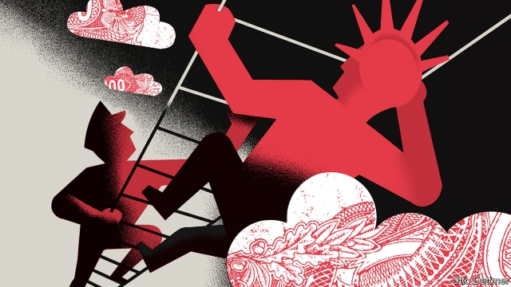

###### Free exchange

# A scholar of inequality ponders the future of capitalism 

 

> print-edition iconPrint edition | Finance and economics | Nov 2nd 2019 

WHEN COMMUNISM fell, that was supposed to be that. History would continue, but arguments about how to organise society seemed to have been settled. Yet even as capitalism has strengthened its hold on the global economy, history’s verdict has come to seem less final. In a new book, “Capitalism, Alone”, Branko Milanovic of the Stone Centre on Socioeconomic Inequality at the City University of New York argues that this unification of humankind under a single social system lends support to the view of history as a march towards progress. But the belief that liberal capitalism will prove to be the destination has been weakened by financial and political dysfunction in the rich world, and by the rise of China. Its triumph cannot be taken for granted. 

Mr Milanovic outlines a taxonomy of capitalisms and traces their evolution from classical capitalism before 1914, through the social-democratic capitalism of the mid-20th century, to “liberal meritocratic capitalism” in much of the rich world, in particular America. He contrasts this with the “political capitalism” found in many emerging countries, with China as the exemplar. These two capitalistic forms now dominate the global landscape. Their co-evolution will shape world history for decades to come. 

Liberal meritocratic capitalism is generally associated with liberal political systems and, though redder in tooth and claw than its social-democratic forebear, is more egalitarian than classical capitalism, thanks to welfare states inherited from social democrats. Its distinguishing feature is a tolerance for inequality that derives from the way in which riches, in a meritocratic system, are earned by people of extraordinary talent. Political capitalism, in contrast, is illiberal. It emerges when authoritarian governments rely for legitimacy on their ability to foster economic growth, which in turn provides the motive for free-market reforms. 

It is wrong to suppose, though, that systems of political capitalism will inevitably become more politically liberal, as Western leaders once hoped would happen in China. They rely on a “zone of lawlessness” that allows the state to suppress uppity private-sector interest groups. The rule of law, as it holds in most advanced economies, would enable a merchant class to become a new centre of power that could press for political reforms, thus limiting the actions of the ruling elite. The zone of lawlessness also allows the state to suppress corruption—endemic under political capitalism—whenever it threatens to undercut economic growth. Whether political capitalism does better than liberal capitalism at fostering growth remains unclear (Mr Milanovic implies at times that it may). China and Vietnam have grown much faster than America in recent decades, but as their incomes rise and opportunities to learn from others dissipate, they will probably slow. 

Whether or not political capitalism is better for growth, it appears to be sustainable—at least for a while. The global status quo may not be, however. Slower growth in China may eventually erode the legitimacy of the ruling party. And liberal systems may converge toward authoritarian ones, rather than the other way round. As Mr Milanovic writes, structural forces within liberal meritocratic capitalism work towards greater inequality. Older vintages of capitalism tended to separate those rich in capital and those with high incomes from labour into separate classes. But in liberal meritocratic capitalism the two groups are coterminous, because the wealthy invest heavily in their children’s education and the talented earn huge sums. The elite uses its economic power to cultivate political power, pushing societies toward the establishment of a permanent ruling class that cannot be dislodged. 

Intergenerational economic mobility in America has indeed fallen. Political spending has soared and is dominated by the very rich. In 2016 the top 1% of the top 1% accounted for 40% of campaign donations. These financially astute people surely expect a return on their money, and indeed research suggests that elected leaders are more attuned to the interests of the rich than those of people further down the income scale. Other aspects of political capitalism are creeping in, too. One is corruption, from the pay-to-play proclivities of the Trump administration to the tendency of both Democrats and Republicans to leap from government service straight into lucrative private-sector jobs. 

Behind this, Mr Milanovic suggests, is an erosion of liberal values. Within capitalist systems, money is the ultimate measure of worth. The pursuit of narrow self-interest is held to lead to the greatest good. People who forgo profit for ethical reasons could thus be seen as harming society, because they are preventing resources from being used at maximum efficiency. Moreover, their restraint creates an opening for less ethical rivals. The elite in such a system increasingly consists of individuals who are willing to do anything not outright illegal that increases their wealth. 

There is something to be said for an amoral approach to business. As Mr Milanovic points out, people all over the world understand the pursuit of self-interest. Amoral commerce can be engaged in by people from many cultures and backgrounds; recent hyperglobalisation would not have been possible without it. But the costs are becoming apparent—when firms bow to Chinese censorship in order to retain access to lucrative markets, for example, or when governments accept flagrant tax avoidance as the price of unimpeded capital flows. 

The ugly aspects of today’s capitalism, like those of the 19th-century version, may be merely an awkward bump on the road to a better world. But it is also possible that the apparent march of progress, from coarser versions of capitalism to better ones, was not a historical inevitability. It may instead reflect the painstaking cultivation of liberal values, such as honesty and the duty to treat others fairly. If so, capitalism alone, without the moderating influence of those values, could reach its own historical dead end. ■ 

