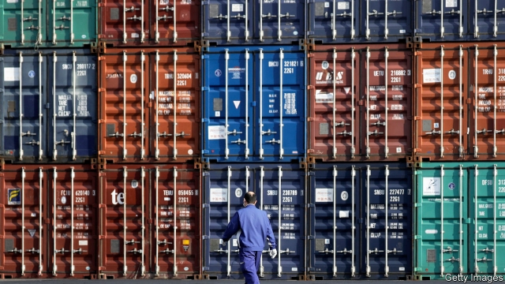

###### Spilling over

# America and China are sparring over subsidies 

 

> print-edition iconPrint edition | Finance and economics | Nov 2nd 2019 

AS TRADE TALKS continue between America and China, old fights are rumbling on. On October 28th China asked the World Trade Organisation (WTO) to allow it to retaliate against $2.4bn of imports from America, as part of a long-running dispute over American treatment of Chinese exports. The final sum will be set by an arbitrator, and will be small in the broader context of the two countries’ escalating trade war. But the symbolism will make it sting. 

The dispute concerns two of America’s biggest gripes: China’s economic model and the WTO’s inability to constrain it. America accuses China’s government of bloating its private sector with subsidies, which spill over to affect businesses abroad. If state-owned banks make cut-price loans, or state-owned electricity companies sell cheap energy, Chinese exporters have an unfair advantage, it says. By last year America had imposed tariffs on almost 7% of Chinese imports, citing such subsidies and the need to defend itself. 

Americans argue that if Chinese state institutions hold a majority stake in a company, this strongly suggests it is a “public body” and therefore capable of giving subsidies. But the WTO’s appellate body has generally disagreed. It has also often backed China’s stance that America’s defensive duties are too harsh. 

The United States Trade Representative, America’s main trade negotiator, attacked the most recent such judgment, in July. Such decisions, it said, illustrated its concerns with the way that the WTO resolves disputes. In an attempt to force a change of approach, it is blocking appointments to the WTO’s appellate body. But bringing the body to a standstill would do nothing to solve the rows that have brought America and China before it again and again. That would require them to agree on what counts as a public body, and when defensive tariffs are allowable. Even better would be a deal to limit subsidies, which might be added to the WTO’s rules. 

Unfortunately American and Chinese negotiators, who are currently trying to strike a “phase one” deal that could bring a ceasefire in the broader trade war, are not even discussing these thorny issues. Meanwhile American sanctions against Huawei, a Chinese telecoms firm, have amplified those voices within China that are calling for even more subsidies. 

In the long run subsidies are hard to tackle bilaterally, since any benefits can be undone if an unconstrained third country boosts its handouts in response. American officials have been discussing what new multilateral rules could look like with European and Japanese officials, but without much visible progress. And even if the trio agreed on something, China might not play along. On October 26th a forum that was supposed to address steel subsidies collapsed, in part because the Chinese withdrew. Tariffs it is, then. ■ 

