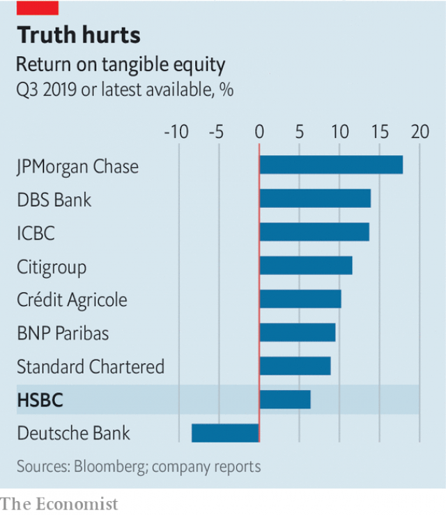

###### Failure to thrive

# As profits dwindle, HSBC plans a radical overhaul 

 

> print-edition iconPrint edition | Finance and economics | Nov 2nd 2019 

WHEN NOEL QUINN took over as interim chief executive of HSBC from John Flint, ousted by the board in August, analysts expected a change in style. Whereas Mr Flint was seen as a cerebral introvert, Mr Quinn is forthcoming, verging on blunt. 

On that front, at least, HSBC’s first quarterly-results announcement on his watch did not disappoint. Although its Asian business “held up well in a challenging environment”, performance in other areas was “not acceptable”, Mr Quinn said on October 28th. Third-quarter net profits, down by 24% on the same period last year, to $3bn, undershot pundits’ forecasts by 14%. Revenues fell by 3.2%, to $13.4bn, missing expectations by 3%. Return on tangible equity (ROTE), its chief measure of profitability, reached 6.4%, compared with analysts’ forecast of 9.5%. Investors agreed with Mr Quinn: the bank’s shares dropped by 4.3% on the news in London. They have fallen by about 11% in the past six months. 

HSBC’s woes can be blamed in part on broader conditions: low interest rates, a slowing global economy, business uncertainty in Brexit-hit Britain and trade tensions (HSBC is the world’s largest provider of trade finance). Yet that is hardly likely to reassure investors. Tom Rayner of Numis Securities, a broker, points out that although some of these trends may be reversed, others, such as Brexit and the trade wars, may linger. Interest rates may well fall further. Investors are not yet pricing in any impact from protests in Hong Kong, where HSBC is the largest lender. That is too optimistic, says Fahed Kunwar, at Redburn, another broker. 

Mr Quinn does not deny the scale of the challenge. HSBC is ditching its ROTE target of 11% for 2020, and there are hints of a radical overhaul. Mr Quinn spoke of accelerating plans to “remodel” poorly performing businesses. In August the bank announced a plan to complete 4,700 redundancies by the end of this year. Reports suggest HSBC could seek to cut an additional 8,000-10,000 jobs from its headcount of 238,000 (a spokesperson declined to confirm the number of jobs to go). 

Yet after years of cost-cutting, analysts are divided as to whether much more fat can be trimmed. Daniel Tabbush of Tabbush Report, an Asia-based research firm, says HSBC “is not particularly bloated”. The bank may also partially exit some share-trading activities in Western markets, and wants to sell its French retail operations. But a hasty disposal of badly performing units, which also include its American wholesale arm, may force it to write down part of their value. 

 

So hopes must be placed in the second prong of HSBC’s grand reform—to move capital away from the dreariest businesses and towards “higher growth and return opportunities”. HSBC’s cost-to-income ratio is 104% in Europe, compared with 43% in Asia, where it generates nearly 90% of its profits. It makes only a quarter of its lending in Britain, yet the country generates 35% of its non-performing loans, says Mr Tabbush. Its $98bn of risk-weighted assets allocated to America produce only $527m in annual profit. 

The bank’s management has so far declined to provide any guidance as to where newly released capital might be sent. HSBC is already the largest corporate lender in Asia by market penetration, according to Greenwich Associates, a research firm. And getting more deeply into China may prove tricky. In August HSBC was omitted from a list of banks helping Beijing set a new interest-rate benchmark. That suggests the Chinese regulator may be shunning the bank over its role in assisting an American investigation into a key executive at Huawei, a Chinese telecoms firm. Other dynamic markets, like Vietnam and Indonesia, are tiny by comparison. 

There are also limits to how much HSBC can rejig its various lines of business. Its strength in trade finance has so far failed to translate into clout in investment banking. Global capital markets are more lucrative, but volatile. In 2018 HSBC launched a new motto, “Together We Thrive”. Its difficulties may have more to do with this grand ambition than with external forces. By trying to do too much for too many people in too many places, it has seen its returns diluted. Yet even for its candid interim boss, that conclusion may be rather too blunt. ■ 

