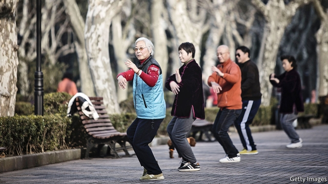
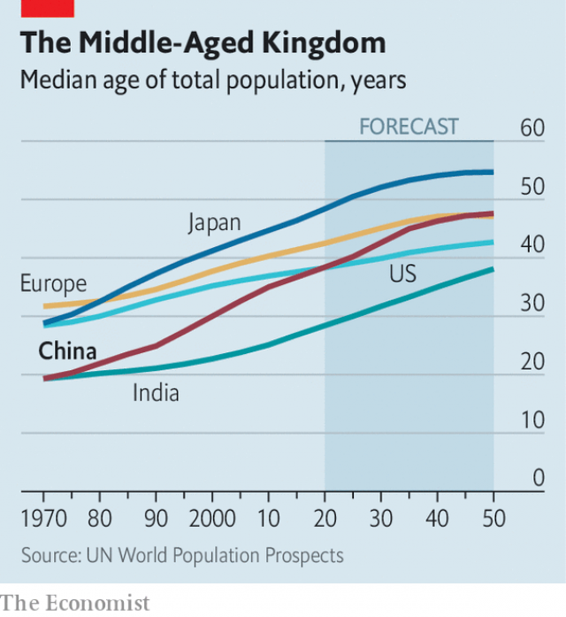

###### Old, not yet rich

# China’s median age will soon overtake America’s 

 

> print-edition iconPrint edition | Finance and economics | Nov 2nd 2019 

SHORTLY AFTER 9am the neighbourhood care centre for the elderly shuffles to life. One man belts out a folk song. A centenarian sits by his Chinese chessboard, awaiting an opponent. A virtual-reality machine, which lets users experience such exotic adventures as grocery shopping and taking the subway, sits unused in the corner. A bigger attraction is the morning exercise routine—a couple of dozen people limbering up their creaky joints. They are the leading edge of China’s rapid ageing, a trend that is already starting to constrain its economic potential. 

Since the care centre opened half a year ago in Changning, in central Shanghai, more than 12,000 elderly people from the area have passed through its doors. The city launched these centres in 2014, combining health clinics, drop-in facilities and old-people’s homes. It plans to have 400 by 2022. “We can’t wait. We’ve got to do everything in our ability to build these now,” says Peng Yanli, a community organiser. 

 

The pressure on China is mounting. The coming year will see an inauspicious milestone. The median age of Chinese citizens will overtake that of Americans in 2020, according to UN projections (see chart). Yet China is still far poorer, its median income barely a quarter of America’s. A much-discussed fear—that China will get old before it gets rich—is no longer a theoretical possibility but fast becoming reality. 

According to UN projections, during the next 25 years the percentage of China’s population over the age of 65 will more than double, from 12% to 25%. By contrast America is on track to take nearly a century, and Europe to take more than 60 years, to make the same shift. China’s pace is similar to Japan’s and a touch slower than South Korea’s, but both those countries began ageing rapidly when they were roughly three times as wealthy per person. 

Seen in one light, the greying of China is successful development. A Chinese person born in 1960 could expect to live 44 years, a shorter span than a Ghanaian born the same year. Life expectancy for Chinese babies born today is 76 years, just short of that in America. But it is also a consequence of China’s notorious population-control strategy. In 1973, when the government started limiting births, Chinese women averaged 4.6 children each. Today they have only 1.6, and some scholars say even that estimate is too high. 

Fertility was bound to decline as China got wealthier, but the one-child policy made the fall steeper. Even though the country shifted to a two-child policy in 2016 and may soon scrap limits altogether, the relaxation came too late. The working-age population, which began to shrink in 2012, will decline for decades to come. By the middle of the century it will be nearly a fifth smaller than it is now. China will have gone from nine working-age adults per retired person in 2000 to just two by 2050. 

The economic impact is being felt in two main ways. The most obvious is the need to look after all the old people. Pension payouts to retired people overtook contributions by workers in 2014. According to the Chinese Academy of Social Sciences, the national pension fund could run out of money by 2035. The finance ministry is taking small steps to shore the system up: in September it transferred 10% of its stakes in four giant state-owned financial firms to the fund. But far more is needed. Government spending on pensions and health care is about a tenth of GDP, just over half the level usual in older, wealthier countries, which themselves will have to spend more as they get even older. 

The second impact is on growth. Some Chinese economists—notably Justin Lin of Peking University—maintain that ageing need not slow the country down, in part thanks to technological advances. But another camp, led by Cai Fang of the Chinese Academy of Social Sciences, has been winning the argument so far. A shrinking labour pool is pushing up wages and, as firms spend more on technology to replace workers, pushing down returns on capital investment. The upshot, Mr Cai calculates, is that China’s potential growth rate has fallen to about 6.2%—almost exactly where it is today. The labour shortage is hitting not just companies but entire cities. From Xi’an in the north to Shenzhen in the south, municipalities have made it easier for university graduates to move in, hoping thereby to attract skilled young workers. 

China could, in theory, mitigate the downside from its ageing by boosting both labour-force participation and productivity—that is, getting more people into work and more out of them. Neither is easy. Retirement ages are very low in China (in many jobs, 60 for men and 50 for women), but the government has resisted raising them for fear of a backlash. And a return to state-led growth under Xi Jinping appears to be hurting productivity. As George Magnus, an economist, writes in “Red Flags: Why Xi’s China is in Jeopardy”, demography is not destiny, and China has time to change course. “The bad news, though, is that the time that is available is passing by rapidly,” he says. 

One piece of good news is that China is thinking creatively about how to look after the swelling ranks of pensioners. Traditionally, children have been expected to care for their elderly parents, which helps explain why public investment in old-age homes has been minimal. But most families now have just one child, and that child is working. Suzhou, a wealthy city near Shanghai, shows how China can take advantage of its scale. In 2007 Lu Zhong, an entrepreneur, founded Jujiale as a “virtual retirement home”, dispatching helpers to private homes on demand. It now has 1,800 employees serving 130,000 retired people. Mr Lu says that it needs to grow by about 15% a year to keep up with demand. 

Yet that is a silver lining in a grey-haired cloud. On October 1st China celebrated the 70th anniversary of the People’s Republic. By the centenary in 2049, Mr Xi has vowed, China will have developed to the point that its strength is plain for the world to see. But as Ren Zeping, a prominent economist, tartly noted in a recent report, the median age in China in 2050 will be nearly 50, compared with 42 in America and just 38 in India. That, he wrote, raised a question: “Can we rely on this kind of demographic structure to achieve national rejuvenation?” ■ 

