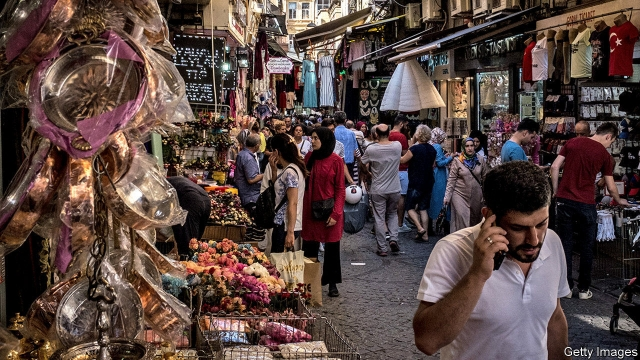
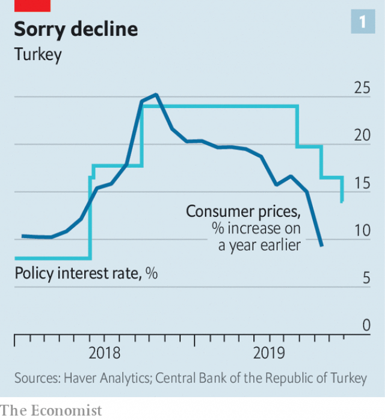
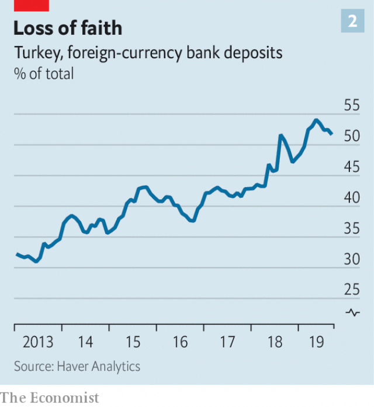

###### By a thousand cuts

# Inflation in Turkey has fallen steeply 

 

> print-edition iconPrint edition | Finance and economics | Nov 2nd 2019 

TURKEY’S PRESIDENT, Recep Tayyip Erdogan, once called high interest rates “the mother of all evil”. Murat Uysal, its new central-bank governor, must then be close to angelic. Since Mr Erdogan sacked Mr Uysal’s predecessor four months ago for refusing to slash interest rates, he has cut three times, by a cumulative ten percentage points (see chart 1). The latest cut, of 2.5 percentage points on October 24th, was more than double market expectations. 

After last year’s aggressive tightening, easing now makes some sense. Inflation is back in single digits, after passing 25% last autumn. The lira has partially recovered from a battering that had pushed domestic prices up. In early October America threatened sanctions in response to Turkey’s offensive in Syria. The lira slumped, but after America brokered a ceasefire deal on October 17th, it steadied again. It strengthened further when Turkey’s and Russia’s presidents signed a similar agreement. That gave the bank room for the most recent cut. 

 

Turkey crawled out of recession at the start of the year, but credit growth is still weak. Companies with hard-currency debt have been unable to borrow, and banks sitting on $20bn-worth of non-performing loans (NPLs) have been reluctant to lend. Monetary policy alone will not fix the economy, says Selva Demiralp of Koc University: “Turkey needs to find a solution to the NPL problem first.” In September the government ordered banks to reclassify debt of 46bn lira ($8bn) as bad loans. But doubts remain as to how banks will clear these loans from their balance-sheets. 

The economy remains vulnerable to outside shocks. On October 29th America’s House of Representatives voted to restrict arms sales to Turkey, sanction the country over its purchase of a missile-defence system from Russia, and investigate Mr Erdogan’s wealth. Lawmakers also passed a motion recognising the Ottoman slaughter of Armenians in 1915 as genocide. Though the sanctions package is unlikely to become law, relations with America are at their worst in decades. 

Another source of anxiety is an investigation in New York into whether Halkbank, a Turkish state lender, circumvented American sanctions against Iran. In an indictment unsealed on October 15th, prosecutors allege that senior Turkish officials took millions of dollars in bribes to keep the scheme running. A former Halkbank executive who was convicted for playing a role in the operation returned to Turkey this summer after two years in prison. On October 21st he was appointed head of the Istanbul stock exchange.  

 

Turkey expects growth of 0.5% this year, and 5% in 2020. If interest rates are cut further in pursuit of that goal, the country risks another currency crisis. The central bank has already burned through billions of dollars in reserves to prop up the lira. It may no longer have the means to defend the currency in the face of sanctions, or if global interest rates rise. Turks have run to the dollar for safety. Foreign-currency deposits at Turkish banks have surged (see chart 2).  

And lack of independence makes monetary policymakers’ job harder. “They have a credibility issue,” says Kerim Rota, a former banker. Interest rates will need to be higher to control inflation than if the market believed the central bank was in charge, he says. But no one now thinks it can raise rates without Mr Erdogan’s say-so. ■ 

