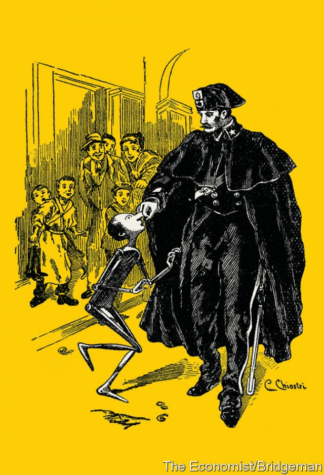

###### This article is full of lies

# You really can fool some of the people, all of the time 

 

> print-edition iconPrint edition | International | Nov 2nd 2019 

IN 2001 JONATHAN HAIDT, a psychologist at New York University, published a paper in Psychological Review delightfully entitled “The Emotional Dog and its Rational Tail”. He argued that when people make moral decisions, they are influenced by emotion, or what might also be termed intuition. They may think they are weighing evidence but in fact their decisions are made in the blink of an eye. The reasons they give afterwards merely reflect these emotions, like a dog wagging its tail. 

Others have taken similar views. “Reason is, and ought only to be, the slave of the passions,” wrote David Hume, a philosopher of the Scottish Enlightenment, in 1739. But the lessons of Mr Haidt’s essay are particularly apt at a time when lying has come to define politics more than usual. 

Dictatorships have always been built on lies: that Kim Jong Un is a demigod, that nothing much happened on June 4th 1989 in Tiananmen Square. The Soviet Union called its main newspaper Pravda (“Truth”). That was a lie, of course. 

Politicians in democracies have always mangled the truth: denying affairs and downplaying the ill effects of their policies. What is new is the degree to which voters are prepared to back leaders who seem to revel in their mendacity. 

Boris Johnson’s first notable act was to be fired from a newspaper for making up a quote. Yet he is Britain’s prime minister. India said that it had downed a Pakistani F-16 fighter jet over Kashmir in February. Facing an election, Narendra Modi, India’s prime minister, said his country had taught Pakistan a lesson. A subsequent inspection of Pakistan’s aircraft by American officials showed that none was missing (India maintained its position). 

As for President Donald Trump, whole websites are devoted to his truthlessness. On one, Glenn Kessler of the Washington Post fact-checks presidential statements and awards scores: three Pinocchios for “significant factual errors” and four for “whoppers” (Mr Trump’s claims about Ukraine and Hunter Biden fit into the whopper category). As of October 9th, the president had made 13,435 false or misleading statements while in office. Rather than grapple with what is true and what is false, Twitter said on October 30th it would ban political ads (Facebook has so far declined to the same). 

Yet their duplicity seems to cost politicians little, if anything, in electoral support. Surveys by YouGov, a pollster, put Mr Johnson’s Conservative Party in the lead in the election due in December. Mr Trump’s job-approval rating, at 43%, is low but only one point below what it was when he took office. No one takes for granted that he will lose next year’s presidential election. 

Why isn’t lying more damaging? One possibility is that lying on a Trumpian scale is so unusual—so frequent, shameless and easily falsified—that people do not know how to react. In tests, between two-thirds and three-quarters of people say they never lie; most of the rest claim to lie fewer than five times a day. It is hard to comprehend someone who goes so far beyond normal, occasional deceitfulness. 

Another explanation is that people trust leaders for whom they have voted, whatever those people say. A recent study by two researchers at Brigham Young University, Michael Barber and Jeremy Pope, examined whether voters are loyal to an individual leader or whether they support leaders who represent the policies and outlook they themselves espouse. Because Mr Trump has abandoned so many traditional Republican policies, such as support for free trade and suspicion of Russia, the researchers concluded that it is personal: those who still call themselves Republicans support Mr Trump because of who he is, not what he stands for. And if personal loyalty trumps ideology, then voters may back a politician even if he does not tell the truth. 

Indeed, Mr Trump’s supporters may even relish his deceits. If you believe that all politicians are liars, those outraged by Mr Trump’s falsehoods are hypocrites. The ire of his opponents and members of the press, such as Mr Kessler, at his lies is taken chiefly as evidence of his cocking a snook at the swampy establishment. 

But even in daily life, without the particular pressures of politics, people find it hard to spot liars. Tim Levine of the University of Alabama, Birmingham, has spent decades running tests that allow participants (apparently unobserved) to cheat. He then asks them on camera if they have played fair. He asks others to look at the recordings and decide who is being forthright about cheating and who is covering it up. In 300 such tests people got it wrong about half of the time, no better than a random coin toss. Few people can detect a liar. Even those whose job is to conduct interviews to dig out hidden truths, such as police officers or intelligence agents, are no better than ordinary folk. 

Evolution may explain credulity. In a forthcoming book, “Duped”, Mr Levine argues that evolutionary pressures have adapted people to assume that others are telling the truth. Most communication by most people is truthful most of the time, so a presumption of honesty is usually justified and is necessary to keep communication efficient. If you checked everything you were told from first principles, it would become impossible to talk. Humans are hard-wired to assume that what they hear is true—and therefore, says Mr Levine, “hard-wired to be duped”. 

So strong is that instinct that people suspend their critical faculties when given orders by a superior. The point was made by one of the most famous experiments in psychology, the “obedience to authority” test conducted by Stanley Milgram in 1961. Subjects were (falsely) told that they were taking part in a test that required them to administer electric shocks to another participant (who was an actor). As the test proceeded, they were willing to give shocks so large that the impact would have been fatal had they been real. The normal interpretation is that people are willing to behave unconscionably if they can tell themselves they were merely “following orders”. But Mr Levine raises another possibility: they may well have had doubts that the experiment was real, but not sufficient to override what he calls the “truth default”. 

Fake news may be exacerbating people’s inbuilt gullibility. A study published last year in Science, a journal, concluded that “falsehood diffused significantly farther, faster, deeper and more broadly than the truth” and that this effect was especially strong for fake political news. Fake news provides voters with a smorgasbord of facts and lies from which to pick and choose. 

In politics, however, these explanations cannot be the whole story. At the heart of the lying-politician paradox is an uncomfortable fact: voters appear to support liars more than they believe them. Mr Trump’s approval rating is 11 points higher than the share of people who trust him to tell the truth. A third of British voters view Mr Johnson favourably but only a fifth think he is honest. Voters believe in their leaders even if they do not believe them. Why? 

The answer starts with the primacy of intuitive decision-making. ln 2004 Drew Westen of Emory University in Atlanta put partisan Republicans and Democrats into a magnetic-resonance-imaging scanner and found that lying or hypocrisy by the other side lit up areas of the brain associated with rewards; lies by their own side lit up areas associated with dislike and negative emotions. At no point did the parts of the brain associated with reason show any response at all. If voters’ judgments are rooted in emotion and intuition, facts and evidence are likely to be secondary. 

The most important consequence of the domination of intuition is the pervasiveness of confirmation bias—the tendency to seek out and interpret information that confirms what you already think. It is a feature of reasoning, not a bug. There are few better illustrations than Americans’ newsgathering habits. To oversimplify, Democrats read the New York Times; Republicans watch Fox News. A Pew poll in 2018 found that 82% of Democrats thought the media perform a useful “watchdog” role of keeping politicians from doing things they shouldn’t. Only 38% of Republicans agreed. By contrast, five years earlier, when Barack Obama was president, the figures were 67% and 69% respectively. 

 

A new version of confirmation bias is “identity-protective cognition”, argues Dan Kahan of Yale Law School. This says that people process information in a way that protects their self-image and the image they think others have of them. For example, those who live surrounded by climate-change sceptics may avoid saying anything that suggests humankind is altering the climate, simply to avoid becoming an outcast. A climate sceptic encircled by members of Extinction Rebellion might do the same thing in reverse. As people become more partisan, more issues are being taken as markers of the kind of person you are: in Britain, the country’s membership of the European Union; in America, guns, trade, even American football. All give rise to the acceptance of bias. 

Thomas Gilovich of Cornell shows how fake news, cognition bias and assuming that people are telling the truth interact to make it easier to believe lies. If you want to believe a thing, he argues (that is, a lie that supports your preconceived ideas), you ask yourself: “Can I believe it?” A single study or comment online is usually enough to give you permission to hold this belief, even if it is bogus. But if you do not want to believe something (because it contradicts your settled opinions) you are more likely to ask: “Must I believe it?” Then, one apparently reputable statement on the other side will satisfy you. That may be why so many climate sceptics manage to cling to their beliefs in the teeth of overwhelming evidence to the contrary. Activists point out that 99% of scientists believe the Earth is warming up because of human actions. But people who doubt the reality of climate change listen to the other 1%. 

You might expect (or hope) that thoughtful people would be more amenable to the force of fact-based evidence than most. Alas, no. According to David Perkins of Harvard University, the brighter people are, the more deftly they can conjure up post-hoc justifications for arguments that back their own side. Brainboxes are as likely as anyone else to ignore facts which support their foes. John Maynard Keynes, a (famously intelligent) British economist, is said to have asked someone: “When the facts change, I change my mind. What do you do, sir?” If they were honest, most would reply: “I stick to my guns.” ■ 

