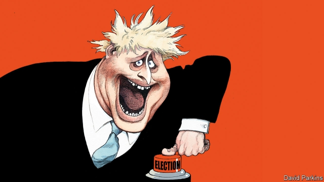

###### British politics

# Here comes the Brexit election 

 

> print-edition iconPrint edition | Leaders | Oct 31st 2019 

A FORTNIGHT BEFORE Christmas, winter fêtes and school nativity plays will be put on hold as village halls are once again converted into polling stations. Britain faces its third general election in little more than four years, a result of the fact that today’s MPs cannot agree on how to leave the European Union—or even whether to leave at all. Boris Johnson, the Conservative prime minister, promises that with a majority he will “get Brexit done”. Jeremy Corbyn, his Labour rival, proposes a second referendum, with the option to call the whole thing off. 

That alone would represent a momentous choice. Yet in what is being billed as the Brexit election, more is at stake than Britain’s relationship with Europe. The far-left Mr Corbyn promises to put the state at the heart of the economy, whereas Mr Johnson’s Tories seem to be moving towards a more freewheeling form of capitalism. At the same time, both potential prime ministers would pick at the ties between the nations of the United Kingdom. Britain’s Christmas contest is its most important in living memory. And with volatile polls, upstart parties and new ideological axes that define voters, it is the least predictable, too. 

We have long argued that a second referendum would be a better way to break the Brexit logjam. The Commons is split over Mr Johnson’s deal—possibly fatally—just as it was over the rather better one negotiated by his predecessor, Theresa May. The clearest and fairest solution would be to ask voters whether they would take his terms over the arrangement they already have, as EU citizens. But Parliament has proved as incapable of organising a second referendum as it has of agreeing on anything else. And rather than see his plan amended, Mr Johnson has chosen an election. For now, a referendum is off the table. 

Voters face a confusing and deeply unsatisfying choice. Parties have set out Brexit proposals to cater to every taste: an instant no-deal exit, courtesy of the Brexit Party; a bare-bones, “Canada-minus” deal with the Tories; a second referendum from Labour; and cancelling Brexit altogether, via the Liberal Democrats. However, voters must balance these policies against the rest of the parties’ programmes, which in some cases are extreme. Labour, in particular, proposes a new economic model in which the state would gain enormous clout. Some Remainers have taken to saying that Mr Corbyn, who is likely to enter Downing Street only with the support of other parties, would lack the votes to push through the more dangerous parts of his manifesto. That is wishful thinking. Even a minority Labour government could do profound damage (see Briefing). Whether the next prime minister is hard-Brexiteer Mr Johnson or socialist Mr Corbyn, the economy will take a beating. 

Both men would also tug at the fraying union. Mr Johnson’s Brexit plan would push Northern Ireland ever closer to the Republic of Ireland. Mr Corbyn would probably rely on the backing of the Scottish National Party to get to Downing Street. The price of its support would be a prompt second referendum on Scottish independence. Polls suggest the nationalists might well win. 

Voters who want the United Kingdom to stay together, or who dislike both socialism and Brexit—potentially, rather a lot of them—will thus be left holding their nose as they mark their ballot paper. And a great many more will feel despair at the result. The next prime minister will enter Downing Street having won well under half the vote. If the outcome of the Brexit referendum left 48% feeling hard done by, this election will leave a large majority feeling that they have lost. 

Who will be on that losing side? The race is wildly unpredictable. Polls put the Tories roughly 12 points ahead of Labour. But the polls are volatile. Only a few months ago the Tories were briefly in third place. Mrs May started her campaign in 2017 with a 20-point lead and five weeks later lost her majority. Since then things have become more complex still, with the birth of the hardline Brexit Party (which will take votes from the Tories) and the rise of the pro-Remain Lib Dems (who will pinch more supporters from Labour). Under the first-past-the-post system, better adapted to two dominant parties, the make-up of Parliament may bear little relation to the national breakdown of the poll, adding to the disillusion of voters. 

Last time Britain held an election—only two years ago—we lamented the “missing middle” in its politics. Since then the improvement in the fortunes of the Lib Dems, to whom we gave our conditional backing, has broadened the menu somewhat. But the two main parties have become even less interested in the centre ground. Elections used to be contests to capture the median voter. But almost no one holds a middling position on Brexit, so both Labour and the Tories are pitching to the extremes (see article). Even the Lib Dems, regrettably, have adopted a strategy of pursuing only hardcore Remainers. This promises to be the most divisive election in many years. 

What is more, the divide is along a new axis. The old left-right split, along economic lines, has gradually been giving way to a new fissure, defined in terms of culture. Brexit has accelerated this, redrawing the political battleground. The Tories are going for working-class seats with a promise of hard Brexit and social conservatism. Labour, meanwhile, is going for well-off, urban areas, preaching Remain and social liberalism. The tactics may not work—Mrs May tried something similar in 2017, and found that working-class northerners were still allergic to the Tories. But the more the parties head in this new direction, the more polarised politics will become. Questions of economics can often be settled by a compromise. Disagreements about identity and culture are much harder to resolve. 

Another divisive contest may be worth it if it at last provides an answer to the great Brexit question. But there is a possibility that even this latest democratic exercise fails to produce a decisive outcome. The rise of small parties has made it hard for anyone to win a big majority. If Mr Johnson is returned with only a small one, he will be at the mercy of the hardline Brexiteers in his party, just as Mrs May was. And if Mr Corbyn enters Downing Street with the support of other parties, he too may find it hard to solve the great riddle. The coming election will have profound consequences for Britain. But don’t be surprised if a year from now the country is still arguing about how to “get Brexit done”. ■ 

