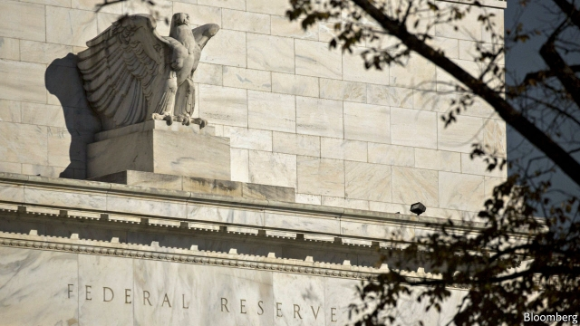
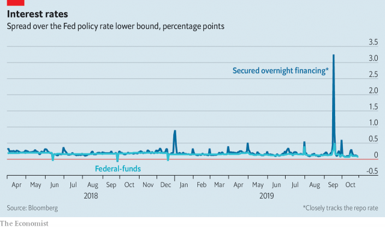

###### A plan to make the repo markets work better

# How to ensure financial firms have enough cash 

 

> print-edition iconPrint edition | Leaders | Nov 2nd 2019 

MOST PEOPLE have—mercifully—not had to think about the money markets since the financial crisis, when obscurities such as LIBOR briefly became part of the discussion. It is time once again to pay a bit more attention because New York’s “repo” market is not working as it should. Every day more than $1trn is borrowed and lent by financial firms through repos, which involve posting Treasury securities as collateral. The interest rate that borrowers pay ripples through the global financial system. Hence, if the repo market malfunctions, it matters. 

That is what happened in September, when rates briefly spiked as high as 10%; they should be much closer to the Federal Reserve’s target interest rate, which this week was cut to 1.5-1.75% (see article). The surge indicated that some financial firms did not have enough cash and were scrambling to get hold of more. Although repo rates have eased back since then, the underlying problem has still not gone away. 

The cash shortage has three causes (see article). As the Fed has reversed its policy of buying long-term bonds, known as quantitative easing (QE), cash has been sucked out of the system. Also, the underlying demand for cash from financial firms and their clients is rising. That reflects a growing economy and lumpy factors such as a cluster of large tax bills. Higher demand also reflects the government’s budget deficit of nearly $1trn, or 4.6% of GDP, which requires record amounts of government bonds to be issued, the buyers of which have to pay in cash. 

 

The third cause is that the cash sitting on the books of financial firms is largely held by a few big commercial banks. They hoard it partly because of post-crisis regulations that are meant to make them safer by requiring them to have big liquidity buffers and partly because they fear the reputational damage of miscalculating and of ever being found short of funds again. When a few big commercial banks hoard piles of cash, other financial firms, including investment banks and dealers, have less. 

What to do? Since September the Fed has opted for a short-term fix, by lending each morning somewhere in the region of $50bn-100bn overnight to ensure the financial system has enough money to keep repo rates under control. But this is uncomfortable because it involves repeated overnight loans and because the recipients are often Wall Street banks and traders, who are not obvious candidates for the open-ended receipt of support from the Fed, even if the loans are safely collateralised. Another option would be to alter the post-crisis rules that require banks to hold lots of cash. On October 29th Steven Mnuchin, the treasury secretary, floated this idea. But that risks watering down the reforms made after the crisis. 

There is a better answer. The Fed has begun to permanently increase the amount of cash held by financial firms, by buying $60bn-worth of shorter-dated Treasury bonds off them per month. Critics will say this represents more QE by stealth—but that is nonsense. Providing the bonds are short-dated, the Fed will have no mechanical impact on long-term interest rates—in contrast to when it conducts QE. And before the financial crisis, it was routine for the Fed to buy and sell short-term Treasuries in order to ensure that the money markets were transmitting monetary policy smoothly. Do this and, with luck, most people will once more be able to forget about the repo market.■ 

