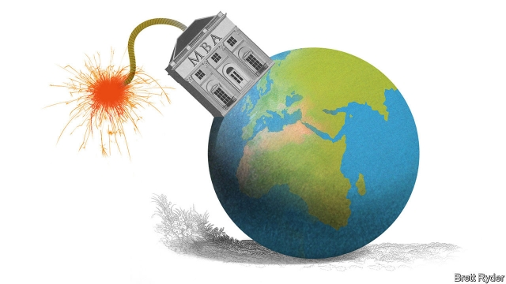

###### The MBA disrupted

# The future of management education 

 

> print-edition iconPrint edition | Leaders | Nov 2nd 2019 

Dear Dean Whiteboard, 

ON BEHALF OF the trustees of the Gordon Gekko Business School, I write with a helicopter view on our beloved institution. There is good news and bad. First, congratulations are in order. Under your leadership, GorGeBS has again been named by The Economist as one of the world’s top 100 business schools. 

The bad news is that our best-of-breed status is in jeopardy because the very business model of our school faces tectonic challenges (see article). Demand is plunging. Our MBA applications are down by a quarter. Across America, applications to business schools have fallen for five years in a row. Even at Harvard, they are down this year by about 6%. 

One reason is a drop in international applicants, many of whom are put off by America’s anti-immigration policies. But before you rush to blame all those law graduates staffing up government departments, the bigger factor is that we are charging too much. Our MBA costs nearly twice as much as it did a decade ago, but nobody believes we are delivering twice as much value. 

We are also failing to grapple with technological disruption. The time I spent getting my MBA on our leafy campus by the fountainhead of the River Rand constituted two of the best years of my life. Even so, I am beginning to think that your dogged defence of a bricks-and-mortar strategy is wrong-headed. Online business education can deliver world-class thought leadership, too. 

Worse, the relevance of our curriculum is being challenged. The students roaming our hallowed halls today are not the red-blooded, Darwinian capitalists who used to strive for business degrees. They are in a very different mind space, demanding that we go beyond our traditional teachings on the primacy of shareholder value to embrace stakeholder value. 

Going forward, we need three priorities. First, to get costs under control. The soup-to-nuts cost for an MBA at Stanford is $232,000—out of our ballpark. The five-star accommodation, gourmet cuisine and other perks on our campus are way over the top. So are some of our packages, even if we haven’t got quite as carried away as Columbia Business School, which, it was recently revealed, paid over $420,000 a year to a professor teaching three classes a year and $330,000 to untenured junior faculty. 

But that is low-hanging fruit. We also should embrace technology. Some schools offer hybrid degrees, mixing the soft skills learned on campus with the convenience of digital delivery. Boston University’s Questrom School of Business has gone the whole hog and now offers its full MBA online for just $24,000. If we do not adapt it will eat our lunch. And we need to get better at teaching technology. Our curriculum ought to drill down on the technical skills employers want, to deal with artificial intelligence and data analytics. No wonder firms themselves are stepping up. Accenture alone spends $1bn training staff in-house; the Silicon Valley giants spend even more. Those investments are cannibalising executive education, our cash cow. 

The trickiest challenge is dealing with the backlash against capitalism. As future CEOs, our charges must manage the conflicting demands placed on firms by myriad interested parties while still fulfilling their fiduciary duties to shareholders. The curriculum can no longer rely on one-dimensional case studies. We need to be better at playing back the trade-offs facing bosses navigating a 3D environment. 

The threat is existential. In the past five years, nearly a tenth of the full-time MBA programmes in America have disappeared. From Florida to Iowa, business schools have stopped offering the degree altogether. If we are to survive, never mind elevate GorGeBS to the top of the rankings, we need to start thinking outside the box and spearhead the next management revolution. 

Let’s touch base offline soon. 

IVOR HANGOUT■ 

