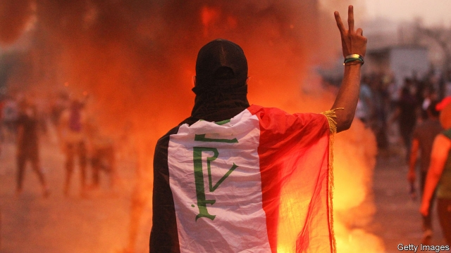

###### A bloody mess

# Protests in Iraq are met with violence 

 

> print-edition iconPrint edition | Middle East and Africa | Oct 31st 2019 

IF IT WERE not for the flags being waved, it would be difficult to tell the difference between the protests in Lebanon and those in Iraq. In Baghdad, as in Beirut, masses of people have taken to the streets, angry over corruption, poor governance and a lack of jobs. Thousands have also come out in cities such as Basra and Karbala in Iraq’s Shia south, the government’s heartland. But unlike in Lebanon (so far), the protests in Iraq have been met with extreme violence. At least 250 people have been killed by the authorities and their allied militias since the turmoil began on October 1st. 

It looks as if Adel Abdul-Mahdi, Iraq’s prime minister, may suffer the same fate as his Lebanese counterpart, Saad Hariri, who stepped down on October 29th. Mr Abdul-Mahdi came to power after elections last year produced a political deadlock. He was the compromise candidate of Muqtada al-Sadr, a firebrand cleric who leads parliament’s largest bloc, and Hadi al-Amiri, who heads an alliance of Iranian-backed Shia militias. But Mr Sadr has now abandoned him and Mr Amiri is wavering. 

His removal is unlikely to satisfy the protesters. Most see him as a puppet of the politicians who have plundered Iraq. Even after the jihadists of Islamic State were pushed off their territory two years ago, the government dithered over rebuilding. The people have benefited little from record oil production. About a fifth of the population is poor. But instead of helping them, politicians enrich themselves and their militias. 

Much of the public’s anger has focused on those militias and their patron, Iran (which calls the protests an act of sedition). In the holy city of Karbala protesters tore down posters of Ayatollah Ali Khamenei, Iran’s supreme leader, and burnt the Iranian consulate. A mob in Amarah lynched the local commander of Asaib Ahl al-Haq, a militia that considers Mr Khamenei its leader. And in Kut protesters torched the home of Qasim al-Araji, a prominent member of Mr Amiri’s alliance. 

Militia commanders vowed revenge. On October 27th Abu Mahdi al-Muhandes, the deputy head of the Hashd al-Shaabi, an umbrella group of government-funded militias, ordered his men to “stand against discord”. The next day his followers opened fire on protesters in Karbala. Between 14 and 30 people were reportedly killed. The authorities say no one died. 

 

In the past Mr Sadr championed protests. But this time his efforts to co-opt them have failed. When he drove to a rally in his hometown of Najaf, protesters would not let him out of his car. More senior clerics also seem to be losing their sway. Grand Ayatollah Ali al-Sistani has called for restraint on both sides. But some criticise him for helping bring to power the parties responsible for misgoverning Iraq. 

The authorities have re-raised the concrete barriers around Baghdad’s Green Zone, the seat of government. Inside, some favour an even more forceful response to the unrest and want Mr Abdul-Mahdi to take the rap until the bloodshed is over. Others have begun squabbling over who gets what once the prime minister goes. 

Outside, the protesters are becoming more angry, more confident and more numerous. Some observers fear they will take down the whole political system. What they want to replace it with is unclear. ■ 

