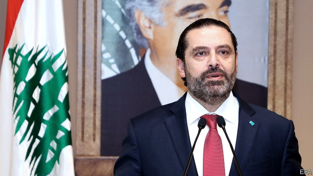

###### A Saad ending

# Saad Hariri, the prime minister of Lebanon, steps down 

 

> print-edition iconPrint edition | Middle East and Africa | Oct 31st 2019 

AFTER NEARLY two weeks of nationwide protests, the demonstrators in Lebanon claimed their first scalp. On October 29th the prime minister, Saad Hariri, said he had reached a “dead end” trying to deal with their demands over corruption and the stagnant economy. A package of meagre reforms, announced on October 21st, satisfied no one. So Mr Hariri said he was stepping down, along with his government. “It has become necessary for us to make a great shock to fix the crisis,” he said. Upon hearing the news, protesters in Beirut broke into applause. 

Mr Hariri’s government had struggled to perform the most basic tasks, such as providing 24-hour electricity or drinkable water. Internet connections in Lebanon are among the world’s slowest. Rubbish often piles up in the streets, or is dumped in the Mediterranean. After the government in mid-October proposed to tax calls made via WhatsApp, a messaging service, public anger erupted. As many as 1m people have joined the protests, in a country with fewer than 5m citizens. Mr Hariri’s departure is unlikely to persuade the demonstrators to end their campaign. 

A rotten political system is at the heart of Lebanon’s problems. The agreement that ended the country’s 15-year civil war in 1990 created a complex power-sharing arrangement that remains in place today. Government posts and public-sector jobs are divvied up among Sunnis, Shias and Christians—regardless of merit. Former warlords still hold sway, hogging government contracts. Some people fear that the resignation of Mr Hariri, a Sunni, will merely contribute to rising sectarian tensions. Michel Aoun, a doddering Christian, remains president; Nabih Berri, a Shia, is speaker of parliament. 

Both men are allied to Lebanon’s strongest power-broker, Hassan Nasrallah, who leads Hizbullah, a Shia militia-cum-political-party backed by Iran. Many blame it for aggravating the crisis. The resignation of Mr Hariri leaves it more exposed. But rather than come up with solutions, Mr Nasrallah has denounced the protests as an Israeli and American plot. Shortly before Mr Hariri tendered his resignation, bully boys clad in black and answering to Mr Nasrallah stormed Beirut’s Martyrs’ Square, the centre of the protests. “Shia, Shia,” they chanted as they beat protesters. Riot police watched. “The security forces don’t want to deal with the protests formally, so they do it informally, with thugs,” says Ali Hashem, a Lebanese commentator. 

Despite such provocations, the protests so far have been remarkably peaceful and non-sectarian. On October 27th hundreds of thousands of people formed a chain stretching from Sidon in the south to Akkar in the north. Demonstrators have staged raves in city squares and made Beethoven’s “Ode to Joy” their anthem. But they are also leaderless and lack clear goals. Some want a secular parliament in which MPs are individually elected, rather than through sectarian lists, as under the current system. Others fear that, given the numerical superiority of Shias, such reforms would simply entrench Hizbullah in power. 

A day before Mr Hariri resigned, Riad Salameh, the veteran central-bank governor, said Lebanon needed a political solution to avert an economic collapse. Banks have been closed for over a week, leading to fears of a run when they reopen. Meanwhile the protesters are growing tired and more concerned about their safety, says an organiser. Faced with the prospect of Hizbullah taking over the government, some may prefer sticking with the old political class, even Mr Hariri (who has been asked to stay on as a caretaker prime minister). Western powers might be convinced to release long-promised loans. None of that, though, would solve Lebanon’s deep structural problems. ■ 

