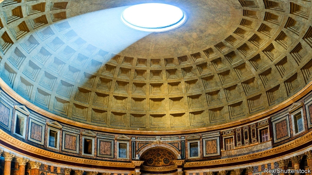

###### Making better concrete

# A pair of Australian bridges try to cure concrete cancer 

 

> print-edition iconPrint edition | Science and technology | Nov 2nd 2019 

MODERN CIVILISATION is built on concrete and steel. Put the two together, though, and you can generate a problem. Reinforcing concrete with steel rods called rebars is the basis of modern construction. But because water gets in through tiny cracks, the rebars rust. This causes them to expand, widening the cracks and weakening the concrete. Hence such structures require constant attention and often have design lives of only 60-100 years. That is pitiful compared with, say, the concrete dome of the Pantheon in Rome—which was completed in 125AD and still stands. 

Various ways of delaying or preventing concrete cancer, as this corrosion is known colloquially, have been tried. These include recipes for concrete that is less permeable to water, and rebars made from rust-resistant materials such as stainless-steel or composites. Such approaches work, but they can be expensive. 

This may be about to change. Next year, if all goes well, a pair of footbridges intended to be cancer-proof will open in Geelong, a town 75km south-west of Melbourne, Australia. These bridges, which will act as prototypes for more than 150 others planned for the expanding city, will be constructed using a novel approach that combines glass-fibre and carbon-fibre rebars. They will, though, cost about the same as equivalent conventional bridges. 

The new design is the brainchild of a joint team of researchers from Deakin, a local university, and Austeng, the firm contracted to build the bridges. This team began with commercially available rebars made from carbon-fibre composite. Although these are as strong as steel ones, they are expensive. They are, therefore, most often used in specialist structures such as buildings to house MRI hospital scanners, where electromagnetic interference from metal can cause problems. 

To get around this the team have worked out how to minimise cost by using carbon-fibre rebars only where strictly necessary. In other places they use glass fibre, which is cheaper. The result is a frame that acts as a skeleton for precast concrete sections which can then be assembled into a bridge. 

According to Mahbube Subhani, one of the researchers at Deakin, a three-metre-long version of such a section has just been tested and has passed local building codes. The group is now pressing ahead with the first of the ten-metre sections needed to construct the bridges themselves. 

The new castings are, as was hoped, both stronger and lighter than steel-reinforced concrete. Tests showed that the prototype’s load-carrying capacity was 20% better, even though its cross-section was 15% smaller. Production costs are “a little bit higher”, Dr Subhani admits. But in the long run, he says, the bridges will work out cheaper because they should last for at least 100 years without any maintenance being required. 

They will also be more environmentally friendly, for the concrete surrounding the skeleton is unconventional, too. Normal concrete is bound with Portland cement, which is made by roasting a mixture that includes limestone (calcium carbonate). This process drives off carbon dioxide, a greenhouse gas, and cement-making is a big source of such emissions. 

Geelong’s bridges, by contrast, will be made with geopolymer concrete. This uses cement made from a different mixture of ingredients, including furnace fly-ash, which do not release carbon dioxide when being processed. 

Further down the line Deakin’s researchers are looking into making rebars out of basalt, an abundant volcanic rock, by melting it and extruding it into fibres. That could provide a cheaper and greener alternative to carbon fibres, which are usually made from oil-based polymers. Some commercial basalt-fibre composites are already available, but the team think they can improve the performance of such fibres further, by adding other materials. 

Coincidentally, one of the ingredients of the Pantheon’s concrete dome is pumice, another volcanic rock. Whether basalt-fibre concrete will similarly stand the test of time only future architects will know.■ 

