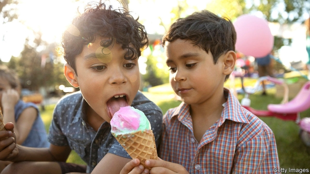

###### The scientific method

# A tale of mistake and retraction shows that science works—eventually 

 

> print-edition iconPrint edition | Science and technology | Nov 2nd 2019 

IN NOVEMBER 2015 a team of psychologists led by Jean Decety of the University of Chicago published an unexpected finding. Based on an experiment involving coloured stickers (trinkets valued by the children who took part) they concluded that youngsters living in religious households are less generous than those who dwell in non-religious households. Many news outlets, including The Economist, reported this result—precisely because it was so surprising. It turns out, though, that it was wrong. In August Current Biology, the journal which published the original paper, published a retraction, saying: 

An error in this article, our incorrect inclusion of country of origin as a covariate in many analyses, was pointed out in a correspondence from Shariff, Willard, Muthukrishna, Kramer and Henrich. When we reanalysed these data to correct this error, we found that country of origin, rather than religious affiliation, is the primary predictor of several of the outcomes. 

Still an interesting result, then. But not what had originally been claimed. Translating the retraction’s jargon, Dr Decety and his colleagues were confessing to the fact that the numerical codes they had assigned to the various countries involved in the study (1=USA, 2=Canada and so on) had been incorporated by accident into the calculation, and had thus thrown the result out of whack. 

The road to this retraction shows both what is good and what is bad about the way the modern scientific method works. The good is that the error was exposed, and has been acknowledged by the paper’s authors. The bad is that it took four years for the retraction to happen. 

The error was originally spotted by Azim Shariff, a psychologist at the University of British Columbia, in Canada. Dr Shariff read Dr Decety’s paper and noted that its findings clashed with many of his own observations. These suggested that a religious upbringing increased kindness towards others, rather than decreasing it. That led Dr Shariff to ask Dr Decety for his data so that he, Dr Shariff, could analyse them in detail to try and work out why their conclusions clashed. Dr Decety obliged. Dr Shariff discovered the coding error. And, based on that discovery, he reported his results in Current Biology in August 2016. 

Current Biology’s publishers, Cell Press, felt that was enough. The original mistake was in the public domain and everyone could now get on with life. It did, though, mean that Dr Decety’s paper remained in the literature, possibly confusing those who had not read Dr Shariff’s. And that was the case until a new, unrelated paper, published by Nature in March, drew attention to Dr Decety’s work and created an outcry on social media for the matter to be addressed. A few months later, after discussion with Dr Decety, Current Biology retracted the paper. 

It is often observed that news media are keen to publicise extraordinary-sounding results, but lose interest in subsequent work—and actually ignore retractions. There is truth in that, though it is also true that journals often fail to draw attention to such matters. Whatever the reason, according to a report that came out in Psychology Today in September, though more than 80 publications reported on the original findings, Dr Shariff’s follow-up was covered at the time by a mere four outlets. 

The happy ending is that Dr Decety has spent the intervening period collecting yet more data on the matter, and that he and Dr Shariff are now collaborating to analyse those data. When they publish, we will endeavour to cover it.■ 

