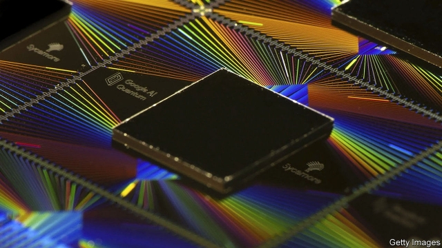

###### Quantum computing

# IBM challenges a recent result in quantum computing 

 

> print-edition iconPrint edition | Science and technology | Nov 2nd 2019 

IT WAS HAILED by many, including The Economist, as a landmark result in quantum computing. In September a scientific paper appeared accidentally on a NASA webpage. In it a team of researchers at Google described how they had used a quantum computer to complete, in three minutes, a calculation that would have taken a classical machine 10,000 years to crunch through. This feat, they claimed, marked the first demonstration of “quantum supremacy”—using a quantum computer to tackle a task unfeasible for a classical one. 

On October 23rd the paper reappeared, intentionally this time, in Nature. But a few days before that some researchers at IBM—which, like Google and several other information-technology firms, including Intel and Microsoft, is also conducting quantum-computing research—posted their own paper to arXiv, an online repository. In it, they cast doubt on Google’s claim. 

The task that Google’s engineers tested their machine with is called circuit sampling. It involves measuring the outputs of randomly wired circuits made of qubits, the quantum-mechanical analogues of the classical bits that lie at the heart of conventional computing. 

In truth, circuit sampling is a toy problem with little practical use. Google picked it as a demonstration because it is mightily difficult for a classical machine to do at all, whereas a well-behaved quantum computer finds it trivial. Moreover, the contest becomes exponentially more unequal as the number of qubits in the quantum machine goes up. 

Google used a 53-qubit machine. The classical-computing yardstick against which its performance was putatively measured was Summit, a machine at Oak Ridge National Laboratory that is, at the moment, the fastest in the world. Google’s engineers did not, however, actually do the experiment. Rather, they arrived at the figure of 10,000 years by extrapolating from easier versions of the task. 

Not so fast, said IBM—or, rather, not so slow. The chief problem Summit faced is that when simulating 53-qubit circuits it would run out of memory. This means that, were anyone actually trying to run the simulation, they would have to use a less memory-hungry but much slower algorithm to do so. IBM pointed out that Summit also has plenty of hard-disk space. Although not usually counted as memory, this could nonetheless be pressed into service. Doing so, combined with a few tweaks to the algorithm, would, IBM’s engineers reckon, allow Summit to breeze through the job in a mere 2½ days. Therefore, according to IBM, Google had not shown quantum supremacy after all. 

Technically, IBM is right. How much it matters is another question. Two and a half days is, after all, still about 1,200 times longer than 3 minutes. Second, each extra qubit doubles the memory required by a classical machine put up against it. Adding just three qubits to Google’s challenger machine would have exhausted Summit’s hard disks. Quantum computers do not face such explosively growing demands. Google’s machine may not quite have crossed the finishing line. But it has got pretty close to doing so. 

