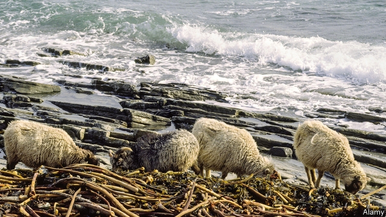

###### Curbing greenhouse-gas emissions

# The answer to livestock that burp methane may be seaweed 

 

> print-edition iconPrint edition | Science and technology | Nov 2nd 2019 

ANCIENT GREEK writings describe livestock eating seaweed, as do Icelandic sagas. And, as the picture shows, sheep on North Ronaldsay, in the Orkney Islands of Scotland, still graze on the stuff. But that is now seen as unusual. It may not be in the future, however, as research conducted in Australia and New Zealand suggests algavory of this sort may reduce greenhouse-gas emissions from stock animals. 

The research in question is being co-ordinated by CSIRO, Australia’s main science agency. The project is looking into microbes that inhabit the stomachs of ruminants such as cattle and sheep. These bugs transform those animals’ fibrous fare into energy-rich molecules, some of which the host animal is able to absorb and utilise. 

One energy-rich molecule that is not absorbed, though, is methane. Instead, the animals belch it into the atmosphere. Which is a problem, because methane is a greenhouse gas that has a warming effect 28 times as powerful as carbon dioxide’s. Since this loss of methane also deprives the host of the energy therein, thus probably reducing its growth rate, controlling methanogenic bacterial activity in ruminants looks like a beneficial twofer. 

The antimethanogenic powers of Asparagopsis, the seaweed in question, were discovered in 2016 and experiments involving it have been going on since then. One of the latest, published in October in the Journal of Cleaner Production, showed that dairy cows eating a diet containing 1% Asparagopsis produce only a third of the methane belched by cows on seaweedless diets. Since a cow has about the same greenhouse effect as a car, cutting the emissions of even a portion of the world’s 1.5bn cattle would bring great benefit. Furthermore, according to Michael Battaglia, who directs CSIRO’s agriculture and global change programme, soon-to-be-published work shows that seaweed-fed beef cattle grew, as predicted, faster than their seaweedless confrères. 

The methane-diminishing effect of Asparagopsis is caused by a compound called bromoform, in which the algae are rich. Bromoform blocks one of the enzymes that methanogens use to create the gas. The obvious solution to the problem might therefore seem to be to add this chemical directly to animal feed. That might work in principle (no one has yet tried), but in practice would require a lot of safety trials and, if those came back positive, a change in the regulations. It would also risk a backlash by consumers, who might perceive adding bromoform as adulteration of some sort. 

The alternative is to cultivate seaweed, rather than gathering it from the wild, in order to provide the quantities that will be needed if the idea of adding Asparagopsis to feed becomes popular. And New Zealand’s government is proposing to do precisely that. It has just made money available for people who hope to develop ways to farm Asparagopsis. Exactly how this will work remains to be seen. But the idea of adding a new crop to the world’s agriculture, and a marine one to boot, is intriguing.■ 

