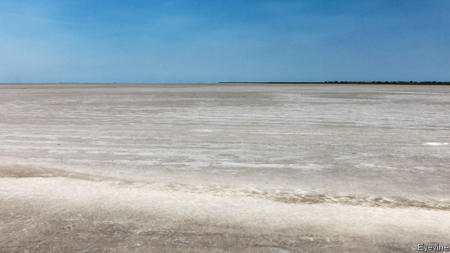
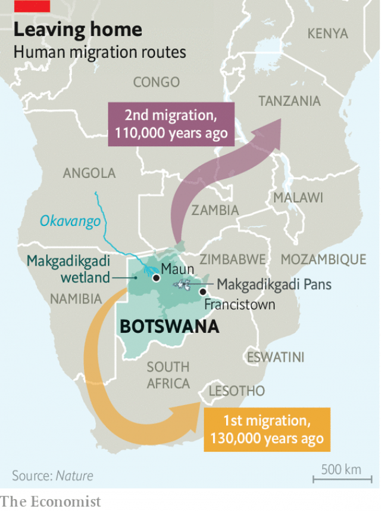

###### Human evolution

# Where was Eden? Perhaps in a sun-baked salt plain in Botswana 

 

> print-edition iconPrint edition | Science and technology | Oct 31st 2019 

NORTHERN BOTSWANA is a land of strange contrast. Drive west from Francistown, the country’s second city, and you skirt Makgadikgadi, a white, salt-encrusted plain that is bone dry for most of the year, but which blossoms into sudden, abundant life during the wet season. Follow the road farther and you arrive at Maun, on the edge of the lush inland delta of the Okavango river, the fourth-longest in southern Africa. Two hundred thousand years ago, though, Makgadikgadi was also lush. Both it and the delta were part of a lake, then the largest in Africa, surrounded by wetlands. For wildlife, the result was a veritable paradise—and also for people, for, if the latest research is correct in its claims, an intriguing episode in humanity’s origins was played out there. 

That Homo sapiens began as an African species was pretty-much proved in the 1980s by Allan Wilson of the University of California, Berkeley. He developed what has come to be known as the Mitochondrial Eve hypothesis by looking at a special type of DNA which is passed, unmixed by sexual reproduction, from a mother to her children. This so-called mitogenome is independent of a cell’s nucleus, where the rest of the genes are found. It resides in structures called mitochondria that are the descendants of once-free-living bacteria and which now act symbiotically as a cell’s power packs. 

Wilson’s research showed that the family trees of present-day human mitogenomes, their branches caused by mutations over the millennia, converge in a way which makes clear that their common ancestor lived in Africa. Hence the nickname Mitochondrial Eve. This woman was by no means the first human being. But everyone now alive can claim descent from her. 

What is true for Eve is also true for Adam. Part of the DNA on the Y-chromosome, which is passed unmixed from father to son, can be used to draw up a similar tree that is also rooted in Africa. Where, exactly, Y-chromosomal Adam resided has not yet been established. But as they describe this week in Nature, a group of researchers led by Vanessa Hayes of the Garvan Institute in Sydney, Australia, think they have found that Mitochondrial Eve—or, at least, people closely related to her—lived for tens of thousands of years in splendid isolation in northern Botswana. 

That northern Botswana was a habitat of early humans has been known for years. Makgadikgadi is littered with stone tools dropped there aeons ago by Palaeolithic hominids. Which particular hominids, however, is not clear. Unlike later artefacts, Palaeolithic tools are not species-specific. Though they were invented about 1.8m years ago by Homo erectus, an early human that spread over Africa and Asia, they were also used by erectus’s numerous daughter species, one line of which leads eventually to Homo sapiens. 

The story that Dr Hayes and her colleagues are proposing is that, whoever might have been living there beforehand, by 200,000 years ago the land around Lake Makgadikgadi was indeed occupied by Homo sapiens. For the following 70,000 years these people evolved in isolation, penned into their homeland by desertlike surroundings. Then, in two bursts—one 130,000 years ago and the other 110,000 years ago—they were unleashed on the wider world. 

 

Mitogenomic ancestral trees are made by looking for typos in the sequences of genetic “letters” in mitogenomes—places in the DNA where a single chemical base differs from one individual to another. Because mitogenomes do not recombine during sex, these changes are all the results of random mutations. By comparing mitogenomes, it is possible to work out in what order the mutations happened. And because even random processes have measurable averages, it is also possible to estimate when a particular mutation arose. 

Follow the branches of the human mitogenomic tree back through time and they converge on a group of mitogenomes known as L0. This group is largely confined to southern Africa. It is the characteristic mitogenome of the Khoesan people, who long predate the arrival in the area of both Bantu from farther north in Africa and Europeans from overseas. Dr Hayes and her colleagues therefore gathered all of the existing versions of L0 that they could find, and also collected 198 new ones, to bring together a total of 1,217 variants from which they sought to refine the ancestral tree. 

With that information, and data about where the samples were collected, maps of how people who share L0 spread can be constructed. And that is what Dr Hayes and her colleagues did. The branches of their new tree converge in time about 200,000 years ago. In space, they converge on northern Botswana. 

The tree also suggests that the L0 population lived in one place for perhaps 70,000 years before part of it moved south-west, and a further period of about 20,000 years before another part moved north-east. This suggestion of an isolated population that underwent two outward migrations is supported by work by Dr Hayes’s collaborator, Axel Timmermann of the Institute for Basic Science in Busan, South Korea. He is a climatologist and has pieced together, from paleogeographic and astronomical evidence, a history of Makgadikgadi and its surroundings. In particular, he has looked at the effects on the climate there of the shifts in Earth’s orbit and axial spin that cause ice ages. 

His conclusion is that for most of this time Lake Makgadikgadi was surrounded by desert, but that this encircling wall was twice penetrated by green corridors along which animals, people included, would have been able to migrate. The first corridor opened 130,000 years ago to the south-west. The second, 110,000 years ago to the north-east. 

The mitogenomic and climatic data thus seem to match. The south-western dispersal would have carried the ancestors of today’s L0 individuals into other parts of southern Africa. In particular, it would explain the traces of habitation along South Africa’s coast that date from shortly after. 

It was the north-eastern dispersal, though, that unleashed the children of Makgadikgadi on the wider world. Their descendants spread through what is now Zambia and into the rest of Africa, interbreeding with people already living there, including the descendants of Y-chromosomal Adam, as they merged into the wider gene-pool of humanity. Indeed, the history of human nuclear genes resembles a web more than it does a tree, which is one reason Wilson sought the clarity of the mitogenome in the first place. 

Eventually, about 50 millennia after these events, some intrepid adventurers crossed to Asia, took up residence there, and thence spread to Australia, Europe and the Americas. The DNA of these travellers was further changed by interbreeding with at least two other species of human: Neanderthals in Europe and Denisovans in Asia. 

Not everyone believes Dr Hayes’s version of history. The further back the human mitogenomic tree is traced, they point out, the more uncertainty creeps into it, so further investigation would be desirable. But the mix of evidence, genetic and climatic, that she and her colleagues present does paint quite a plausible picture of the experiences of one particular branch of modern people’s ancient ancestors.■ 

