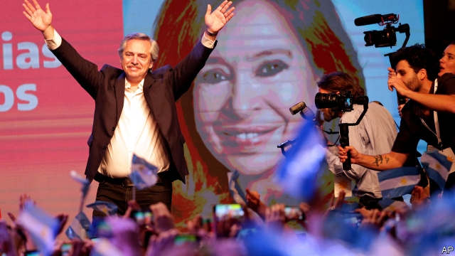

###### Rolling back the years

# Argentina gives the Peronists another chance 

 

> print-edition iconPrint edition | The Americas | Nov 2nd 2019 

“WE WILL DEVOTE all our efforts to ending the suffering of all Argentines,” declared Alberto Fernández, Argentina’s president-elect, before a crowd in Chacarita, a working-class area of Buenos Aires. Mr Fernández was celebrating his victory over the incumbent, Mauricio Macri, in a presidential election on October 27th. But Mr Macri raised similar hopes after his election four years ago, which ended 14 years of rule by the Peronist movement to which Mr Fernández belongs. 

The victory by the Peronists—who secured 48% of the vote against Mr Macri’s 40% with most of the votes counted—was narrower than expected but large enough to avoid a run-off vote in December. The question is whether they can do a better job of resolving the country’s chronic economic troubles than Mr Macri did. 

The election offered voters a choice between two failed models. Mr Macri’s supposedly business-friendly presidency is ending with a shrinking economy, a falling currency and rising prices. But the years of populist rule by the Peronists that preceded it were at least as bad. The author of the previous Peronist disaster, Cristina Fernández de Kirchner (no relation to Mr Fernández), will now be vice-president. When it became clear after a primary vote in August that the Fernández duo would win, the peso plunged by 25% and inflation surged. Even as the winners were chalking up the votes on October 27th, shopkeepers were marking up prices, anticipating further devaluation and higher inflation. 

Nerves have since settled. The peso strengthened a bit against the dollar in the black market in the days following the election. Mr Macri, conceding defeat, invited the president-elect immediately to the Casa Rosada, the presidential palace. The hope is that the two can agree a “transition package” to keep the markets steady until Mr Fernández takes office in December. They have already signed off on tighter currency controls, limiting dollar purchases to just $200 a month, to prevent a possible run on the peso. That is much lower than the $10,000 limit imposed in September. 

The election did not resolve the question of which Fernández would truly succeed Mr Macri: Alberto, the president-elect, or Cristina, the charismatic former president who elevated Alberto from backstage operative to presidential frontman. 

The early signs are mixed. In the closing days of the campaign, Mr Fernández insisted he and his running-mate were inseparable. “But that was the candidate speaking,” said one of his inner circle, as the president-elect celebrated his victory. “He knows he has to cut the cord if he is to stabilise this economy, and win time for recovery from this economic mess.” Mr Fernández has already signalled that he will seek a pact with businesses and unions to contain inflation. Entrepreneurs sound receptive. “Count on me, especially when it comes to a social pact,” said one of Argentina’s biggest soya farmers, Gustavo Grobocopatel, who had backed Mr Macri. 

One clue to Mr Fernández’s intentions will be his choice of treasury minister. The two leading candidates, Matías Kulfas and Guillermo Nielsen, are veterans of the Kirchners’ rule (and members of Mr Fernández’s transition team). But their reputations differ. Mr Nielsen has encouraged bondholders and the IMF to show patience with the new government. He cites the example of Uruguay, which repaid its creditors after a crisis in 2002 slowly, but without subjecting them to a “haircut”. That may not work in Argentina given the size of its debts (near 90% of GDP, according to JPMorgan Chase) and its weak currency. But investors welcome the sentiment.  

Mr Nielsen, who led Argentina’s negotiations with the IMF from 2003 to 2005, may reprise that role as Argentina seeks to revise the terms of its existing $57bn loan from the fund. That may make Mr Kulfas, a general manager of the central bank during Ms Fernández’s presidency, the favourite for the top economic job. He is viewed as a traditional Peronist in his economic thinking. “So expect protectionism, interventionism, strict currency controls to limit capital flight,” said a former senior official. A big job for Cecilia Todesca, a moderate who served alongside Mr Kulfas at the central bank, would be a reassuring signal. 

Other election results will have a bearing on the struggle for power within the Peronist government. The province of Buenos Aires, home to almost 40% of Argentina’s population, elected Axel Kicillof as governor. A former economy minister under Ms Fernández, he will have an influential voice. And it is not an entirely reassuring one. “The economic situation we inherit today represents scorched earth, the ultimate failure of neoliberalism,” Mr Kicillof declared at the Peronists’ victory celebration. 

Even so, other results suggest those scorching “neoliberals” may have a say in how Argentina is governed. A member of Mr Macri’s party won re-election as mayor of the city of Buenos Aires by a huge margin. Mr Macri’s coalition looks likely to form the largest group in the lower house of congress (although Mr Fernández’s alliance will control the senate). 

“The good news is we have two broadly based coalitions coming out of this,” concluded Sergio Berensztein, a political analyst. The Peronists will have to seek allies rather than berate their enemies. With luck, Mr Macri will have left a political legacy of “conversation, not conflict”.  

Mr Fernández’s foreign policy may be more ideological than his economic policy. His first foreign trip as president-elect will be to visit Mexico’s populist president, Andrés Manuel López Obrador. Relations with Brazil, Argentina’s biggest neighbour, are off to a frosty start. Jair Bolsonaro, Brazil’s right-wing president, refused to congratulate him on his election victory. 

“All I care about is that the Peronists and Cristina will look after us once again,” said Marta Moreno, a housewife at Mr Fernández’s victory rally. The poster in her hand recalled an election victory of 73 years ago. It bore the image of Eva Perón, General Juan Perón’s wife, who is still popular with those who want leaders to look after them. ■ 

