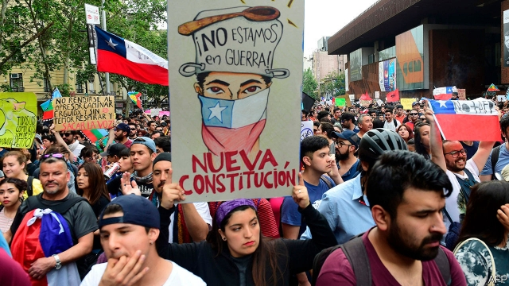

###### Piñera’s pickle

# Chile’s president tries to quell unrest 

 

> print-edition iconPrint edition | The Americas | Nov 2nd 2019 

THE PROTESTS that have convulsed Chile have taken every conceivable form. They began when students in Santiago, the capital, started dodging metro fares, which had been raised by 30 pesos (four cents) at peak times to 830 pesos. Anger then began to express itself in arson and looting and spread to other cities. The government imposed its first curfew in Santiago since the end of dictatorship in 1990. At least 20 people died in the unrest and more than 1,000 have been injured. 

On October 25th 1.2m people, a fifth of the city’s population, converged on central Santiago to express (peacefully) their disgust with inequality and with the way the country is run. “I would like to retire but can’t,” said Carolina, a 62-year-old teacher, who has saved enough for a pension of just $275 a month after 30 years on the job. Placards demanded everything from a lower VAT on books to a new constitution. 

Sebastián Piñera, Chile’s centre-right president, at first took a tough line with the malcontents. “We are at war,” he declared during the rioting. The state’s response was heavy-handed. Although most of the deaths occurred because of arson, Chile’s Human Rights Institute is compiling evidence of 120 cases of abuse by security forces, including five killings. 

As protests grew, Mr Piñera’s tone changed. On October 19th he rolled back the fare increase. On October 22nd he announced further concessions. These included higher public spending on pensions and health care, a boost to the minimum wage and a reversal of recent rises in electricity prices. These measures will cost the government $1.2bn, 0.4% of GDP. To help pay for this the government is to raise taxes on top earners. 

Mr Piñera followed that up on October 28th by replacing eight members of his cabinet. The new cabinet has a younger, friendlier face. The president, who promised “better times” when he took office in 2018, says these changes herald the start of “new times”. But it is unclear how much novelty he is planning, and whether it will satisfy Chile’s restive people. 

Violence has lessened, but continues. Some protesters are demanding Mr Piñera’s resignation. On October 30th he announced that two high-profile international meetings, a UN climate conference and a summit of Asian and Pacific countries, will not be held in Santiago. He wants to focus on restoring order and talking to Chileans. 

If Mr Piñera is to deal with the roots of discontent, he will have to reform Chile’s way of providing health care, education and pensions, believes Eugenio Tironi, a sociologist. Under a model developed by free-market economists during the dictatorship of Augusto Pinochet, who ruled from 1973 to 1990, citizens are expected to save for their own retirement. 

In many other countries, public pensions are financed by taxing current workers and giving the money to current pensioners—a system that comes under strain when the population ages. Chileans, by contrast, invest the money they save in privately managed funds. This system has helped Chile manage its public finances and encouraged the development of long-term capital markets, which in turn has boosted economic growth. But Chileans like Carolina are furious to discover that they have not contributed enough money to pay for adequate pensions. Many are equally angry about long waiting times to see doctors in the public health system and about the lousy education available in public schools. 

Post-dictatorship governments have tried to boost public spending on the hard-up. In 2008, for example, the Socialist government of Michelle Bachelet increased the value of payments to schools attended by the children of poor families. But even after such changes the government spends less than 11% of GDP on education, health and pensions, well below the average of the OECD, a club of mainly rich countries, to which Chile belongs. 

The conservative Mr Piñera is unlikely to scrap a system which in many ways has served Chile well. It is the second-richest country in Latin America, thanks in part to its healthy public finances and robust private sector. Mr Piñera is likely to resist demands for a constituent assembly to rewrite the constitution. This might push reform in the direction of populism and discourage investment. 

One problem for the government is that the protesters’ demands are unclear. Their movement grew largely through social media, without identifiable leaders. Another problem is that Chile’s political class has lost credibility. A survey conducted in May this year by CERC-Mori, a pollster, found that the senate, the chamber of deputies and political parties were among the country’s four least-trusted institutions. (The fourth was the pension-fund managers.) 

Mr Piñera’s own approval rating dropped last week from 29% to 14%, an all-time low for a president in the democratic era, according to Cadem, another pollster. A rich businessman, he is seen as an exemplar of what is wrong with Chile. His coalition, Chile Vamos, has a minority of seats in congress, which has made it hard for him to govern. Anger over human-rights abuses may further complicate his efforts to introduce reforms. 

Mr Piñera wants to overcome such obstacles by convening town-hall meetings similar to those held by France’s president, Emmanuel Macron, in response to the gilets jaunes (yellow jackets) protests this year. These could help, says Juan Pablo Luna, a political scientist at the Catholic University in Santiago, provided they bring together people from different backgrounds. Mr Piñera is betting that dialogue and a revamped government will break deadlocks over how to reform the country. The result could be a new Chilean model.■ 

