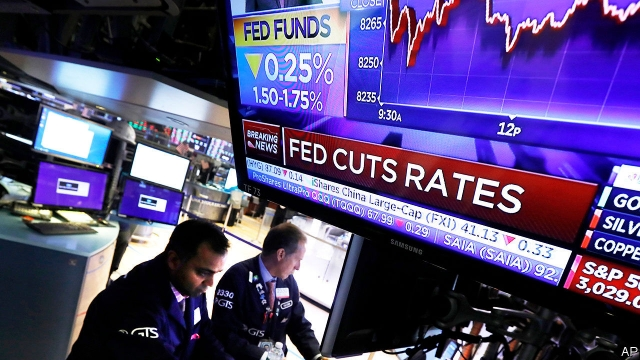
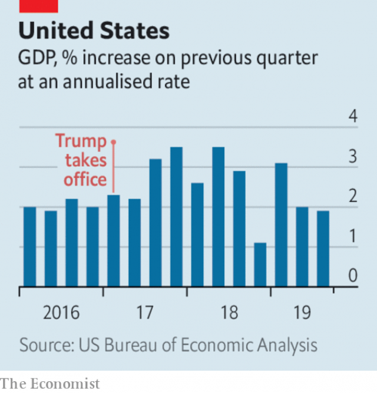

###### Saudi Aramco

# Business this week 

 

> Nov 2nd 2019 

The Federal Reserve cut its benchmark interest rate for the third time this year, shaving off another quarter of a percentage point to a range of between 1.5% and 1.75%. Arguments have raged at the central bank about the need for further easing in America’s still robust economy. Many have read the runes of the carefully worded statement by Jerome Powell, the Fed’s chairman, that “policy is likely to remain appropriate”, to suggest that future reductions are on hold. See article. 

 

Official figures showed that the American economy grew by 1.9% at an annualised rate in the third quarter. The data underlined the Fed ratesetters’ conundrum; consumer and government spending remained buoyant, though business investment was limp. See article. 

Groupe PSA, the maker of the Peugeot car brand, and Fiat Chrysler Automobiles agreed to merge, creating the world’s fourth-largest car manufacturer. Carmakers are under increasing pressure to consolidate in an industry beset by rising costs and disruptive technologies. Earlier this year Fiat Chrysler tried to engineer a merger with Renault, but it hit a dead end when the French government, which owns 15% of Renault, withheld its support. See article. 

The recent strike at General Motors is now thought to have cost the company $2.9bn. The 40-day strike was the longest at the carmaker since 1970. 

In a week when it announced that it would have to lay off up to 15% of its workforce, Juul which dominates the market for e-cigarettes, faced a lawsuit from a former executive accusing it of selling contaminated vaping pods to retailers. It is another blow for e-cigarettes, which are under scrutiny in dozens of cases of lung disease. 

General Electric reported another huge quarterly net loss, this time of $9.5bn, as it booked charges connected to its restructuring. Some $8.7bn of that relates to writing down its investment in Baker Hughes, an oil-services firm. 

The long-awaited IPO of Saudi Aramco was reportedly ready to be launched on November 3rd. Shares in the world’s biggest oil company, owned by the Saudi state, are expected to start trading in mid-December. See article. 

Microsoft won a $10bn contract to create a “war-fighter” cloud-computing system for the Pentagon. The decision to award the Joint Enterprise Defence Infrastructure (JEDI) project to Microsoft was a surprise, as Amazon had been the front-runner. It might yet challenge the decision, especially given Donald Trump’s animosity towards Jeff Bezos, Amazon’s boss. Mr Trump reportedly wanted to “screw” Amazon over the contract. 

Arm, a chip designer based in Britain, is to resume supplying components to Huawei, a Chinese tech firm sanctioned by the American government. Arm is now confident that its designs do not fall under American export-control rules after all. The firm is one of Huawei’s most important, and least replaceable, suppliers. 

WhatsApp is to sue the NSO Group, an Israeli maker of commercial spyware. The encrypted chat service, which is owned by Facebook, alleges that NSO’s malware was used to spy on the conversations of 1,400 people in 20 countries, including lawyers, journalists and human-rights advocates. 

Facebook reported a surge in revenue and profit for the third quarter. Mark Zuckerberg used the occasion to reflect on “the importance of standing for voice and free expression”, as he defended his position not to “censor” politicians. Earlier, Twitter announced a ban on all political advertising on its platform worldwide. 

Apple’s quarterly earnings retold a now-familiar tale. Sales from the iPhone were down, though revenues from wearable devices and services jumped; those two segments accounted for 30% of the company’s sales in the quarter. 

Murray Energy, America’s fourth-largest coal miner, filed for bankruptcy protection. It is the latest firm to go to the wall in an industry that has been squeezed by natural gas and renewable energy, despite Donald Trump’s many promises to save coal jobs. 

LVMH, the world’s largest luxury-goods company, made an unsolicited bid to buy Tiffany, a jewellery firm. Tiffany valued the deal at $14.5bn. The offer is the largest acquisition yet attempted by Bernard Arnault, LVMH’s multi-billionaire boss, and another big bet on bling; in 2011 LVMH took a majority stake in Bulgari. 

Virgin Galactic became the first space-tourism venture to become a publicly traded company when it floated in New York (it avoided an IPO by combining the business with an already-listed investment vehicle). Galactic thinks it can eventually turn a profit by persuading enough rich folk to pay $250,000 for a 90-minute, 50-mile trip above the Earth’s surface, part of its “mission” of “democratising space”. 

