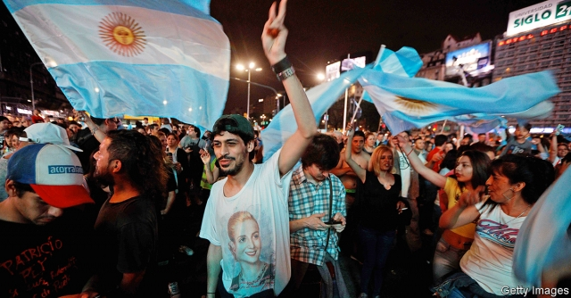

###### Saudi Aramco

# Politics this week 

 

> Nov 2nd 2019 

Alberto Fernández, a Peronist, won Argentina’s presidential election, defeating the pro-business incumbent, Mauricio Macri. Voters blamed Mr Macri for a recession, an inflation rate of more than 50% and a poverty rate that tops 35%. The newly elected vice-president, Cristina Fernández de Kirchner, laid the groundwork for these economic problems when she was president from 2007 to 2015. See article. 

Bolivia’s electoral authority declared that President Evo Morales won re-election, avoiding a run-off by just 0.57% of votes cast. At least two people died and dozens were injured in clashes between his supporters and those of opposition candidate Carlos Mesa, who has accused the government of rigging the vote. 

Chile’s president, Sebastián Piñera, reshuffled his cabinet and agreed to spend extra money on pensions and health care and to raise taxes on high earners, after 1.2m people demonstrated in Santiago, the country’s capital, against inequality and threadbare public services. At least 20 people died in rioting and arson attacks. Chile cancelled plans to host a summit of Asian and Pacific leaders in November and a UN climate meeting in December. See article. 

Claudia López, a crusader against corruption, was elected mayor of Bogotá, Colombia’s capital. Ms López is the first woman and first gay person to be elected to the job. The regional elections were a setback for the Democratic Centre party of the president, Iván Duque, who lost control of strongholds like Medellín. 

A constitutional amendment that strips Jammu & Kashmir of statehood and divides it into two territories administered directly by India’s national government came into effect. Life in the Kashmir valley has been severely disrupted since the government announced the change in August, because of restrictions on communications and travel, as well as protests and militant violence. 

A court in Myanmar sentenced five members of a satirical troupe to a year’s hard labour for mocking the army’s role in politics. 

King Maha Vajiralongkorn of Thailand dismissed two aides for adultery, a week after he stripped his official mistress of her titles for disloyalty. 

Scores of people died when a gas stove being used by passengers to cook breakfast aboard a train in Pakistan exploded. It was the country’s worst rail disaster in a decade. 

Hong Kong’s government barred a pro-democracy activist, Joshua Wong, from standing in district elections. It linked the decision to Mr Wong’s calls for “self-determination” for the territory. Meanwhile, official figures showed that Hong Kong has slipped into a recession. 

Nearly 400 of China’s most senior officials gathered in Beijing for a secretive meeting of the Communist Party’s Central Committee. The agenda was described as “important issues concerning how to uphold and improve the socialist system with Chinese characteristics”. See article. 

The pious rapist in charge of Islamic State, Abu Bakr al-Baghdadi, killed himself to avoid capture by American soldiers. The jihadist group once controlled territory the size of Britain, but lost its last scrap of land earlier this year. Mr Baghdadi was found in north-west Syria, where he was chased down a tunnel. He detonated a suicide-vest, murdering two of his own children. Donald Trump said: “He died like a dog.” See article. 

Saad Hariri, the prime minister of Lebanon, resigned amid demonstrations over the struggling economy and poor governance. Some fear his resignation will benefit Hizbullah, the Shia militia-cum-political-party, whose thugs have tried to break up the protests. See article. 

Protests resumed in Iraq, where dozens of people were killed by the security forces and other armed groups. In the holy city of Karbala masked gunmen reportedly shot dead 18 people. The protesters are angry about corruption, a lack of jobs and poor services. See article. 

Mozambique’s main opposition party asked the courts to annul the result of the recent presidential election, which the incumbent, Filipe Nyusi, won with 73% of the vote. The election has rekindled enmity between the ruling and opposition parties, which signed a peace deal in August. 

Boris Johnson, Britain’s prime minister, admitted that he could not “get Brexit done” by October 31st, and called a general election. The EU granted an extension until January 31st. Jeremy Corbyn (above), the far-left leader of the opposition Labour Party, reversed course and acquiesced to the election. The date was set for December 12th. Voters will not directly be asked whether they approve of Mr Johnson’s hard Brexit deal, which bears little resemblance to what they were promised in the Brexit referendum in 2016. See article. 

America’s House of Representatives voted to recognise the mass slaughter of Armenians by Turks during the first world war as genocide. The vote took place on Turkey’s national day. US-Turkish relations, already strained by Turkey’s invasion of northern Syria, grew more so. See article. 

Die Linke, a German far-left party that descends from the East German Communists, won a state election in Thuringia. The far-right Alternative for Germany came second. Collectively, centrist parties won less than half the vote. 

In another upset, Italy’s Northern League led an anti-immigration populist coalition to victory in an election in Umbria, a hitherto solidly left-wing region, defeating an alliance led by the country’s ruling Democratic Party and Five Star Movement. 

Millions of people in northern California were again left without power, as wildfires, whipped up by strong, hot winds, raged around the Bay Area and surrounding counties. The local utility, Pacific Gas & Electric, has imposed the blackouts because of worries that its power lines may spark the flames. The Los Angeles area also battled wildfires. 

A ban on most abortions in Alabama was blocked by a federal judge, two weeks before it was due to come into force. That makes it likelier that the Supreme Court will tackle the issue, which is what the ban’s proponents want. 

John Kelly, Donald Trump’s former chief of staff, said he had advised him not to employ a “yes man” as his replacement, as that would lead to the president’s impeachment. Mr Trump’s press secretary said Mr Kelly had been “totally unequipped to handle the genius of our great president”. 

