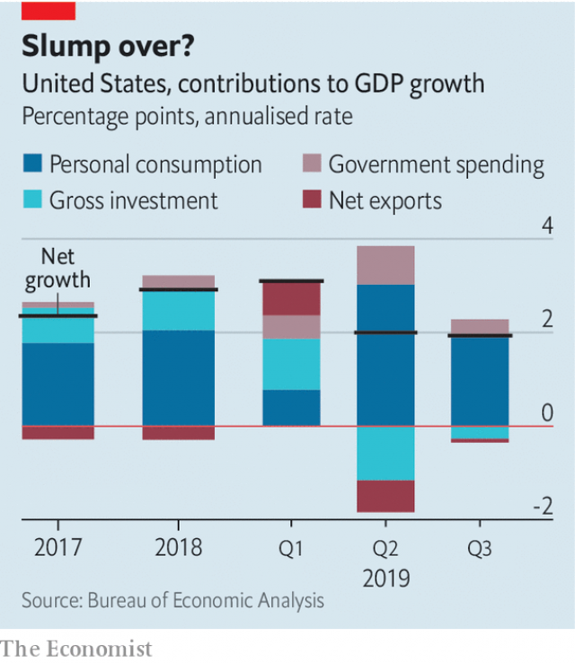

###### Easy now

# America’s economy is resisting the pull of recession 

 

> print-edition iconPrint edition | United States | Oct 31st 2019 

THIS WAS not the way it was supposed to go. “Four, five and maybe even six percent” growth was what President Donald Trump promised in December 2017. Even within the relatively sober pages of the budget proposal released by the administration in March this year, Mr Trump’s team forecast economic growth rates of 3% or more right through to 2024—which would be the last full year of a second Trump term, were one to occur. Instead, the American economy, which just missed the 3% growth target in 2018 despite the boost from the president’s budget-busting tax bill, continues to lose steam. In the third quarter of this year GDP, adjusted for inflation, rose at an annualised rate of 1.9%, down from 2% in the previous three months. The question hanging over Mr Trump, and millions of American workers, is just how far the slowdown will run and how deep it will go. 

The first signs of trouble for America’s economy appeared in late 2018. Housing construction slumped as higher mortgage rates (pushed upward by Federal Reserve interest-rate hikes) combined with rising home prices to drive buyers from the market. At the same time, a global slowdown in manufacturing and trade weighed on American producers. New manufacturing orders dropped fairly steadily from September 2018 until May this year, and parts of America’s manufacturing heartland experienced declines in factory employment. Economy-watchers have waited anxiously in the months since to see whether weakness in industry and construction would bleed into the service sector, where most Americans work. 

Mounting anxiety eventually roused the Fed to action. The central bank spent most of 2018 raising its benchmark interest rates in order to keep inflation in check, despite some withering criticism emanating from the president’s Twitter account. As the world economy sputtered, the Fed slowly changed course: first halting its cycle of increasing rates, then cutting them by 0.25% in both July and September this year. Jerome Powell, the Fed’s chairman, insisted that the moves represented a “mid-cycle adjustment”, lest markets read the cuts as a sign that the end of America’s longest expansion on record was nigh. 

 

The cuts appear to have helped. Mortgage rates have retreated; the average rate on 30-year loans, which rose to nearly 5% a year ago, has dropped back to 3.75%. That has put a bit of wind back in the sails of the residential construction industry, which began work on about 20,000 more homes in September than in the same month last year. Residential investment contributed positively to GDP growth in the third quarter, the first time it had done so in nearly two years. 

Rate cuts also seem to have switched off the bright, blinking recession-warning light which is the “yield curve”. “Inversions” of the yield curve, which occur when rates on long-term government bonds fall below those on short-term government debt, frequently appear a year or so before the onset of recession. The curve inverted over the summer, fuelling recession worries, but has since flipped back. Stock prices, which looked sickly in May, have roared back to touch record highs, buoyed by better-than-expected earnings reports as well as the prospect of a trade truce between America and China. 

On October 30th the Fed reduced its benchmark rate once more, by another 0.25%. But in doing so it very nearly declared victory in the battle to ward off a downturn. Markets now expect the Fed to hold its ground for at least the next six months. Mr Powell, while emphasising that the Fed will be watching the data closely, said, “We see the current stance of monetary policy as likely to remain appropriate...We believe monetary policy is in a good place.” A majority of members of the rate-setting committee reckon the Fed should resume rate increases in 2020. 

The Fed’s confidence, if understandable, may be premature. The conditions weighing on the economy earlier in the year have eased a little, but the growth scare did its damage. Consumers have been the ones driving the economy forward. They continue to spend, but with less gusto than before. Personal consumption spending grew at a 2.9% annual pace in the third quarter: not bad, but down from 4.6% in the second. Retail sales in September dropped by 0.3%, suggesting that the quarter ended on a weak note. Measures of consumer confidence—a guide to how spending may evolve in future—have slipped. 

Firms, too, are behaving cautiously. Measures of business confidence have been softening. Anxiety among bosses is affecting investment: the boost to third-quarter GDP from investment in housing was more than offset by a hefty drop in investment in non-residential building and equipment. Weak investment figures are particularly irksome to economists in the Trump administration, who argued that the president’s tax reform would encourage a boom in business spending. Business enthusiasm could recover a bit in the months to come, if indeed a trade-war ceasefire is declared. But the trade war is only partly responsible for firms’ woes. More important is the worldwide slowdown. Both Europe and Japan have slipped close to the brink of recession, and the deceleration in Chinese growth shows few signs of abating. A turnaround in American economic fortunes, if it occurs, will begin with homegrown optimism. 

Hopes for that hinge in turn on the health of the labour market. The jobs picture has been the most enduring source of encouragement to those looking on the bright side. The pace of hiring has slowed; payrolls have risen by 1.4% over the past 12 months, down from 1.8% over the year before that. But that is not an unexpected development this deep into an economic expansion, when fewer jobless workers remain to be hired. The unemployment rate, at 3.5%, remains extraordinarily low. So long as firms continue to hire and wages to grow, consumers are likely to keep spending at rates sufficient to steer the economy clear of a downturn. 

Given the uncertainty surrounding the path of the economy, the Fed might have been expected to signal its readiness to keep cutting rates, if necessary, more clearly. Confidence is easier to maintain than to restore, and the risks of a surge in inflation have fallen in recent months. The price index for personal consumption expenditures, the Fed’s preferred inflation measure, rose at a 1.5% annual pace in the third quarter, below the Fed’s 2% target and down from 2.4% in the second. Instead, the central bank seems content to wait and see how conditions develop—and to allow a president facing threats from all sides to twist in the wind.■ 

