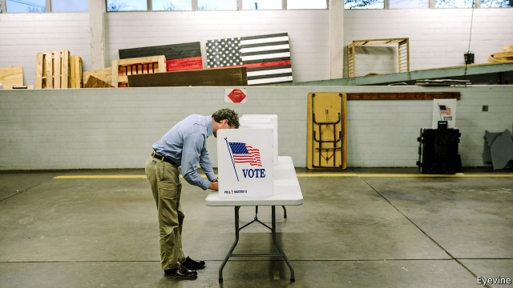

###### Polls in Dixie

# Can conservative Democrats still compete in the Deep South? 

 

> print-edition iconPrint edition | United States | Nov 2nd 2019 

THE TWIN RACES for the governorships of Mississippi (on November 5th) and Louisiana (on the 16th) will show whether, as a former House Speaker once said, “all politics is local”, or whether, in the days of Donald Trump, national partisanship supersedes everything and even local politics are not local any more. At stake is whether conservative Democrats can win statewide office in the Deep South. 

Traditionally, southern voters have regarded governors differently from the officers they send to Washington. Senators or congressional representatives are judged on their party, and Republicans have swept the South. But governors have been seen as local problem-solvers. They were judged on their personalities, and sometimes on links to powerful local families. In both states, Democrats this year are putting up the kind of person who has usually held his own in the South. 

John Bel Edwards is a Catholic who has signed one of the country’s toughest anti-abortion laws, has a military background and is a defender of gun rights. As the incumbent in Louisiana, he is the only governor from his party in the South. For a Democrat in a Republican state, he is remarkably popular, with a net favourability rating of 18 (50% approve, 32% disapprove). He has stabilised the state’s shaky finances and introduced criminal-justice reforms which mean Louisiana is no longer the state with the highest incarceration rate. 

In Mississippi, Jim Hood is the only Democrat holding statewide office, having been elected attorney-general four times. The incumbent (Republican) governor is term-limited, so this race is open. Mr Hood has proposed an expansion of Medicaid and increased funding for the state’s roads. But he also looks like a much-loved Mississippi-born country-music singer, Conway Twitty. He and Mr Edwards are the inverse of “Republicans in name only”. They are Republicans in all but name. 

Yet even in Louisiana—with its French-influenced legal system, 2m alligators and unique Caribbean-French-Creole-Catholic-Cajun culture—the nationalisation of politics is changing the political rules. On October 12th the state held its “jungle primary”, in which all candidates for office regardless of party were on the ballot and those who got 50% were elected without having to go through a second round. Mr Edwards’s vote soared in areas around cities (New Orleans, Baton Rouge) and crashed in the rural rest of the state. As a result, he narrowly missed the magic 50%. Kyle Kondik, a political analyst at the University of Virginia, argues that this reflects a national trend: “White, rural areas with little college education are shifting to Republicans. Suburban areas with more college graduates are shifting to Democrats.” 

Mr Trump is doing his best to consolidate this national trend. On the eve of the primary he held a big rally in Louisiana to turn out the white working-class vote, to great effect. In Louisiana the Republican candidate is a construction magnate and self-styled “conservative outsider” called Eddie Rispone who models himself on the president. He won the nomination by criticising his rival as inadequately Trumpist and says he will “do to Louisiana what Trump has done to America”. 

 

If Mississippi and Louisiana are politically distinctive it may be because they exaggerate national trends, rather than contradict them. They are the two states with the highest proportion of African-American voters; these are solidly Democratic. They have an unusually high proportion of white working-class and rural voters; these are reliably Republican. As a result, say Nate Silver and Nathaniel Rakich of FiveThirtyEight, a statistical website, the two states have among the least “elastic” electorates in the country: their voters are among the least likely to change their minds. Moreover, thanks to the second group, Mr Trump is even more popular in the two states than might be expected. Messrs Silver and Rakich calculate states’ “Republican lean” based on polls and the party’s performance over previous cycles. Compared with this baseline, Mr Trump is more popular in Mississippi and Louisiana than in any other Republican states. 

If they are indeed characteristic of the nation, that may not bode well for Democrats in Republican states. In Louisiana’s jungle primary, Republicans enjoyed a landslide. Five of seven statewide officers from the party won in the first round. Republicans won a supermajority in the state Senate. Republicans in Mississippi also think they can increase their share in the state House to two-thirds. 

Such majorities could enable ruling Republicans to overturn a governor’s veto. That matters because 2020 is a census year, and after each census the state legislature must draw new redistricting (voting-area) maps to reflect population shifts. In practice, Republican-controlled houses with supermajorities could redraw voting maps to hurt Democrats, without fear of a Democratic governor’s veto. 

None of this means a Democrat cannot win in the Deep South. Mr Edwards fell short in the primary mainly because of low turnout among African-American voters. Their numbers usually rise in the second round. That, plus votes from some disaffected anti-Rispone Republicans, would be enough for him. Mr Hood’s climb is steeper because the Republican is ahead in the polls and because of Mississippi’s constitution (see article). The two men’s difficulties show how hard it is for centrists to win in states where politics is less and less local, even at a local level.■ 

