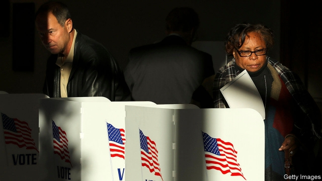

###### Loser take all

# Jim Crow still haunts Mississippi’s politics 

 

> print-edition iconPrint edition | United States | Nov 2nd 2019 

THE GOVERNOR’S race in Mississippi is a reminder that America has strange, little-known election rules which can profoundly affect results. This one could mean the candidate with fewer votes gets chosen for the state’s highest office under a system that could be rejected by the Supreme Court. 

Under Mississippi’s constitution, statewide officers must win a majority of the popular vote and a majority of the 122 districts comprising the state’s House of Representatives. If no one wins a double-majority, the House may choose the governor. This provision’s aim was overtly racist. According to a record of the state’s constitutional convention, which was held in 1890 at the start of the Jim Crow era, the framers declared: “It is the manifest intention of this convention to secure to the state of Mississippi ‘white supremacy’.” By crowding blacks into a few districts (and denying them the vote), the framers ensured that whites could never be outvoted. 

The law now discriminates against Democrats, the political party for whom African-Americans overwhelmingly vote. In practice, Democrats need to win at least 55% of the popular vote to win a majority of districts. 

Other states once had similar provisions. In Georgia candidates had to win a weighted majority of counties. That was struck down by the Supreme Court in 1963, ruling that it offended against the principle of one person-one vote. The surprise is that Mississippi’s law has survived so long. 

In May the National Redistricting Foundation, headed by Eric Holder, President Obama’s attorney-general, and the Mississippi Centre for Justice, a legal group, filed suit in district court, claiming the constitution discriminates against African-Americans. In hearings in October the judge was sympathetic to the argument but wary of changing election law on the eve of a vote. However he rules, the provision is likely to continue in force, since the losing side will appeal and the case could make its way to the Supreme Court. 

That could have immediate consequences. The race for governor is tight. The Republican is ahead but Jim Hood, the Democratic candidate, could win the popular vote though not a majority of districts. In other races when this happened, either the losing candidate conceded before the House got involved or the leading candidate was from its majority party, which selected him. This time, the Republican candidate, Tate Reeves, has refused to rule out letting the House decide. The candidate with the most votes could lose the election. Hardly a popular mandate. 

