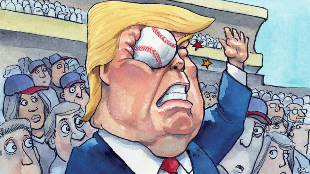

###### Lexington

# Take me out of this ball game 

 

> print-edition iconPrint edition | United States | Oct 31st 2019 

AS A RULE of thumb, the more an American president is loved, the more baseball stories there are about him. Many are even true. George Washington was recorded playing wicket—a rival game—at Valley Forge. Dwight Eisenhower claimed to have played semi-pro under a fake name. When commentating on the Chicago Cubs for a radio station in Iowa, Ronald Reagan invented foul balls to fill the gaps when his live feed failed. But Abraham Lincoln did not, as alleged, whisper on his deathbed to Abner Doubleday, “Keep baseball going; the country needs it.” Lincoln never regained consciousness after being shot. And Doubleday—who was not baseball’s inventor, contrary to another myth—was not with him. 

The profusion of such stories illustrates the national pastime’s place in the culture. Baseball is an institution as American as the presidency itself. It also reflects politicians’ inability to keep away from a popular game. Even Theodore Roosevelt, who despised baseball, felt unable to say so publicly. And every subsequent president bar one has marked the start of the baseball season or its epic denouement, the World Series, by throwing a ceremonial “first pitch”—starting with William Howard Taft, a huge fan in every sense. (Though he did not, as many claim, invent the “seventh-inning stretch” by unfurling his cramped limbs while watching the Washington Senators.) The sole exception is Donald Trump. 

He had not been to watch the Washington Nationals (the Senators’ successors) before this week. And though he was persuaded to go because the “Nats” were appearing in their first World Series, he was not invited to throw the first pitch. On what he might have expected to be his best day as commander-in-chief (he revealed the killing of Abu Bakr al-Baghdadi hours earlier), he was hidden away in an executive suite. The Lerner family that owns the Nats did not want him sitting with them. And the one time he flashed up on the big screen the jeering of the crowd was thunderous. A chant of “Lock him up!” rippled round the stadium long after Mr Trump’s image was replaced by footage of smiling servicemen. “Veterans for impeachment” read a banner behind home plate. 

Mr Trump’s Republican defenders dismissed this indignity as mere swamp gurgling. “You can either be loved in DC and hated in America. Or you can be loved in America and hated in DC,” tweeted Congressman Jody Hice. But it signified much worse for the president and his party than a few thousand hostile bureaucrats. 

Mr Trump might face a similar reception in any of the 30 major-league stadiums. All are in big cities, with well-educated, go-getting, diverse populations, where he is loathed. Even Houston, home of the Nationals’ opponents and the biggest city in a state synonymous with conservatism, is now largely Democratic. And Washington is a more typical metropolis than Mr Hice (who also considers abortion “much worse than Hitler’s 6m Jews”) would care to recognise. Its victorious baseball team illustrates this. 

“First in war, first in peace, and last in the American League,” went the old joke about baseball in the capital. Washington’s black population was long considered too poor and its white one, dominated by federal-government workers, too transient to support a major-league team. Before the Nationals arrived in 2005 the city had not had one for 33 years. But a booming, increasingly diversified economy has since transformed the capital. Its population, in decline for half a century, has grown rapidly. Its row houses have been taken over by yuppies; its cultural and nightlife scenes are thriving. And the Nats, who draw over 2m spectators a year, illustrated that change even before their stunning triumph in the World Series this week made them emblematic of it. 

“I’d lived in DC for 20 years before the Nationals arrived, but only then did it become my city,” said Paul Rosenzweig, a conservative lawyer and native New Yorker, from his perch behind right-field. Baseball’s deep history, above all its association with a capacious national identity encompassing racial and political divisions, make it a powerful force for civic attachment. This was apparent in the way Washingtonians went gaga for the game as soon as their team began inching to its World Series victory a month ago. Nats shirts and flags have been everywhere; Dominican food, their bilingual team’s favourite, is all the rage. America’s capital has found in baseball a way to celebrate and advertise its reemergence. Mr Trump was not jeered by a bunch of federal pen-pushers so much as by representatives of the confident metropolitan America—which produces most of its wealth and will increasingly define its future—he has turned his party against. 

He is not the first president to be booed at a sporting event. Bill Clinton was jeered by a NASCAR crowd, George W. Bush and Barack Obama at baseball games. But veterans of those occasions (and there were several watching the Nats that night) considered the hatefulness of the response to Mr Trump qualitatively different. This should make conservatives even more worried. For years they have exaggerated the vindictiveness and radicalism of the left to mask the contradictions in their own camp. Yet Mr Trump’s divisiveness has turned this into a self-fulfilling prophecy. Charged with partisan grievance, many on the left want to scrap the electoral college, pack the courts—do whatever it takes to never again be tyrannised by an antediluvian minority. Conservatives may soon have more than the odd gay wedding cake to contend with. 

And it already seems certain that the one baseball event Mr Trump will be associated with occurred at Nationals Park this week. Sport lifts people with a feeling of vicarious striving for perfection even when their team loses. And when it wins, as the Nationals ultimately did, bringing Washington its first World Series in almost a century, the memory never fades. This is why sport is so much more loved than politics. Immortalised in baseball history, Mr Trump’s humiliation this week will be remembered long after most of his administration’s scandals have faded into oblivion.■ 

