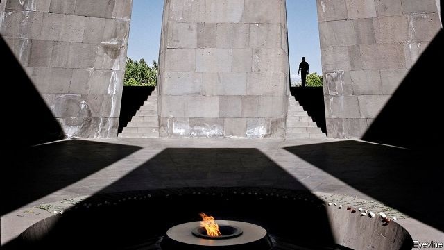

###### A long march

# The House votes to recognise the persecution of Armenians as genocide 

 

> print-edition iconPrint edition | United States | Nov 2nd 2019 

FOR ARMENIAN-AMERICANS, it was a moment of vindication. After decades of campaigning for their country to acknowledge their forebears’ agonies, news came that the House of Representatives had voted by 405 to 11 to recognise as genocide the persecution of the Armenians launched by the Ottoman empire in 1915. “I’m so happy, I can’t get over it,” said Aram Garabedian, an 84-year-old activist from Rhode island. 

Since at least the 1970s, Congressional battles over how to characterise the Armenians’ suffering have been a perennial feature of American politics. The House passed a similar resolution in 1984 but successive administrations have laboured to dissuade legislators from using the g-word for fear of alienating Turkey, an American strategic partner. 

Yet when relations with Turkey are at a low ebb because of its incursion into Syria, the energy needed to push back seems to have sapped. House Resolution 296 asserted that America had already, through a series of officially supported gestures and initiatives over the past century, recognised the genocidal nature of the Ottoman Turkish actions. 

What is not in doubt is that in spring 1915, as they were locked in war with Britain, France and Russia, the Ottoman authorities ordered the relocation of hundreds of thousands of Armenians in conditions that many were doomed not to survive. Some victims were killed by Turkish and Kurdish armed bands while some perished as they were marched in horrific conditions. 

Most historians of mass killing, including the International Association of Genocide Scholars, agreed that this episode amply meets the criterion laid down by the UN convention on genocide of 1948. This defines the ultimate crime as “acts committed with intent to destroy, in whole or in part, a national, ethnical, racial or religious group” whether through outright killing of “inflicting…conditions of life” designed to bring about their destruction. 

Some Western governments share the official Turkish view that the intention to bring about death on a huge scale remains unproven, or that the context of terrible suffering on all sides should be factored in. Turkish President Recep Tayyip Erdogan denounced the vote as the “biggest insult” to his people. 

In the short term, the vote looks very likely to play into Mr Erdogan’s hands, as he drums up defensive feelings among his compatriots and stokes their suspicion of a Western world whose intentions, he says, have always been malign. “This is a resolution which is doomed to be misused,” predicted Brady Kiesling, a former American diplomat who has served in Armenia. 

