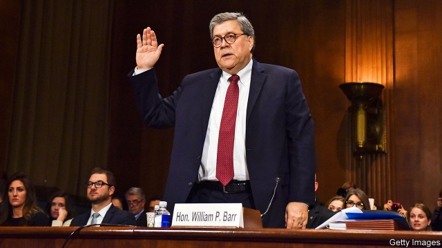

###### In search of lost crime

# The Justice Department opens a criminal investigation into itself 

 

> print-edition iconPrint edition | United States | Nov 2nd 2019 

TESTIFYING EARLIER this year before the Senate Appropriations Committee, William Barr, Donald Trump’s attorney-general, said, “I think spying did occur” against Mr Trump’s campaign in 2016. That is an odd way to characterise the FBI-led investigation into Russian interference, which began not with surveillance, but with a tip from Australia’s government—that Russia had offered “dirt” on Hillary Clinton’s campaign. But it delighted Mr Trump, who has long blamed his woes on a “deep state” conspiracy. Mr Barr recently gave the president another reason to smile, as news leaked that the Justice Department (DOJ) had opened a criminal inquiry into the origins of the Russia investigation. 

That has left many in Washington confused. On one hand, the attorney whom Mr Barr has put in charge of the investigation—John Durham, the chief federal prosecutor in Connecticut—is respected across the political spectrum for his apolitical thoroughness as well as his probity. A criminal inquiry gives him the power to subpoena witnesses, empanel grand juries and bring indictments. 

On the other, investigations into possible malfeasance within an agency are usually carried out by the agency’s inspector general (IG). Indeed, the DOJ IG’s office was already looking into roughly the same thing (possible surveillance abuses by the DOJ and FBI against the Trump campaign) and is expected to issue a full report soon. How that inquiry fits with Mr Durham’s is unclear. Michael Horowitz, the IG, has admitted to “hav[ing] had communications” with Mr Durham, which is unusual, because IG’s offices tend to operate independently from their agencies. 

Mr Barr has taken an active role in this investigation. He accompanied Mr Durham to Rome in late September, where they reportedly received a taped deposition from Joseph Mifsud, a Maltese professor who in April 2016 told George Papadopoulos, a low-level foreign-policy aide to the Trump campaign, that Russia had Mrs Clinton’s stolen emails. (Mr Mifsud has since gone to ground.) Attorneys-general do not do that sort of thing. As one former federal prosecutor put it, “that’s what agents are for.” 

What Mr Durham is investigating remains unclear. After saying he thought the Trump campaign was spied on, Mr Barr said he wanted to “explore” whether the surveillance was justified. But criminal inquiries tend to require better grounding than this. Perhaps Mr Durham or Mr Horowitz has found evidence of illegal activity; if so, they have said nothing. 

Opening a criminal investigation into people Mr Trump has cast as his political enemies—but who appear to have followed genuine leads and uncovered evidence of Russian electoral interference that has led to dozens of indictments and several convictions—could signal a worrying erosion of the DOJ’s independence. Mr Barr, who has been a longtime proponent of executive power, may believe that independence only extends as far as the president allows. But such a position, as Jerry Nadler and Adam Schiff, Democratic congressmen leading the impeachment inquiry, agreed in a joint statement, risks making the DOJ into “a vehicle for President Trump’s political revenge” and doing “irreparable damage” to the rule of law. 

The impeachment inquiry, of course, is still in early days. And the DOJ investigation may yield indictments. Even if it does not, it gives Republicans something other than impeachment to talk about. It blunts charges of corruption and self-dealing hurled at Mr Trump, and validates to him and his supporters his feelings of persecution. In 2016 Hillary Clinton’s polling lead plummeted following an announcement, 11 days before the election, that the FBI had reopened an investigation into her emails. Mr Trump wanted Ukraine’s president, Volodymyr Zelensky, “in a public box,” announcing an investigation of Joe Biden, a potential rival for the presidency. 

And it may last a while. A former federal prosecutor praised Mr Durham for being “very methodical, [meaning] slow.” His inquiry could drag on well into next year, letting Mr Trump contend from the hustings that he is investigating the “deep state” and needs one more term to defeat it.■ 

