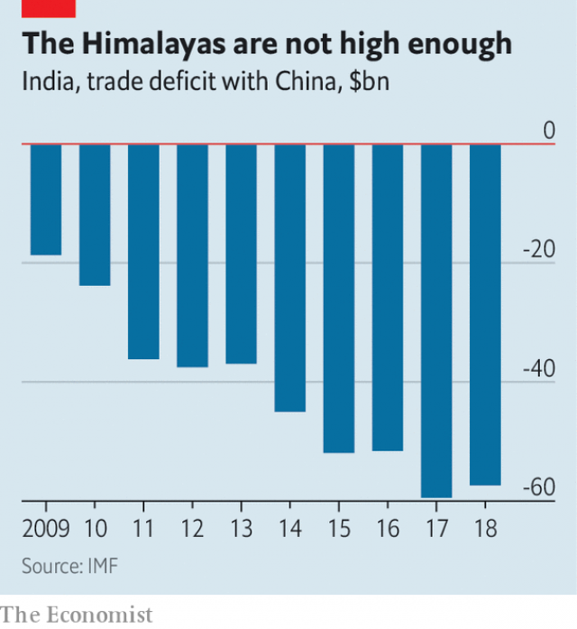

###### Spare wheel

# Asia’s trade negotiators decide they can no longer wait for India 

 

> print-edition iconPrint edition | Asia | Nov 9th 2019 

STUFF TOO many sheaves of paper into a stapler and it will struggle to fasten them together, however thin each page may be. The same is true of the Regional Comprehensive Economic Partnership (RCEP), a long-delayed trade deal involving 16 Asian countries. RCEP was intended to bind together all of the existing trade agreements between the Association of South-East Asian Nations (ASEAN) and the region’s other big economies, including China, Japan, South Korea, Australia, New Zealand and India. But adding India to the pile has caused the mechanism to jam. 

At a summit this week in Bangkok, the region’s leaders announced that 15 of the 16 participants had concluded their talks and would be ready to sign a deal in February, after the text was given a good “legal scrubbing”. But India was not yet ready to join them. “Neither the talisman of Gandhiji nor my own conscience permit me to join,” said Narendra Modi, India’s prime minister, invoking Mohandas Gandhi (pictured), who preached self-reliance and relished the frugality it requires. 

Although India and China have free-trade pacts with ASEAN, they do not have an agreement with one another. Many in India fear that lowering tariffs on Chinese goods will only increase its yawning trade deficit with the country (see chart). They also worry that India’s poor farmers will be flooded out of the market by Australian grains and milk from New Zealand. 

 

These concerns seem overblown. The agreement (which has not yet been published) is unlikely to have liberalised agriculture much, if at all. And it reportedly allows its poorer members to proceed cautiously and gradually in lowering tariffs on manufactured goods. Indian and Chinese officials had been discussing adjustment periods of up to 25 years for some items. To assuage Indian concerns, its negotiating partners were also apparently willing to let it impose some sort of “safeguard” tariffs if imports surged too sharply. 

None of that was enough to overcome vitriolic domestic opposition to the deal. Trade negotiations tend to click only when the fear of foreign competition is offset by the temptations of foreign markets. For India, however, the temptations and fears are wildly mismatched. It is eager to open up new markets for its competitive IT firms. But services such as IT tend to be neglected by traditional trade deals. Only ambitious, forward-looking agreements venture deeply into these areas, and those deals usually entail a degree of openness to foreign manufacturers that would terrify India’s industrialists. Thus India typically falls between two stools, approaching trade in industrial and agricultural goods like a poor country and trade in services like a rich one. 

Even without India, RCEP encompasses almost 30% of the world economy and the same proportion of its population. Its members also span every level of development. The income per person of its most prosperous member (Singapore) is 50 times higher than its poorest (Myanmar). As well as the traditional focus on cutting tariffs on goods, it includes some helpful provisions on investment and embryonic rules on intellectual property. 

The agreement will also bring some logistical benefits. The rules for deciding the country of origin of manufactured goods (which typically include components made in many different places) differ from one ASEAN agreement to the next. The new partnership will help unify those rules. Imagine a firm that makes furniture in South-East Asia, says Deborah Elms of the Asian Trade Centre, an advisory firm in Singapore. As things stand, it might have to assemble tables one way to qualify for preferential access to the Chinese market and another way to qualify for low tariffs in Japan. Under RCEP it only has to conform to one set of rules for access to all 15 markets. 

To maintain its geographical reach, the agreement has sacrificed some depth and breadth. On services, the members’ commitments apparently vary a lot, with some countries adopting a “negative list” (ie, anything not listed is open to trade) and others a “positive” one (anything not listed is closed). The text is also likely to include many noncommittal phrases: “members shall endeavour to”, rather than “members shall”. In these sorts of agreements, do and do not are not the only options. There is plenty of try. 

The partnership also leaves out the kinds of provisions on the environment, labour and state-owned enterprises that America insisted be included in a rival agreement, the Trans-Pacific Partnership, before it lost interest in writing trade rules—or following them. Because RCEP includes China (and TPP pointedly did not), the pact is often described as a “Beijing-led” initiative to write the rules of globalisation to its liking. But ASEAN bristles at that notion. It has organised the negotiations—almost 30 rounds of them. And its agreements are the sheaves of paper that RCEP is supposed to staple together. “Even though it’s always been painted as a China-led initiative…it has always been an ASEAN-led initiative,” says Ms Elms. “Which is why it’s taken so long.” ■ 

