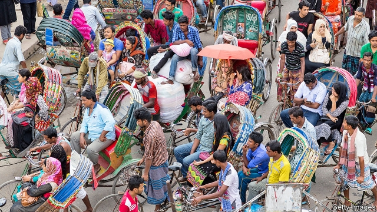

###### Three wheels v four

# Bangladesh’s biggest city plans to ban cycle rickshaws 

 

> print-edition iconPrint edition | Asia | Nov 9th 2019 

FOR MANY Westerners, the cycle rickshaw (also known as the cyclo or pedicab) is an iconically Asian form of transport. In fact, most Asian cities have long since abandoned them (and a few European and North American cities have taken them up). But in Bangladesh the cycle rickshaw is as popular as ever. In the capital, Dhaka, rickshaws can be seen creaking down almost every street. Dhaka’s administrators, however, would like to consign its rickshaws to the past, too. 

In July the city banned rickshaws on three main roads. All of Dhaka will be “rickshaw-free” within two years, says Mohammed Atiqul Islam, the mayor of the northern half of the city. “Dhaka has a traffic problem,” explains Dhrubo Alam of Dhaka Transport Co-ordination Authority. “It is one of the world’s most densely populated cities, and most congested.” According to a recent World Bank report, the average traffic speed fell from 21km per hour in 2008 to 7km per hour last year. On current trends, it will be faster to walk by 2035. 

Sitting in traffic is not just annoying; it is also wasteful. The World Bank estimates that 3.2m working hours are lost each day, at a cost of billions of dollars each year. 

According to Mr Alam, slow-moving but highly manoeuvrable vehicles like rickshaws are a big part of the problem. There are between 600,000 and 1m of them in Dhaka. They can change lanes or make U-turns very abruptly. “That creates chaos,” he says. Another reason to get rid of them, he adds, is that most are illegal. Only around 80,000 of Dhaka’s are licensed. No new licences have been granted since 1986. 

For the city’s rickshaw-drivers such concerns seem beside the point. “What am I supposed to do?” asks Abdul Mubin, a 32-year-old. “I have mouths to feed.” He and thousands of other rickshaw-drivers went on strike in protest against the proposed ban in July. By blocking several big roads, they exacerbated the jams across the city. 

The drivers are not the only ones with reason to worry. There are also hundreds of thousands of rickshaw-owners (who rent out the vehicles to drivers), makers, mechanics and spare-parts traders who rely on the business for their livelihood. 

Then there are Dhaka’s commuters, who rely on rickshaws more than any other form of transport. At least 40% of the 3.5m trips that take place each day on Dhaka’s streets are made by rickshaw. There is little public transport. The city has only 8,000 public buses to cater to its 18m people. Worse, they do not follow any timetable and the drivers are often unlicensed. Last year students took to the streets when racing buses, competing for passengers, hit and killed two schoolchildren. 

Buses will soon come under one regulatory authority, Mr Alam promises. The routes will be “rationalised” to provide “smooth service”. A metro system is also under construction, though it will not initially be big or cheap enough to make much of a dent in traffic. Meanwhile, the number of private cars is rising fast. They will soon undo all the benefits of banning rickshaws and then some, Mr Alam says, if public transport is not improved. 

Mr Mubin says rickshaw-drivers are too poor to strike again. He sees no redress. But he finds the double standard galling: “Rich people are buying cars and motorbikes. A lot of them have more than one. How is banning rickshaws going to help traffic?” ■ 

